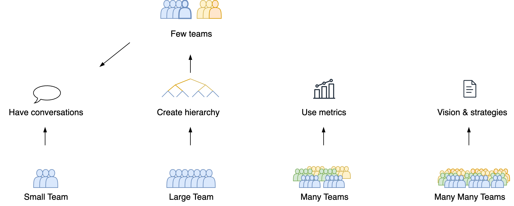
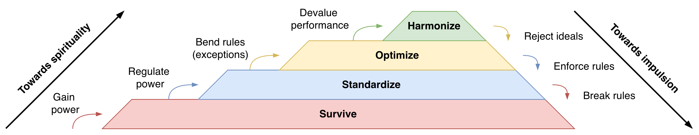

# Alignment

Also see [proposals](../collaboration/communication/proposals.md) and [documentation](../collaboration/documentation.md).

[toc]

## Introduction

Alignment is foremost a scaling problem. The more people are involved, the greater the collision of opinions and needs. Aligning colleagues involves balancing opinions, ego's and incentives. Alignment with external parties brings even more challenges. This document attempts to give insight into styles and tools to maintain alignment.

Different tools can be used to privide *gentle* alignment for larger organizations.

- Conversations work well for small groups.
- Hierarchy and roles provide structure for large groups.
- Metrics allow many teams to follow specific directions.
- Vision and strategies inform leaders to set out their individual direction.

## Organizational Structure

Next to scale, alignment depends on the structure of the organization and its partners. We can distinguish four typical structures, each based on: power, rules, performance and ideals. There is a natural evolution of organization through these phases. Alignment changes alongside this evolution. See [power](../systems/power.md).

1. In authoritative organizations alignment is achieved through a strong, **powerful** leader.
2. In bureaucratic organizations power is regulated through **standardization**. This distributes alignment, but increases stability.
3. A focus on **performance** re-aligns the organization. The organization aligns to certain metrics.
4. The bias for metrics is mitigated by celebrating certains **ideals**. The organization aligns to a single mission or north star.

## Control & Guidance

There are two seemingly opposite philosophies to achieve alignment. See also systems [control](../systems/control.md) and [leadership styles](./leadership-styles.md).

1. 🎛️ **Control**. A direct, brute-force approach that uses *power* to obtain control. It relies on rules and directives.
2. 🧭 **Guidance**. A softer, indirect style that uses *empowerment*. It involves receptivity, facilitation and incentives.

These approaches use a variety of tools. Organizations tend to mix tools from both styles in different situations.

|                | Control (low autonomy) | Guidance (high autonomy)             |
| -------------- | ---------------------- | ------------------------------------ |
| **Small team** | 🗣️ Direct, command      | 👂 Conversations                      |
| **Large team** | 👮‍♂️ Roles, rules        | 🚧 Guidelines, procedures, incentives |
| **Few teams**  | 🪜 Hierarchy            | 📈Metrics                             |
| **Many teams** | 🏛️ Institutions         | 📄 Abstraction. Vision & strategies.  |

Guidance requires a different perspective than control. It's rooted in acceptance, rather than toleration.

## Tools

**Power structures** exist at different scales. As roles, rules, (class) hierarchy or institutions. These structures provide:

- A separation of concerns.
- Delegation of responsibility.
- Structure & expectations. Compensate restriction with freedom in other areas.
- Self-sustaining systems that protect the status quo.

**Responsibilities** are often formalized. Typical responsibilities are products (projects), people (resources) and capabilities (technology). At greater scales, roles transform to functional teams and to departments (centers of expertice). See [product](../management/product-management.md) and [team](../teams/team-management.md) management.

**Abstractions** decouple strategy from execution. This provides flexibility and protect a manager from being overwhelmed by operational details. See also [goals](./goals.md) and [vision and strategy](./vision-strategy-documents.md).

- The world of **strategy** focusses on vision, alignment, and systems.

- The world of **operations** focusses on quality & delivery.

## Conflicts

Velicity conflicts. Worries that the project is going too slowly.

- Solution: vizualize progress. This allows all parties to agree on the progress. The discussion can then move on to e.g. feasibility.

Priority conflicts. Disagreement about the order of work. Steps:

1. Explain the policies (values) that guide priority
2. Then explain prioritized items
3. Then relate this to the conflicts
4. Then, re-evaluate your policies (values)

Note: policies are often not explicit. Values is a more natural and informal alternative

# References

- F Laloux, *Reinventing Organizations.*
- W. Larson, *An elegant puzzle. Systems of Engineering Management.*
- R. Westrum, *A typology of organisational cultures*
