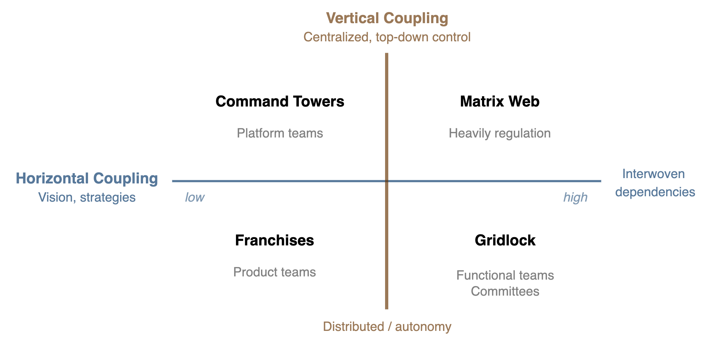

# Horizontal & Vertical Coupling

Coupling is an ambiguous term, relating to alignment, autonomy, cohesion, consistency and (in)dependence. This document presents a model based on two dimensions. See this [blog](https://cutlefish.substack.com/p/tbm-379-vertical-vs-horizontal-org).

- **Vertical**: coupling to "parent" structures. E.g. a manager.
- **Horizontal**: coupling with "sibblings", e.g. other teams, other team members.

These dimensions roughly translate to centralization and autonomy, respectively.

<table><thead>
  <tr>
    <th colspan="2" rowspan="2"></th>
    <th colspan="2" style="text-align:center;">Horizontal</th>
  </tr>
  <tr>
    <th style="text-align:center;"><strong>Low</strong></th>
    <th style="text-align:center;"><strong>High</strong></th>
  </tr></thead>
<tbody>
  <tr style="text-align:center;">
    <td rowspan="2"><strong>Vertical</strong></td>
    <td><strong>High</strong></td>
    <td><strong>Command Towers</strong> Platform teams</td>
    <td><strong>Matrix Maze</strong> Heavily regulation </td>
  </tr>
  <tr style="text-align:center;">
    <td><strong>Low</strong> </td>
    <td><strong>Franchises</strong> Product teams </td>
    <td><strong>Gridlock</strong> Functional teams, Committees </td>
  </tr>
</tbody>
</table>

## Governments

The dimensions translate directly to government-type of organizations. See [power](../systems/power.md).

- Vertical coupling: centralization of power.
- Horizontal coupling: consistency of components. I.e. governments of regions, provinces, cities etc.

|                       | Loose Coupling: Autonomous                                   | Tight Coupling: Consistent                                   |
| --------------------- | ------------------------------------------------------------ | ------------------------------------------------------------ |
| **Centralized** Power | **Federation**. Independent kingdoms, connected by shared values, ideologies and institutions. | **Oligarchy**. A ruling elite, but with limited power.       |
| **Distributed** Power | Totalitarian **bureaucracy**. Distributed power structures. Rules & regulation. Matrix structures. | **Autocracy**. Full centralized, top-down control. One leader, one state, one nation. Everything else bends. |

In this model, a federation can be bureaucratic. A democracy lies between federation and oligarchy. The health of its institutions determind the balance.

### Networks

Authoritative power structures tend to be hierarchical and top down. The other structures are more distributed.

