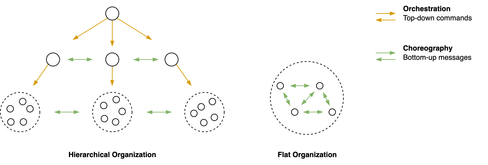

# Orchestration & Choreography

The short-term behaviour of agents in a system determined by their *a priori* configuration and their (local) interaction. Interaction can be driven by demands or individual preferences. These interactions result in [orchestration](https://en.wikipedia.org/wiki/Orchestration_(computing)) and [choreography](https://en.wikipedia.org/wiki/Service_choreography), respectively. The former relies on command-driven communication that are pushed to specific agents. The latter is associated with agents that observe their surroundings and react autonomously.

- Depending on the domain, there is a need for a balance between the two. Too much orchestration can lead to inflexibility. Too much choreography can lead to anarchy or chaos.

|                    | Orchestration                       | Choreography               |
| ------------------ | ----------------------------------- | -------------------------- |
| **Nature**         | Chain of command                    | Autonomous agents          |
| **Centralization** | Central point of influence          | Absence of a central point |
| **Optimized for**  | Execution, transparency, efficiency | Agility, resilience        |
| **Risk**           | Inertia                             | Anarchy                    |
| **Communication**  | *Commands*                          | *Events*                   |

Note that the social structure may change over time.

**Celebrity status**

Real organizations tend to mix these models. A specific form is that of

- A celebrity that attracts fans, without direct control.
- A solar system with planets that orbit around a sun.

From a networking point of view, the [degree distribution](https://en.wikipedia.org/wiki/Degree_distribution) of these networks is enormously skewed. The celebrity acts as a [hub](https://en.wikipedia.org/wiki/Hub_(network_science)).

**Alignment**

The alignment of agents may change over time. Their behaviour can be flexible or consistent.

## Commands & Event Messages

See [commands and events](../software-industry/commands-events-messages.md).

- **Commands** flow along the hierarchy. Commands require authority.

- **Messages** can be send in any direction, even between employees. This includes proposals and opinions.

Communication (commands) may happen *synchronously* - with blocking messages - or *asynchronously*.

## Background

In principle, information flows top-down and a bottom-up.

### Networks

Authoritative power structures tend to be hierarchical and top down. The other structures are more distributed.

## 