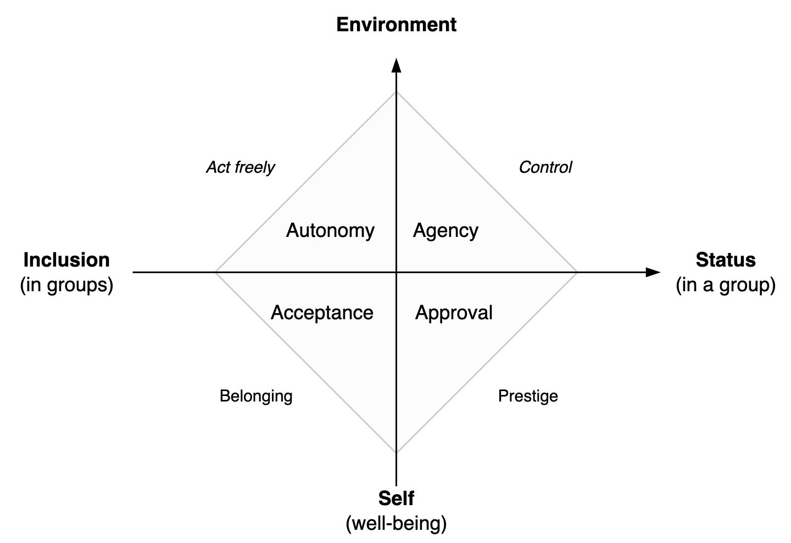

# Desire

In psychology, desire relates to an subject and a change. See [desire (subjects)](../subjects/desire.md),  [ego](../psychology/ego.md) and [identity](../subjects/identity.md).

[toc]

## Pyramids

Two flavours of a simple model for desire and human needs.

1. The primary layer is physical and psychological safety. E.g. food, water, shelter.
2. The middle layer relates to the position (belonging) in a society. Either a status or ability to participate. A typical metric is net worth.
3. The top layer relates to forms of enlightenment. Actualizing ones true potential. Being at peace.

Typical desires:

- In a individualist culture: I want a perfect partner, and live in a big house. Then become the next CEO.
- In a collectivist culture: I want to become a great member for my community, and find inner peace.

|                  | Individualist Model                          | Collectivist Model           |
| ---------------- | -------------------------------------------- | ---------------------------- |
| **Success**      | "My" status (social, economic, intellectual) | Community or ideology        |
| **Example**      | *Want to be the best*                        | *Desire to support an other* |
| **Bias**         | Global, objective metrics                    | Local, informal connections  |
| **Risk**         | Optimize metrics                             | Stuck in tradition           |
| **Anti-virtues** | Poverty suggests laziness                    | Wealth suggests exploitation |

In pure individualistic cultures there is an incentive to quickly grow up to be independent. Conversely, in collectivist cultures there is a bias to trust and rely on family or the community.

Both models contain a - biassed - measurement of a **utility**. They compare the value of one's life. Corporate or communal achievement indicate high utility. Doing nothing signifies low utility.

The difference is highlighted in **resumes**. These may either:

- Rely on self-promotion of achievements. Emphasize individual results.
- Show the relation to authorities. I.e. membership to prestigeous organizations. Contribution to team results.

### Attribution & Humiliy

Attribution styles bear a resemblance to the two categories.

-  **Internal attribution** is ego-centric. It emphasizes exceptionalism and pride. It also implies a high level of personal responsibility. 
- **External attribution** recognizes the interdependent nature of the world. Success is as attributed to luck or the environment. Failure is surrounded by excuses and forgiveness. Confuscian humility creates a stark contrast with ego-centric exeptionalism. It embraces being ordinary. It teaches gratefulness for being lucky enough when success.

|                           | Individualist Model      | Collectivist Model                   |
| ------------------------- | ------------------------ | ------------------------------------ |
| **Attribution (success)** | Internal (ego). Be proud | External (luck). Confuscian humility |
| **Attribution (failure)** | Personal responsibility  | Excuses, forgiveness                 |

## Types of needs

Standard human needs (Maslow).

1. Survival. Physiological needs.
2. Safety. Security.
3. Acceptance, belonging, friendship, intimacy.
4. Recognition. Prestige.
5. Knowledge and understanding
6. Order and beauty
7. Self-actualization. Realizing ones potential.

In two dimensions

1. Personal. Well-being (safety) versus agency in an environment.
2. Social . Inclusion (belonging) versus status in groups (prestige).

**Jobs**

Purpose of a job

- The core method to measure self-worth.
- A means to obtain leisure.

# Other

## Simple Model

Simple [model](https://en.wikipedia.org/wiki/Self-determination_theory)

- Autonomy
- Social connection
- Competence / skill

## Dual Model

Personal harmony.

- Self-expression
- Spontaneity / leisure / joy
- Self-control. Ability to regulate (manage) emotions.
- Ego. A stable, coherent identity. A usable worldview.

Social harmony

- Acceptance, social connection
- Autonomy, competence
- Justice. Being treated fairly.
- Safety, security, predictability
