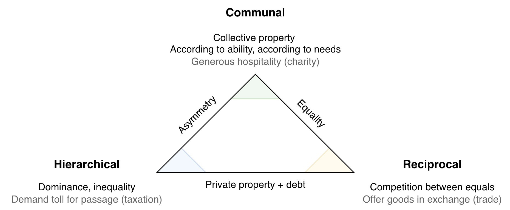
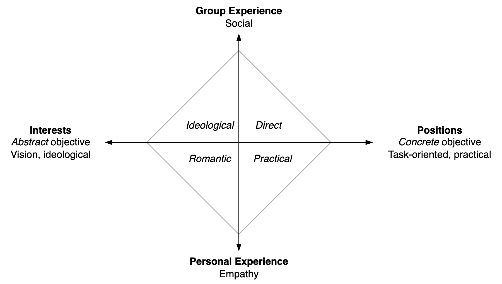
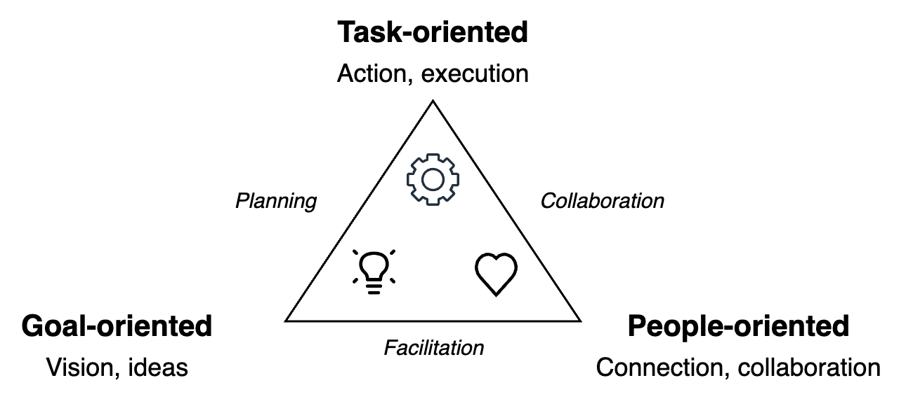
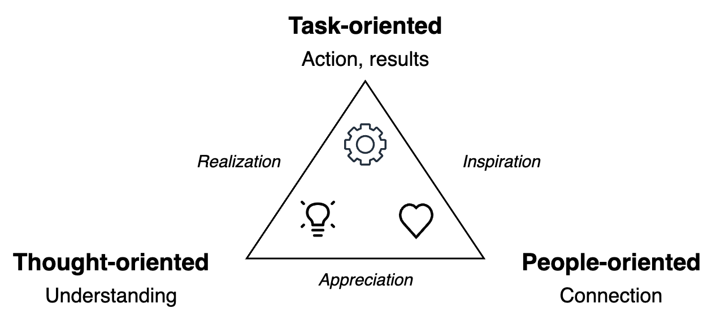

# Relationships

We can distinguish three fundamental types of relationships. In a given society, different relationships are used in different contexts. Each type has a different sense of justice.

**Communal relationships** prioritize the collective over the individual. Shared property: from each according to his ability, to each according to his needs, as Marx said. It is not limited to communist regimes, in fact, many capitalist corporations (teams) operate in this way. Families and communities are full of communal relationships as well. There are no transactions or debt between parties.

*Gifts are free donations.*

**Reciprocal relationships** are more transactional. Private property is exchanged for something of perceived value. It involves two parties interacting on *equal* or fair terms. Both parties are engaging without coercion. Paradoxically, each party seeks either a direct benefit or an indirect social advantage, such as strengthening the relationship or improving reputation (optics). The exchange does not have to be explicit or formal. E.g. in gift economies there is an expectation of eventual reciprocity of favours.

*Gifts are loans, to be paid back in the future.*

**Hierarchical relationships** are about inequality. One party dominates the other in some way. A king enforces taxes on its subjects. Gifts are based on precedent and custom, rather than need or ability. An initial gift establishes the nature of the relationship. It is a precedent for demanding the gift again. Gifts are effectivey proof that one party is indebted to the other.

*Gifts are confirmation of subjugation. Initial gifts are precedents for future gifts.*

### Justice

Each relationship has a different meaning of justice.

| Relationship | Justice means                                               |
| ------------ | ----------------------------------------------------------- |
| Communal     | Sharing. Hoarding is sinful.                                |
| Reciprocal   | Repaying debt                                               |
| Hierarchical | The law of the jungle. Weaker parties are forced to comply. |

## Reciprocal Relationships

The nature of personal relations can vary.

- Transactional. Fair exchange of services. Interface-based. Mutual benefit.
- Reciprocal. Personal. Based on cooperation. Mutual support. Shared experience. Long-term
- Shared interests.

|                  | Transactional   | Reciprocal        | Shared Interests |
| ---------------- | --------------- | ----------------- | ---------------- |
| **Core**         | Fair exchange   | Shared experience | Aligned actions  |
| **Purpose**      | Mutual benefit  | Mutual support    | Shared vision    |
| **Meta-purpose** | Result-oriented | People-oriented   | Thought-oriented |
| **Method**       | Trade           | Cooperate         | Alignment        |
| **Time-horizon** | Instantaneously | Long-term         | Long-term        |

### Related Models

  

## References

- D. Graeber, *Debt: The First 5000 Years*
