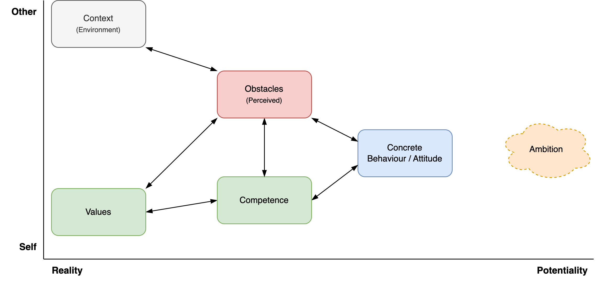

# Coaching Conversations

[toc]

## Context

Any conversation requires trust and familiarity. There needs to be some shared understanding in place in order to have a meaningful conversation.

## Stereotypes

Two specific patterns of coachees

- A **victim**. Attributing problems to the environment. Blaming others. *"It's impossible to get anything done here!"*
- **Avoidant** personality. Believing they are doing great. Avoiding challenge. *"It's going well, I just need more time"*

For both patterns, find a strength they already have. Then, from a place of strength, explore ambitions and dreams. Based on their ambition, challenge the current reality. Deconstruct obstacles to make way for a path to move towards the ambition. Let the coachee take responsibility.

## Grow model

[GROW](https://en.wikipedia.org/wiki/GROW_model) model.

## Competency-Value Model

Initially the ambition might not be clear. Facilitate the coachee to discover it.

**Flow**

After making contact, sitting down and small talk, continue to a deeper conversation.

- Start with the **context**. Learn about the environment.
- This often touches certain perceived **obstacles**. Listen to these, but do not dwell on them. Put them into perspective, challenge them or look past them. Explore what is possible.
- To look past obstacles it can help to moving the focus to either a **competency** or personal **value**. Emphasize these and explore how they can contribute to the coachee. Explore capabilities.
- Move back and forth to topics based on intuition. Zoom in and out by exploring (future) **ambition**.
- Eventually, move towards concrete, alternative **behaviour** that could help.
- Let the conversation end with action points. Check whether these match the preferences of the coachee.

**Side stepping**

> Read between the lines.

Pay attention to topics that are significant or that bring up emotions. These are keys to underlying factors. Be mindful of non-verbal clues.

- Linger on these topics. Avoid rushing a conversation. Dare to pause and be silent.
- Given a topic such as an event, consider both the resulting *behaviour* and the *experience* (feeling).
  - Effect: "How did that affect you?"
  - Behaviour: *"How did you react?"*
  - Feeling: *"How do you feel about that?"*
- Link these topics to the ambition. Explore how they relate to the ambition.

**Active listening**

Listen actively. Recognize the other. Be fully empathetic. Put yourself in the other's shoes, without judging.

- Note that communication is bidirectional. Be mindful of your own appearance (incl. nonverbal communication).

Tools

- Focussing
  - E.g. repeat a significant phrase. Address a relevant (nonverbal) signal.
- Exploring. This is useful when the other is sending multiple or mixed messages.
  - Summarize what was said.
  - Involving. Ask open questions.
  - Check assumptions.

**Values**

Typical values, categorized by direction:

- Integrity. Respect, fairness, justice. Transparency, honesty.
- Autonomy, independence, liberty.
- Self-actualitzation, creativity, challenge, purpose. Dynamic lifestyle.
- Social-economic position. E.g. status, influence, wealth. Static lifestyle.
- Security, safety.

**Associating and dissociating**

Different topics focus attention on different aspects of life. They help to associate and dissociate.

