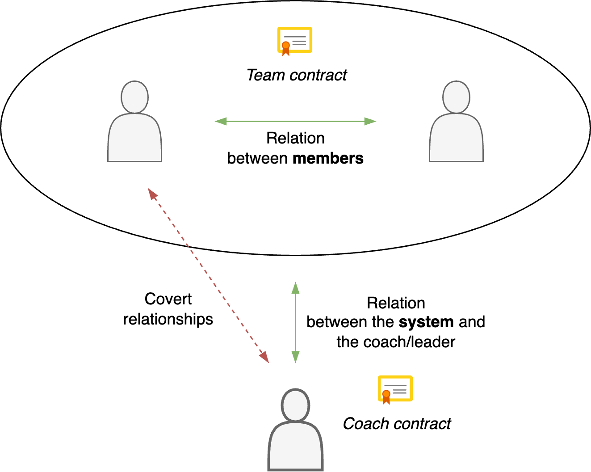
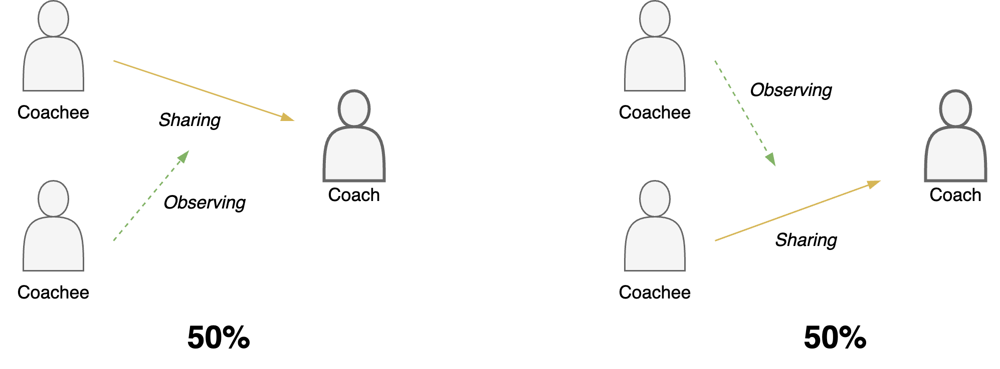

# Team Coaching

The coaching journey of a single person differs from that of a team. However, coaching techniques do translate naturally to groups and teams. The main difference is an emphasis on relationships, instead of individuals. See also [professional emotions](emotions.md).

[toc]

## Overview

Team coaching focusses on the relationship between team members. The members from a system, that can be addressed as a whole.

Systems view

- Everyone is right, partially.
- Each team member is a voice of the system. Behaviour of an individual is a signal from the system.
  - You are part of the system and also separate from it.

Coaching team requires a balance between addressing the team and individual members.

A common pattern is to focus on the team at the start and the end of projects (iterations), and pay attention to on individual members during the middle of the projects. In between projects the team is given the room to to focus.

**Stance**

- *Invite* team members to provide feedback and relflection, rather than filling in how they behaved. E.g. *"How did you feel after that meeting?"*, rather than *"I noticed that you rushed and ...."*.
- Align and check assumptions.
- Avoid secrets between team members. As a workaround, you can share "anonymous" messages.

**Triangle**

Balance the attention and input of all coachees.

## Energy Field

The relation between people is partially invisible and not said out loud. It can be addressed indirectly, without over-suggesting or forcing a direction.

Weather metaphors

- 🌡️ What is the temperature in this room?
  - ♨️ It’s getting hot.
  - ❄️ That feels cold.
- ☀️ Do you feel the sun shining?
- ☁️ I notice some clouds.
- ⛅ The sun is starting to get through.
- 🍃 I feel a light breeze. Air is starting to flow.
- 🌪️ That felt like a tornado.

Other metaphors

- 🐘 Elephant in the room. A big obvious topic. You cannot go around this.
- 🌊 Underlying current. Dynamics that affect the main topic.
- 🧩 Stakes. What makes it significant.

Style

- Tension. Contraction. Shut down.
- Expansion. Open up. Welcoming.

## References

[ORSC Coaching](https://crrglobal.com/about/orsc/)
