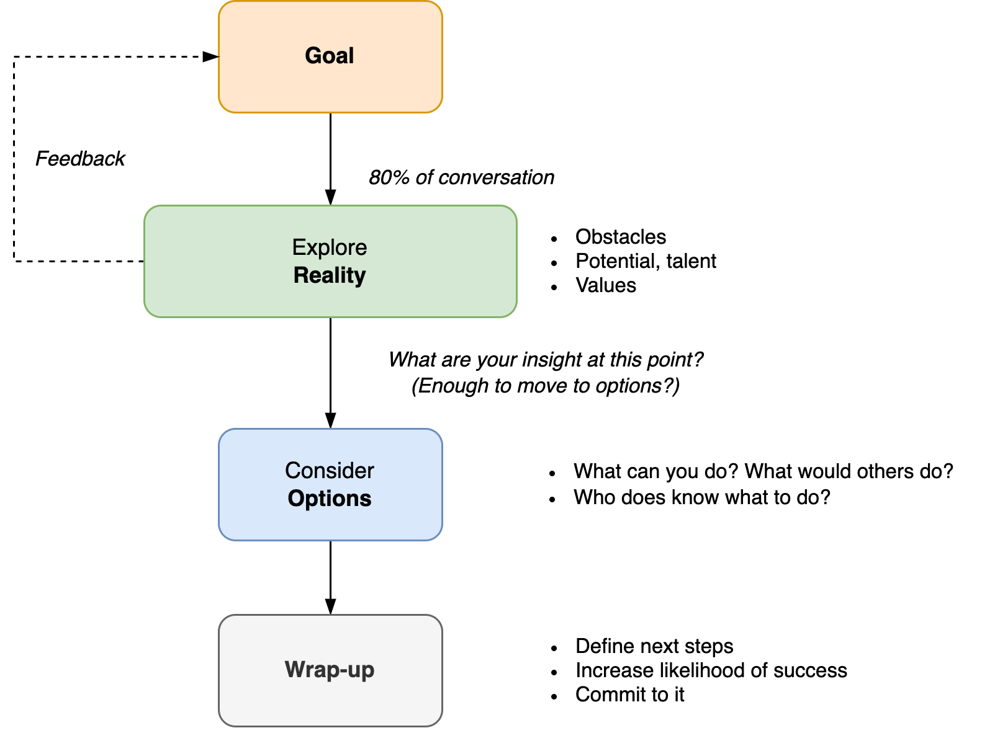
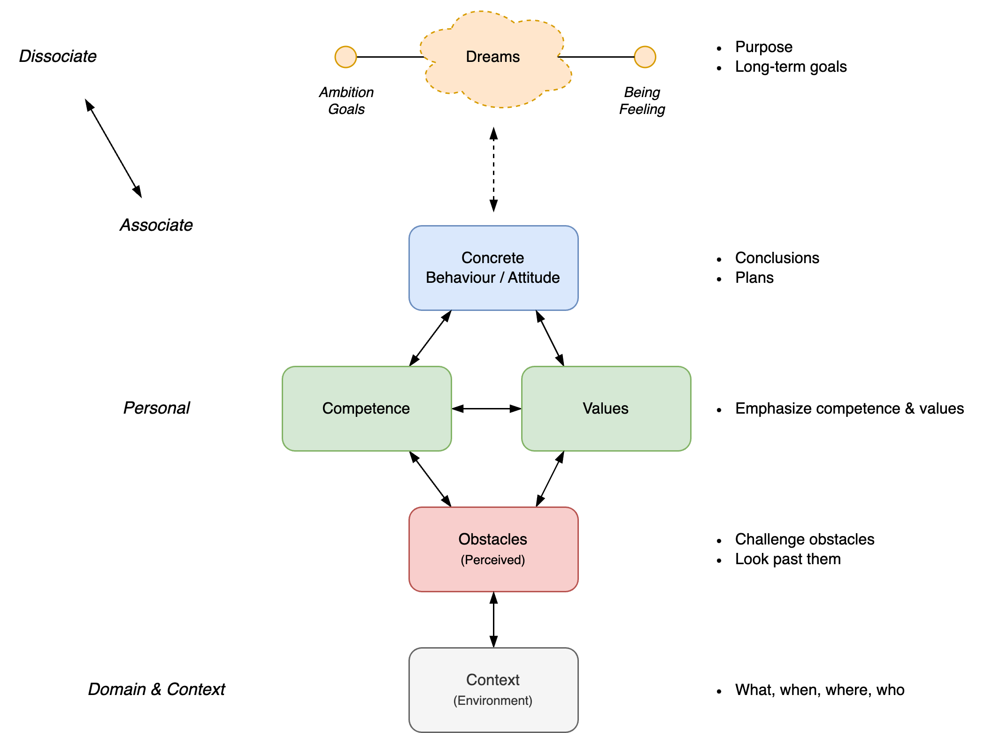
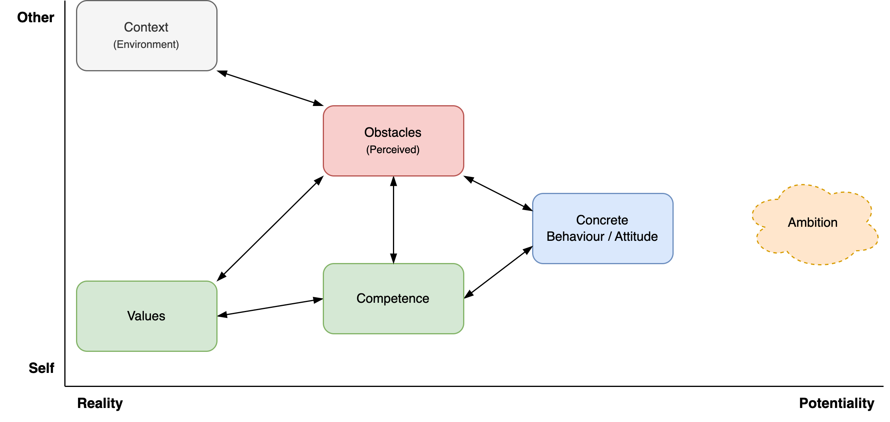

# Coaching

Coaching is about providing a soundboard, through questioning. It's oriented towards potential and results.

See also [goals](../activity/goals.md), [purpose](activity/purpose.md).

[toc]

## Overview

> Help people (teams) move from who they are now, to who they’ll be in the future, in a way that maximizes well-being.

Coaching revolves around the preferences of the coachee. It consists of a series of conversations in which:

- The coach helps the coachee to see new perspectives and potential.
- The coachee decides how to incorporate this.


### Intent & Purpose

Help the coachee achieve the what they want.

Coaching is not limited to planning and goal-setting. It may range from:

- Empathy, recognition
- Provide a soundboard
- Provide a new perspective
- Challenge perceived obstacles
- Show blind spots
- Explore potential
- Choose a next step
- Plan a next step


### Method

Coaching is **result**-oriented. This means:

- Start with a desired result, based on the preference of the coachee. Note that desires may change over time.
- Optimism rather than pessimism.
    - Explore core desires rather than fears.
    - Focus on potential. Explore options rather than obstacles.
    - Emphasize what is possible, instead of what is not.
    - Emphasize what worked well over failures.
- Practical steps rather than theory and analysis.
    - Don't over-analyze problems

- End conversations with an action point.
- Let the coachee come up with solutions. Then explore these.
    - Don't provide solutions.


**Requirements**

Necessary conditions.

- Trust. Which requires:
    - Confidentiality.
    - Clarity.
    - Transparency about context, motivation, interests, other parties.
    - Request approval when approaching boundaries. E.g. for personal questions, giving suggestions.
- Agreement on the coach-coachee relation. 
- Sessions
    - Intake session to align expectations and set an initial objective. Check the expectations with respect to coaching itself.
    - Repeated conversational sessions that end with action points.


### Team Coaching

Coaching team requires a balance between addressing the team and individual members.

A common pattern is to focus on the team at the start and the end of projects (iterations), and pay attention to on individual members during the middle of the projects. In between projects the team is given the room to to focus.


## Context

### Power dynamics

Coaching requires confidentiality. Avoid conflicting interests.


**Anti-pattern**

Coach as a middlemen, between the employee and manager.


### Supporting roles

Differences between coaching, mentoring and consulting.


**Focus**

Differences in focus:

- Coaching: intersection of the subject and a *context*. E.g. an organization.

- Mentoring: intersection of the subject and a *domain*. E.g. a sport or craft.


**Behaviour**

Differences in problem solving:

- Coaching: Help the subject to solve a problem.
    - Or, challenge the obstacle itself.
- Mentor: Show alternative approaches to a problem.
- Consultancy: Provide *a* solution for a problem. In addition to aligning and emphasizing the need for solutions.


|                 | Coach                             | Mentor                              | Consultant                       |
| --------------- | --------------------------------- | ----------------------------------- | -------------------------------- |
| **Focus**       | Personal (empathy)                | Domain                              | Diagnose problem                 |
| **Goal**        | Explore, improve self-awareness   | Training                            | Advice, second opinion           |
| **Attitude**    | Beginner's mind                   | Expert                              | Unbiased expert                  |
| **Method**      | Active listening<br />*What, how* | Teach, explain, <br />use analogies | Specific questions<br />*5x Why* |
| **Questioning** | Ask open questions                | Answer questions                    | Provide advice                   |
| **Mode**        | Facilitate subject                | Lead subject                        | Provide service to subject       |


## Conversations

Note

- First impressions have a strong effect on each other's perception and attitude.
- It takes time and effort to gain trust. Deep personal questions can be inappropriate if there is not enough trust.
- Conversations are about flow, rather than about steps.

For coaching conversations

- The other decides when they're ready to move further.
- Provide choices to the other. Request approval before giving advice, making suggestions, asking personal questions or changing topics.
- Verify assumptions.


### Templates

#### Grow model

[GROW](https://en.wikipedia.org/wiki/GROW_model) model.




#### Conversation Flow

Initially the ambition might not be clear. Facilitate the coachee to discover it.

**Flow**

After making contact, sitting down and small talk, continue to a deeper conversation.

- Start with the **context**. Learn about the environment.
- This often touches certain perceived **obstacles**. Listen to these, but do not dwell on them. Put them into perspective, challenge them or look past them. Explore what is possible.
- To look past obstacles it can help to moving the focus to either a **competency** or personal **value**. Emphasize these and explore how they can contribute to the coachee. Explore capabilities.
- Move back and forth to topics based on intuition. Zoom in and out by exploring (future) **ambition**.
- Eventually, move towards concrete, alternative **behaviour** that could help.
- Let the conversation end with action points. Check whether these match the preferences of the coachee.





**Side stepping**

> Read between the lines.

Pay attention to topics that are significant or that bring up emotions. These are keys to underlying factors. Be mindful of non-verbal clues.

- Linger on these topics. Avoid rushing a conversation. Dare to pause and be silent.
- Given a topic such as an event, consider both the resulting *behaviour* and the *experience* (feeling).
    - Effect: "How did that affect you?"
    - Behaviour: *"How did you react?"*
    - Feeling: *"How do you feel about that?"*
- Link these topics to the ambition. Explore how they relate to the ambition.


**Active listening**

Listen actively. Recognize the other. Be fully empathetic. Put yourself in the other's shoes, without judging.

- Note that communication is bidirectional. Be mindful of your own appearance (incl. nonverbal communication).

Tools

- Focussing
    - E.g. repeat a significant phrase. Address a relevant (nonverbal) signal.
- Exploring. This is useful when the other is sending multiple or mixed messages.
    - Summarize what was said.
    - Involving. Ask open questions.
    - Check assumptions.


**Values**

Typical values, categorized by direction:

- Integrity. Respect, fairness, justice. Transparency, honesty.
- Autonomy, independence, liberty.
- Self-actualitzation, creativity, challenge, purpose. Dynamic lifestyle.
- Social-economic position. E.g. status, influence, wealth. Static lifestyle. 
- Security, safety.


**Associating and dissociating**

Different topics focus attention on different aspects of life. They help to associate and dissociate.





## Templates

**Compass**

Purpose: zoom in towards core values and motivation.

```markdown
- Context
- Static reality
	- Obstacles
	- Competence
	- Values
	- Ambition | big A
- Potential
	- Goal | petit a
```

**Qualities & Allergies**

Purpose: understand extreme forms of behaviour. See [communication-principles](communication-principles.md).

```markdown
List of

- Quality (a trait)
  - Pitfalls of the quality. When there is too much of the quality.
  - Challenge: how to overcome the pittfall.
  - Allergy: the opposite of the quality.
```


**Needs (Maslow)**

Purpose: understand where desires come from.

```markdown
List of

- Inherent needs
  - Value. Based on difference.
  - Desire. Change difference.
  - Fear. Perceived risks.
```


**Actionable**

```
How likely do you feel/think this is to succeed? What would you need in addition?
How motivated are you on a scale from 0-10? Why not higher/lower?
```

