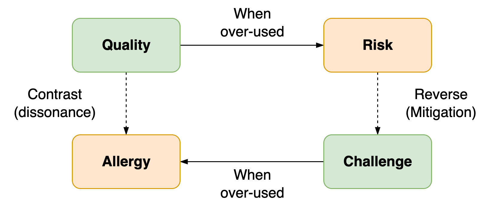

# Coaching

Coaching is about providing a soundboard, through questioning. It's oriented towards potential and results.

See also [goals](../organization/goals.md), [purpose](activity/purpose.md).

[toc]

## Overview

> Help people (teams) move from who they are now, to who they’ll be in the future, in a way that maximizes well-being.

Coaching revolves around the preferences of the coachee. It consists of a series of [conversations](conversations.md) in which:

- The coach helps the coachee to see new perspectives and potential.
- The coachee decides how to incorporate this.


Two main modes are: critical and supporting.

|              | Critical Coach           | Supporting                          |
| ------------ | ------------------------ | ----------------------------------- |
| **Core**     | Challenge, direct        | Empathy, understanding, inspiration |
| **Attitude** | Avoid failure, do better | Learn from experience               |
| **Energy**   | Pushing, sprinting       | Growing, step by step               |

### Intent & Purpose

Help the coachee achieve the what they want.

Coaching is not limited to planning and goal-setting. It may range from:

- Empathy, recognition
- Provide a soundboard
- Provide a new perspective
- Challenge perceived obstacles
- Show blind spots
- Explore potential
- Choose a next step
- Plan a next step

### Method

Coaching is **result**-oriented. This means:

- Start with a desired result, based on the preference of the coachee. Note that desires may change over time.
- Optimism rather than pessimism.
  - Explore core desires rather than fears.
  - Focus on potential. Explore options rather than obstacles.
  - Emphasize what is possible, instead of what is not.
  - Emphasize what worked well over failures.
  - Start half a step ahead, rather than miles away from what's realistic.
- Practical steps rather than theory and analysis.
  - Don't over-analyze problems

- End conversations with an action point.
- Let the coachee come up with solutions. Then explore these.
  - Don't provide solutions.

**Requirements**

Necessary conditions.

- Trust. Which requires:
  - Confidentiality.
  - Compassion. A genuine optimistic view of the coachee.
  - Clarity.
  - Transparency about context, motivation, interests, other parties.
  - Request approval when approaching boundaries. E.g. for personal questions, giving suggestions.
- Agreement on the coach-coachee relation.
- Sessions
  - Intake session to align expectations and set an initial objective. Check the expectations with respect to coaching itself.
  - Repeated conversational sessions that end with action points.

### Team Coaching

Coaching team requires a balance between addressing the team and individual members.

A common pattern is to focus on the team at the start and the end of projects (iterations), and pay attention to on individual members during the middle of the projects. In between projects the team is given the room to to focus.

**Stance**

- *Invite* team members to provide feedback and relflection, rather than filling in how they behaved. E.g. *"How did you feel after that meeting?"*, rather than *"I noticed that you rushed and ...."*.
- Align and check assumptions.

## Context

### Power dynamics

Coaching requires confidentiality. Avoid conflicting interests.


**Anti-pattern**

Coach as a middlemen, between the employee and manager.

### Supporting roles

Differences between coaching, mentoring and consulting.

**Focus**

Differences in focus:

- Coaching: intersection of the subject and a *context*. E.g. an organization.

- Mentoring: intersection of the subject and a *domain*. E.g. a sport or craft.


**Behaviour**

Differences in problem solving:

- Coaching: Help the subject to solve a problem.
  - Or, challenge the obstacle itself.
- Mentor: Show alternative approaches to a problem.
- Consultancy: Provide *a* solution for a problem. In addition to aligning and emphasizing the need for solutions.

|                 | Coach                             | Mentor                              | Consultant                       |
| --------------- | --------------------------------- | ----------------------------------- | -------------------------------- |
| **Focus**       | Personal (empathy)                | Domain                              | Diagnose problem                 |
| **Goal**        | Explore, improve self-awareness   | Training                            | Advice, second opinion           |
| **Attitude**    | Beginner's mind                   | Expert                              | Unbiased expert                  |
| **Method**      | Active listening<br />*What, how* | Teach, explain, <br />use analogies | Specific questions<br />*5x Why* |
| **Questioning** | Ask open questions                | Answer questions                    | Provide advice                   |
| **Mode**        | Facilitate subject                | Lead subject                        | Provide service to subject       |

## Templates

**Compass**

Purpose: zoom in towards core values and motivation.

```markdown
- Context
- Static reality
 - Obstacles
 - Competence
 - Values
 - Ambition | big A
- Potential
 - Goal | petit a
```

**Qualities & Allergies**

Purpose: understand extreme forms of behaviour. See [communication-principles](communication-principles.md) and also [personality](personality.md).

```markdown
List of

- Quality (a trait)
  - Pitfalls of the quality. When there is too much of the quality.
  - Challenge: how to overcome the pittfall.
  - Allergy: the opposite of the quality.
```



**Needs (Maslow)**

Purpose: understand where desires come from.

```markdown
List of

- Inherent needs
  - Value. Based on difference.
  - Desire. Change difference.
  - Fear. Perceived risks.
```

In two dimensions

1. Personal. Well-being (safety) versus agency in an environment.
2. Social . Inclusion (belonging) versus status in groups (prestige).


**Actionable**

```
How likely do you feel/think this is to succeed? What would you need in addition?
How motivated are you on a scale from 0-10? Why not higher/lower?
```

**Challenging**

Prompts

- Empathy. *"Seems like he had a reason for saying that."*
- Dissociate. *"You are aware of the thought of X"*
- Out of the box. *"What would need to be true for you to belief this?"*

