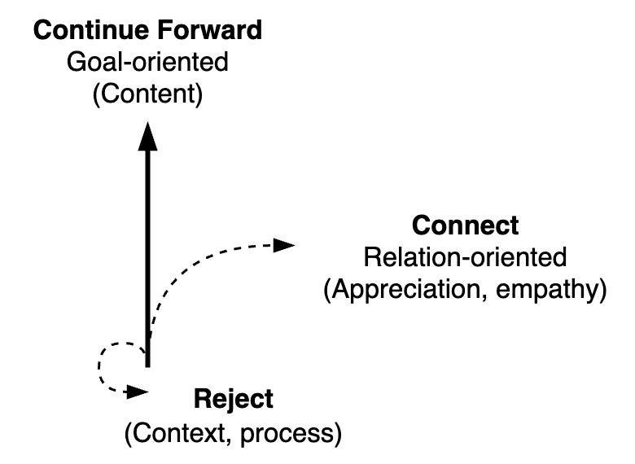

# Communication Triangle

## Overview

Dimensions

- Result-oriented or people-oriented.
- Focus on the present, focus on the future.
- Command or invite.
- Form or content.

## Components

Communication consists of more than [messages](messaging.md) (i.e. content). Two pillars are necessary in order to communicate a message: *process* and *relation*.

- Process (form). Shared expectations of how to communicate. Any etiquette and formalities.
- Relation. The bond between the participants. How they feel about each other. Including their history and power dynamics.

A fourth component is *context*. This affects the meaning of each point.

**Conversation Flow**

Move naturally between corners for a good, balanced conversation flow. Avoid dwelling too long on a single aspect.

**Perspectives**

First, second, third position.

1. The self. I, how I see/feel/hear it.
2. The other, with whom I interact.  How they see/hear/feel
3. An outside view. Someone who’s not involved. “Objective”

## Direction

Communication can focus on moving forward (towards a goal), connecting to each other, or to slow down and reconsider. See [change](../subjects/change.md). Also see [styles](https://www.zuidema.nl/blog/stijlflexibiliteit-welke-stijl-zet-jij-in-om-effectief-te-communiceren).

| Focus    | Direction      | Communication styles       | Space         |
| -------- | -------------- | -------------------------- | ------------- |
| Content  | Moving forward | Pushing, commanding 🫳      | Take space    |
| Relation | Connecting     | Pulling, inviting 🫴        | Welcome space |
| Context  | Slow down      | Avoid, diffuse, disengange | Create space  |

### Pushing

Communication styles that help you move forward. Take in space. Emphasize ratio. Focus on content.

- **Asserting**. Make deliberate statements. Do this carefully, with precision. E.g. use:
  - Evualuations. *"That was good"*
  - Expectations. *"I expect X when Y"*
  - Consequences. "If X, then Y"
- **Persuading**. Use layers of arguments to strenghten your case. E.g. use
  - Proposals. *"I propose that ..."*
  - Reasons and facts. *"Because ..."*

Shared understanding --- persuade / change direction purpose

|            | 💡 Asserting           | 🗣️ Persuading                     |
| ---------- | --------------------- | -------------------------------- |
| **Method** | Statements            | Reasoning                        |
| **Focus**  | Shared understanding  | Judgement. Actions and decisions |
| **Scope**  | Context. Where we are | Goal. Where to go                |

### Pulling

Communication styles that emphasize connection. Invite the other to come closer.

|              | 💡 Overcome difference                      | 👂 Reduce difference     |
| ------------ | ------------------------------------------ | ----------------------- |
| **Why**      | Find a shared purpose. Find common ground. | Connect to each other.  |
| **What**     | Inspire, motivate                          | Empathize               |
| **Attitude** | Enthusiasm                                 | Curious,                |
| **Style**    | High energy, great ideas                   | Intimate, compassionate |
| **Method**   | Tell stories, envision possibilities.      | Ask, listen, disclose.  |

Connecting to the other may involve:

- Active listening. Verbally and non-verbally. Asking follow-up questions.
- Summarizing or paraphrasing what was said.
- Mentioning what you see. Suggesting evaluations.
- Disclosing. Express what you feel.

