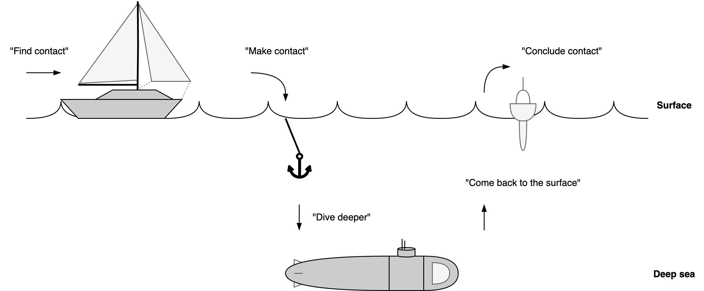

# Conversations

This document focusses on coaching and planning conversations.

[toc]

## Introduction

Note

- First impressions have a strong effect on each other's perception and attitude.
- It takes time and effort to gain trust. Deep personal questions can be inappropriate if there is not enough trust.
- Conversations are about flow, rather than about steps.

For coaching conversations

- The other decides when they're ready to move further.
- Provide choices to the other. Request approval before giving advice, making suggestions, asking personal questions or changing topics.
- Verify assumptions.

## Flow

Principles

- Natural lanuage and nonverbal communication is ambiguous. 
- Communication requires trust.

Moving between different topics requires care, especially for difficult converstations.

Conversations tend to move. E.g.:

- From superficial to deep topics.
- From casual to personal topics.
- From passionate topics to goodbyes.

The style may change, as more trust is build up.

- From playful to serious.
- From formal to personal.

## Topics

See communication principles.

## Types

Group conversation types.

- Social small talk. Current events, sports, hobbies.
- Catching up. Mention milestones.
- Storytelling. E.g. personal experiences.
- Emotional support.
- Opinions and debates.
- Advice-seeking.
- Planning and organizing.

|              | Small Talk          | Passionate Talk | Deep Conversation     |
| ------------ | ------------------- | --------------- | --------------------- |
| **Content**  | Anything            | Specifics       | Personal experiences  |
| **Form**     | Casual, superficial | Directed        | 1:1                   |
| **Relation** | Non-personal        | Shared interest | Trust & vulnerability |
| **Pace**     | Fast                | Energetic       | Careful               |

## Models

### Small talk

Move from small talk to deep conversations (and back)

1. Greeting. Make contact. Acknowledge each other. Set expectations.
2. Content.
3. Goodbye. Commit to future actions.

### Professional conversations

Each level should be sufficient, before moving to the next level. Jumping to the last step may cause misunderstanding.

1. Small talk
2. Relation
3. Personality
4. Expertise
5. Style
6. Content

### Grow model

[GROW](https://en.wikipedia.org/wiki/GROW_model) model.

### Competency-value Model (Coaching)

Initially the ambition might not be clear. Facilitate the coachee to discover it.

**Flow**

After making contact, sitting down and small talk, continue to a deeper conversation.

- Start with the **context**. Learn about the environment.
- This often touches certain perceived **obstacles**. Listen to these, but do not dwell on them. Put them into perspective, challenge them or look past them. Explore what is possible.
- To look past obstacles it can help to moving the focus to either a **competency** or personal **value**. Emphasize these and explore how they can contribute to the coachee. Explore capabilities.
- Move back and forth to topics based on intuition. Zoom in and out by exploring (future) **ambition**.
- Eventually, move towards concrete, alternative **behaviour** that could help.
- Let the conversation end with action points. Check whether these match the preferences of the coachee.

**Side stepping**

> Read between the lines.

Pay attention to topics that are significant or that bring up emotions. These are keys to underlying factors. Be mindful of non-verbal clues.

- Linger on these topics. Avoid rushing a conversation. Dare to pause and be silent.
- Given a topic such as an event, consider both the resulting *behaviour* and the *experience* (feeling).
  - Effect: "How did that affect you?"
  - Behaviour: *"How did you react?"*
  - Feeling: *"How do you feel about that?"*
- Link these topics to the ambition. Explore how they relate to the ambition.

**Active listening**

Listen actively. Recognize the other. Be fully empathetic. Put yourself in the other's shoes, without judging.

- Note that communication is bidirectional. Be mindful of your own appearance (incl. nonverbal communication).

Tools

- Focussing
  - E.g. repeat a significant phrase. Address a relevant (nonverbal) signal.
- Exploring. This is useful when the other is sending multiple or mixed messages.
  - Summarize what was said.
  - Involving. Ask open questions.
  - Check assumptions.

**Values**

Typical values, categorized by direction:

- Integrity. Respect, fairness, justice. Transparency, honesty.
- Autonomy, independence, liberty.
- Self-actualitzation, creativity, challenge, purpose. Dynamic lifestyle.
- Social-economic position. E.g. status, influence, wealth. Static lifestyle.
- Security, safety.

**Associating and dissociating**

Different topics focus attention on different aspects of life. They help to associate and dissociate.

