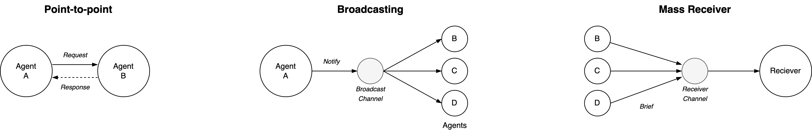

# Documentation

> Use documentation to recall conversations rather than as an alternative for them.

The goal of documentation is to externalize thinking. This helps with aligning the whole organization.

Summarize higher level in one-pages, but do use appendices (for details) and link to additional sources. See also [writing documentation](https://github.com/voschezang/coding-handbook/blob/main/documentation.md).

[toc]

## Practice

Respect the audience.

- Emphasize what works well. Be inspriational.
- Mix text with sketches and models.

## Scalable Status Updates

The consider the following modes of scaling. See [communication patterns](systems/communication-patterns.md).

1. One-to-many. E.g. an employer to employees.
2. Many-to-one. E.g. an employee to an employer or manager.

|                  | Broadcasting            | Mass Receiver                       |
| ---------------- | ----------------------- | ----------------------------------- |
| **Relationship** | One-to-many             | Many-to-one                         |
| **Purpose**      | Push ideas or commands. | Notify someone.                     |
| **Example**      | Employer to employees   | Employee to employer                |
| **Inititative**  | Sender                  | Receiver. They can ask for details. |



**Effort**

> You can write a weekly update in 7 days.

- Write down signals during the week. Investigate the most relevant or urgent ones.
- After each week, select the most relevant signals and ideas.

**Style / Tone**

> Make it a joy to read

1. Start with the core message - from a high level. E.g. a single sentence (hook).

2. If desired, add additional 

3. Then, list positive and neutral points. Be liberal in giving compliments.

4. Finally, list negative points and risks briefly but objectively. *Decouple* objective events from opinion and speculation.

   1. Leave the solution open. Avoid converging into a single solution (tunnel-vision). E.g.:

      ```markdown
      - "I'm thinking about this ~~initiative~~ outcome."
      - "There are at least 3 directions to change this."
      ```

## Template: One-to-many

### Focussed

```markdown
**Core message**
- Project A has been cancelled

**Core Details**
A clarification of the core message. An interpretation or suggestion.
- Such and such
- So and so

**Other messages**
Any relevant signals, risks or notes.
```

### Informational

Purpose: give an high-level overview what's changing. Can be used as preparation for a status meeting. See also [feedback](collaboration/communication-principles.md).

Note: This template is ideal for abstract and technical topics. It is less suited for personal, emotional or sensitive topics.

 ```markdown
**Focus / Core Message**
E.g. OKRs, health indicators.

**Last Week / Month**
- 1-3 most relevant points

**This Week / Month**
- 1-3 most relevant points

**Risks**
Any noteworthy risks. Ranging from emergent to nightmarish.

**Awareness**
Communicate how it is going with a team or project.
- People (resources)
- Purpose (alignment, vision)
- Process (quality)

**Notes**
Anything else that's relevant. E.g.
- What is the latest good news?
- What did we learn recently?
 ```

## Template: Many-to-one

- Style. Short bullet points - ordered by importance. Make it easy to understand. Reduce ambiguity and surprises. 
- The receiver might receive many messages. Faciliate their efficiency.
- Give the receiver the opportunity to ask details about what's relevant *for them*. Give them the initiative.

Template

```markdown
**Bullet points**
- A is in the final stage.
- B did progress half as fast as expected.
- C is released.
```

