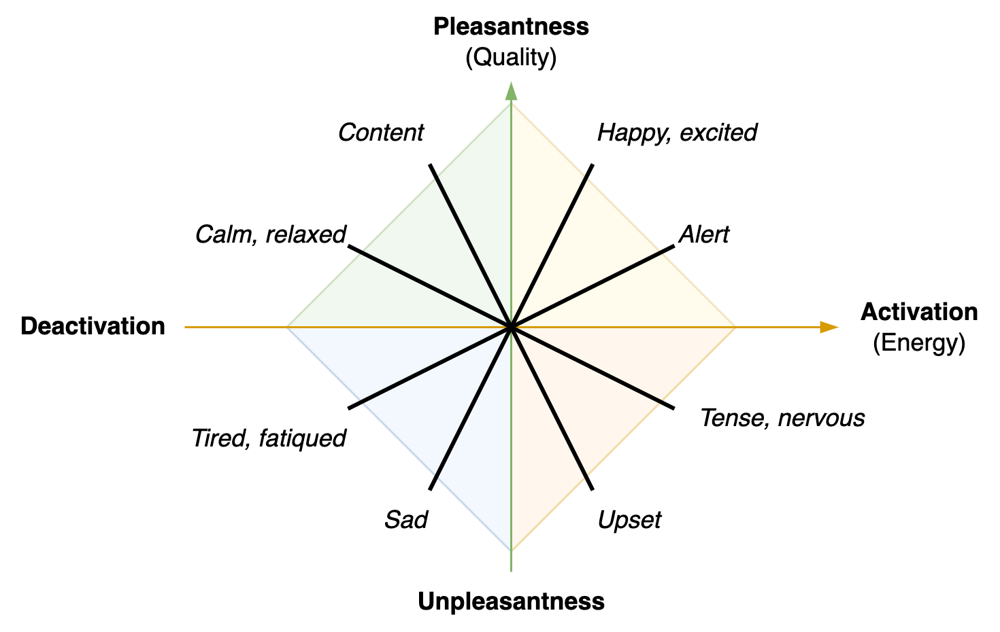

# Emotions

> Emotions can be experienced in endlessly new ways.

Emotions are dynamic. They are experienced, rather than fixed.

1. Experience ranges from [pleasant](#Experience) to unpleasant.
2. Emotions provide a [multiplicity](#Emotions) of experience.

Emotions are used as communication devices. Between your body and mind and between yourself and others. In addition, they are highly dependent on the environment and someone's interpretation of it. For example, image the difference between seeing a lion in the zoo or on the street.

## Experience

We can distinguish two dimensions: **pleasantness** (quality) and **activation** (energy).

Some higher dimensions are guilt, shame and surprise. These reflect (dis)liking of a primary emotion in a certain context.

## Primary Emotions

Emotions communicate *qualities* and personal needs. They are  have both personal and social effects.

- Happens indicates quality of pleasure. Sadness indicates the loss of it.
- Anger and fear indicate conflict, disruption and loss of quality. Anger relates to crossing [boundaries](https://en.wikipedia.org/wiki/Personal_boundaries) and [pushing](https://en.wikipedia.org/wiki/Aggression).

**Flow**

> Emotions flow

Emotions *disrupt* the human body temporarily. After a burst of emotions (e.g. crying or laughing), the human body tends to return to a [balanced state](https://en.wikipedia.org/wiki/Homeostasis). The two extreme deviations of this are an absense of emotions and a persistency of specific emotions. These signal an imbalance. Examples of long-term, persistent emotions are depression, hate and paranoia.

|                          | 😁 Happiness               | 😭 Sadness                | 😠 Anger                        | 😱 Fear                      |
| ------------------------ | ------------------------- | ------------------------ | ------------------------------ | --------------------------- |
| **Purpose**              | Indicate quality          | Indicate loss of quality | Indicate disruption of quality | Indicate risks to quality   |
| **Social**               | Connect *more,* broadcast | Connect *less,* retreat  | Push existing relations        | Question environment        |
| **Individual Behaviour** | Immerse, trust            | Pause, step back         | Be assertive                   | Be careful. Stay alert.     |
| **Extreme Behaviour**    | Cheer, moan, laugh        | Retreat, cry             | Be aggressive                  | Lose confidence. Be anxious |

Dutch translation: *blij, bedroefd, boos, bang*.

Other emotions

- Desire. Love, longing.

- Disgust. From liking to revulse.

- Surprise. From awe to disbelief (skepticism).

