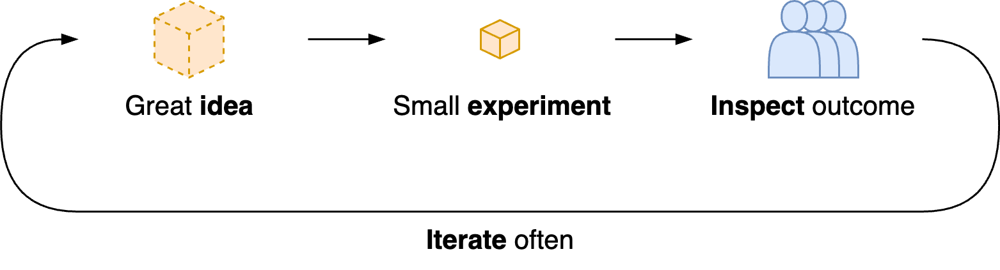

# Gardening for Teams

Managing teams has many similarities with managing a garden. In a garden, you plant seeds, rather than giving orders. Plants grow by themselves, if their environment can support it. Weeds (bad behaviour) are addressed periodically.

[toc]

## Context

This document considers (semi) self-managing teams. It assumes that:

-  Team members have some level of agency. They will make many decisions on their own.
- Team members are expected to work autonomously. They will adapt to uncertainty in the environment.

Typical difficulties in such environments are alignment, motivation and collaboration.

The subjects can be junior, senior or new team members.

## Principles

It can be difficult to find a the right balance between coaching, mentoring and delegating. Ideally there are clear expectations, motivational goals and engagement.

### TEAM

Inspired by the TEAM acronym from See *Hunt, Gather, Parent*.

|                          | **Intent**                                        | **Practice**                                           |
| ------------------------ | ------------------------------------------------- | ------------------------------------------------------ |
| **Together**             | Participation over delegation                     | Pair up                                                |
| **Encourage**            | Inherent motivation                               | Incentives over rules,  opportunity over problems |
| **Autonomy**             | Initiative of members                             | Discover what members want, but cannot do              |
| **Minimal Interference** | Avoid micromanagement / spoon-feeding information | Provide room to struggle & learn                       |

This does require proper guard rails. 

- The environment should be resilient enought to handle (small) mistakes.
- The environment should be [safe](https://en.wikipedia.org/wiki/Psychological_safety).

Cross-functional teams. Diversity in experience and specialziation. Similar to a [joint family](https://en.wikipedia.org/wiki/Hindu_joint_family), team members will learn from each other, coach each other and they will see others learn.

### Empiricism

Transparency, inspection and adaption. See [empiricism](../intelligence/empiricism.md). This requires the willingness to take risks, which requires psychological safety.

### Psychological Safety

See [teams](teams.md).

#### AAA

Many (work) environments have emotional challenges. E.g. dealing with setbacks, competition or incidents. This acronym provides a path to address these.

- This is about addressing radical change. This differs from handling day-to-day change, as seen in hectic (chaotic) environments.

Caore: Slow down, rather than jumping to conclusions, or reacting immediately. Find *grounding*, before acting.

1. Awareness. By paying attention.
2. Acceptance of the new reality.
3. Agency. Exercise influence.

## Communication

- Be liberal in share needs and desires. Then others can be considerate.
  - Sharing doubts is enough. Doubts are just a signal.

- Make requests rather than demands. Autonomy means that people can say no.
  - Pressure can be increased through facilitation and sanctioning. Communicate consequences.

## References

*Hunt, Gather, Parent* 