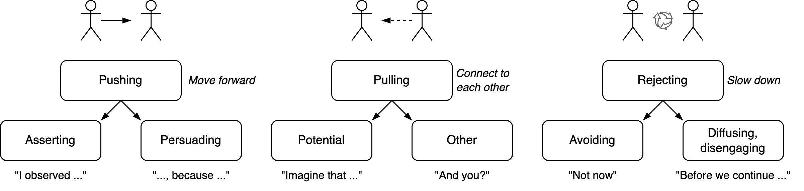

# Messaging

Communication is often bi-directional and complex. It can be deconstructed into *sending* and *receiving* messages. Each message consists of a verbal and a non-verbal component.

[toc]

## Overview

Communication can focus on moving forward (towards a goal), connecting to each other, or to slow down and reconsider. See [change](../subjects/change.md). Also see [styles](https://www.zuidema.nl/blog/stijlflexibiliteit-welke-stijl-zet-jij-in-om-effectief-te-communiceren).


| Focus    | Direction      | Communication styles       | Space         |
| -------- | -------------- | -------------------------- | ------------- |
| Content  | Moving forward | Pushing, commanding 🫳      | Take space    |
| Relation | Connecting     | Pulling, inviting 🫴        | Welcome space |
| Context  | Slow down      | Avoid, diffuse, disengange | Create space  |





### Pushing

Communication styles that help you move forward. Take in space. Emphasize ratio. Focus on content.

- **Asserting**. Make deliberate statements. Do this carefully, with precision. E.g. use:
  - Evualuations. *"That was good"*
  - Expectations. *"I expect X when Y"*
  - Consequences. "If X, then Y"
- **Persuading**. Use layers of arguments to strenghten your case. E.g. use
  - Proposals. *"I propose that ..."*
  - Reasons and facts. *"Because ..."*


### Pulling

Communication styles that emphasize connection. Invite the other to come closer.

|          | Potential                                  | Other                  |
| -------- | ------------------------------------------ | ---------------------- |
| **Why**  | Find a shared purpose. Find common ground. | Connect to each other. |
| **What** | Inspire, motivate                          | Empathize. Learn.      |
| **How**  | Tell stories, envision possibilities.      | Ask, listen, disclose. |

Connecting to the other may involve:

- Active listening. Verbally and non-verbally. Asking follow-up questions.
- Summarizing or paraphrasing what was said.
- Mentioning what you see. Suggesting evaluations.
- Disclosing. Express what you feel.


## Sending Messages

See [communication-monologues](../communication-monologues.md).


Challenging & activating people.

- Informing, e.g. over email. one-to-many
- Checking in. Sharing news and verifying follow-up actions
- Challenging. 
  - Bridging, invite change. one-to-one (conversation). bi-directional, through conversation or one-way
    - Coaching
  - Push boundaries. Use authority
    - Eg mentoring, teaching
  - one-to-many (broadcasting). through alerting

(at individual or group level)


### Initiating contact / setting the state

...

### Requesting Change

Motivation for change: a problem or opportunity.

Steps.

1. Align on the **problem**. Move from my problem to our problem.
2. Align on a **solution**. Define a desired state or objective.
3. Align on a **implementation**. Find a path to reach the objective.

### Giving Feedback

> Giving feedback = disclosing information about yourself

Principles

- Let the other come up with a solution, rather than handing one directly to them. This increases follow-through.
- Separate the observation and your interpretation. Avoid judgement.
- Requests questions where "no" is an acceptable answer - in contrast with *demands*. When the answer is no, then empathize with the other's needs, rather than strengthening the request.

Steps for giving feedback. For sensitive topics or unpredictable receivers. Ensure alignment on each level.

1. **Event** (objective). Describe your observation of a signal.
2. **Effect** on yourself (subjective). Meaning, your interpretation.
3. **Pause**. Give the other space to accept, interpret and react.
    - Ensure there is alignment. Verify that the other can relate to your view?
4. **Desired** effect. Definition of success. What you need.
5. Suggestions or a **request**.

Template: alternative forms.

```markdown
- event-effect-pause
- observation-effect-you
- observation-feeling-need-request
```

#### Anti-patterns

- Mix the event and the subjective effect. The receiver might disagree with aspects in this statement and consequently neglect the whole message.
- Compliment sandwich. Pack criticism in between seemingly softening compliments, instead of being straightforward and sincere.

### Delivering News

There are two main tools. They determine the initial expectation.

- Great (significant) news.
- Casual or ordinary news.


Priming: good or bad news.


Layers of information.

- A potential change. It's implications.
- Resulted change. Realization.


**Guidelines**

- Keep it simple. Don't make it bigger than it has to be. Find incremental steps / nuance.
- Decide what the most appropriate core message should be. Make it suitable to the current working relation.
    - Mention what you want in a addition to the news.
- Find an appropriate moment to deliver the news. This may be in a meeting or outside of business hours.
- Relate to the other. Ensure that the other accepts the message.

**Plan**

Although this usually happens between two people a plural form is used to allow for a more generic description.

1. Make **contact**. Set the stage and the tone.
    1. Initiate the interaction, ensure that the both parties are paying attention. E.g. "We have something important to tell you".
    2. (Optional) establish empathy. Acknowledge that there may exist strong emotions.

2. **Delivery** without explanation. Deliver the core message concisely. Don't immediately start a justification or defense.

3. Let the other **acknowledge** the message.
    1. Let the other party understand and then accept the message.
        1. Acknowledge the emotional reaction of the other party and attenuate it. For example, show genuine understanding, compassion. Apologize, offer reassurance or react non-verbally.
        2. Repeat this until the emotion or sentiment is cleared. If necessary, reiterate that the decision is final.

    2. Let the other party decide when it is time to continue (with an explanation or action point). If necessary repeat the third step.

4. **Explain** or justify the message or decision. Then keep acknowledging the emotional reaction and attenuate it.

5. **Future**
    1. In case of agreement or acceptance: continue with the How, start making concrete plans.
    2. In case of rejection: offer help, ask what is necessary to reach acceptance. Re-iterate your commitment to their wellbeing.


### Proposing ideas

#### 🍔 Hamburger model

Present a proposal, give 2-3 reasons, then re-iterate the propsal.

Each reason can be elaborated with an example

```markdown
1. "We believe that ..."
2. "For two reasons: ..."
3. "That's why we believe that ..."
```


### Responding to Messages

#### PREP Model

Point reason example point (PREP)

- Give short answers to a business queries.
- React directly, give a reason and give an example.

```markdown
# Point
1. Pause, before reacting verbally. Look up rather than down. Nod you head.
2. Paraphrase the question.
3. Point. Answer briefly and assertively. Bottom line up front (BLUF).
   - “We strongly belief that ...”

# Reason
Logic. Appeal to the _rational_ side of the audience.
1. "The reason why ..."

# Example
A story. Appeal to the _emotional_ side of the audience.
1. A datapoint.
  - "We've seen X."
2. A generalization.
  - "This happens twice a month. The impact is ..."

# Point
Re-iterate. Repeat the main point.

# Relate
Relate back to the audience.
1. "How does that sound? What questions do you have?"
```


## Receiving Messages

See also

- Handling complaints
- Handling conflict
- Saying no (to the idea)

### Receiving Feedback

Steps

- **Listen** to the message itself.
- **Interpret**. Feel the consequences. What's the result if this this hypothesis would be true?
- **Clarify**. Ask questions.
- **Evaluate** whether the message is useful.

### Receiving Complaints

Note that a "mistake" can be defined as an event and an emotion.

1. Calm down: **come inside**
    1. Give the other the opportunity to complain or to let out rage. Let all complaints blow past you.
    2. Be on the same level down before discussing content

2. Acknowledgement: **sit down**
    1. Acknowledge the complaint, apologize, take responsibility.

3. **Focus**. Specification and reduction. Reduce chaos: choose a beverage
    1. Make the complaint concrete. Ask questions. Go from global/generic to local/specific.

4. **Align**. commit, make a promise
    1. Make commitment to find a solution. Note that this could merely alleviate the problem.

5. **Plan**. Discuss solutions: look outside
6. Ask/offer future collaboration.
7. Compliment: **farewell gift**