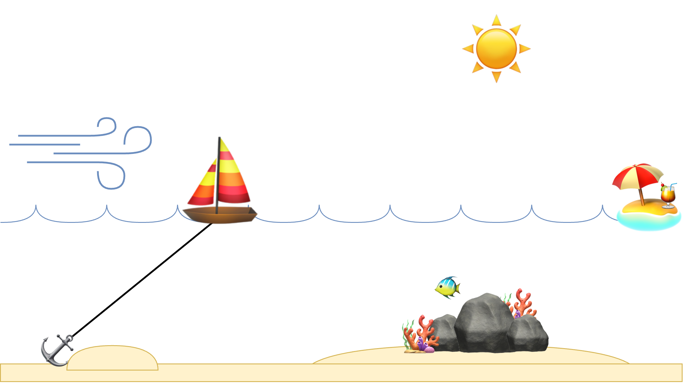

# Retrospective Templates

See [psycholgy](../psychology), [health](../psychology/health.md) and [goals](../labour/goals.md).

https://retromat.org/en/

[toc]

## Overview

Principles

- Use a warmup exercise to set the mood. Manage expectations.
- Use multiple time-boxed exercises to stimulate a good balance of going wide and going deep.
  - Bring attention back to the group in each next section.
- Switch between individual and group conversations.
  - "How do you see this?"
  - "Does anyone recognize this?"
- Follow-up on interesting answers.
- Reserve a brief moment at the end to reflect on the session itself.
  - "What are your takeaways?"


Focus on flow, rather than control

- Loop over the group after each iteration
- Lots of degrees of freedom in between


## Introductions

### Read the room

#### Weather report

How do you feel, after the last week? Choose one of either:

```markdown
- Storm
- Rain
- Clouds
- Sunshine
```

How did you make this choice? What events did you consider?


#### ESVP

How do you feel? Use one of the following categories. [src](https://retromat.org/en/?id=1)

```markdown
- Explorer. Eager to learn.
- Shopper. Optimistic and ready to find a good deal.
- Vacationer. Relax and observe.
- Prisoner. Feel forced to participate.
```

What did you take into account for this choice?


### Expectation Management

Possible prompts

```markdown
- What is the purpose of this session?
- What do you need from this session?
- Why retrospectives?
- What brings you here?
```


## Reflection & Recap

> How did you win? > Why did you lose?

Focus on what worked, rather than listing all possible problems.

```markdown
What did you learn in the last weeks?
```


What should we?

```markdown
- do more of | repeat
- do less of | avoid
```


Name events that made you feel either:

```markdown
- pleased
- surprised
```


### Storytelling

```markdown
- What was your favourite moment?
- What was a novel (surprising) moment?
- Which change turned out be helpful?
```


## Goal setting / focus

### Value Chain

Focus on the value chain.

- List the components of the value chain.
- Let the team reflect on components on this chain.

Verify

- Are the segments clear? What are the exceptions?
- Is there uncertainty or risk involved in specific segments?


### Value Proposition


|                    | Service Provider      | Service Consumer         |
| ------------------ | --------------------- | ------------------------ |
| **Identity** (who) | Products and services | User profile             |
| **Purpose** (why)  | Mission / vision      | Job / role               |
| **Gains**          | Gain creators         | Benefits                 |
| **Pains**          | Pain relievers        | Liabilities, impediments |


|                    | A Team Member         | Rest of the Team         |
| ------------------ | --------------------- | ------------------------ |
| **Identity** (who) | Activities / services | Roles of team members    |
| **Purpose** (why)  | Goals                 | Role in the organization |
| **Gains**          | Gain creators         | Benefits                 |
| **Pains**          | Pain relievers        | Liabilities, impediments |


### Remember the future

Imagine the next 2 weeks go perfect. 

```markdown
- What does that look like?
- What would you hear?
- What do you feel?
```


### Cover story

Imagine a [cover story](https://gamestorming.com/cover-story/) a decade from now. Start with brainstorming

```markdown
- Brainstorm: initial ideas for the cover story.
- Quotes: what people might say.
```

Then assemble the article.

```markdown
- Cover: the main message. A BIG story of their success.
- Headlines: key results and achievements.
- Sidebars: interesting facets of the cover story.
- Images: to supporting the content.
```


## Planning

### Follow through

Refine the initiatives for a given objective. [src](https://retromat.org/en/?id=117)

```markdown
- Action.
- Motivation. How can we motivate ourselves to do this? 
- Ease. How can we make it easy to do? 
- Reminder. How will we remember to do this? 
```


## Brainstorming / Sense making

### Sailboat

Imagine sailing across the ocean.

```markdown
- 💨 What our wind? What pushes us forward?
- ☀️ What's our sun? What gives us energy?
- 🎯 What's our goal? In what direction are we moving?
- ⚓ What our anchor? What keeps us in place?
- 🪸 What are the reefs? What risks are out there?
```



### Air Balloon

Imagine flying in a hot air balloon. Together you're trying to go somewhere.

```markdown
We're flying towards `[..]`.
- ♨️ Hot air. What is lifting us up? What is giving us success?
- ⚓ Rope, weights. What is keeping us down? What is difficult?
- 🌨️ Weather storms. What risks do you see?
- 🌤️ Sun. What do you appreciate?
```


### Train Station

Image that you're on a train station. Your train is delayed. [src](https://retromat.org/en/?id=127)

```markdown
- Destination. Where is your train going?
- Delay. How much delay is there? What contributed to this?
- Announcement. What is the announced reason for the delay?
```


### Map: focus and collaboration

Let each team member denote where they are on a map. Use arrows to show where they want to move to.


### Crazy Idea

Compile a list of ideas:

```markdown
- What would be a crazy idea?
```

Then reclect each item. What would be the benefits? How else could we achieve those?


### Worst case scenario

Compile a list of ideas:

```markdown
- What would turn the next week/month into a disaster?
- If we 
```

Then flip each item. What would be the opposite of this?


### 3 Qualities

Inspired by [Jnana yoga](https://en.wikipedia.org/wiki/Jnana_yoga).

```markdown
- Drive. What gives you motivation and energy?
- Discernment. Detachement.
	- ❤️ What do you *like*? What do you want to do now?
	- ♻️ What is *good* for you? What would you have wanted to do a year from now?
- Dispassion. How easy is it to defer or delay work?
  *"Focus means saying no"*
```


### RCA: 5x Why

> There is never one problem.

> People are never impediments, but roles can be.

Root cause analysis (RCA). Get to the root of a problem.

Asking `why` can be confronting. To invite openness, make it smaller.

- Make it specific.
- Make it abstract. *"What could we do in the future?"*

```markdown
# Given a problem or event.
- Start positive. What went well?
- Why did this happen?
  - And why did that happen?
    - And why?
      - And why?
        - And why?
```