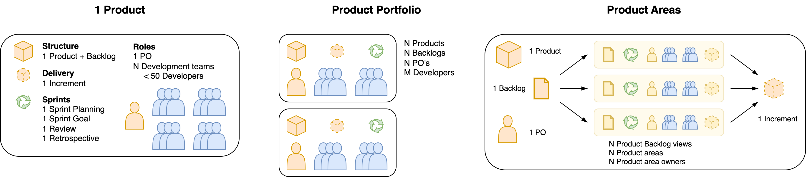
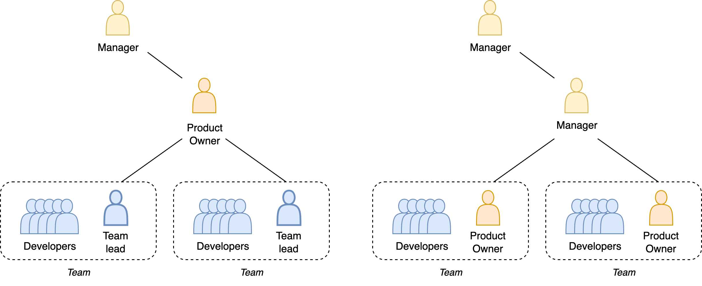

# Scrum

[toc]

## Roles

- Product owner. Goal/thought oriented. Envision plans.
- Developers. Task oriented. Challenge and execute plans.
- Scrum master. People oriented. Facilitate collaboration and process.

## Scale

Scrum can be scaled up in several ways. The following models adhere to Scrum's framework. In general, a single product is associated with a dedicated PO, a Product Backlog, a Product Goal, an Increment and a Sprint Goal.

- In Scrum, it is vital to keep a single PO accountable for each product.
- Teams should be cross-functional and self-organizing. This will allow multiple teams to pick up work from the same backlog.

In order to ensure alignment on a single Sprint goal, planning and retrospective sessions should centralized. 

- Planning sessions can be divided into shared and individual parts. The former focusses on the *why* and *what*, whereas the latter focusses on the *how*.
- Retrospective sessions should at least reflect on the Sprint as a whole, including the shared outcome. They can be complemented by team-specific sessions that reflect on inter-sprint events.

See [systems](../systems/structure.md).

**Anti-patterns**

- Water-Scrum-fall. Waterfall with the following steps. `Planning-Scrum-release`

### Models

**1 Product**

- `< 50` developers, `1` product.

**Product Portfolio**

- `\> 50` developers, `n` independent products.

**Product Areas**

- `\> 50` developers, `1` product.

- `n` product areas,  `n` product area owners.

**Scaling of products and teams**

1. Shared PO. The PO is not part of a single team. The PO delegates to team representatives.
2. Dedicated PO. The PO acts as team lead.

## Scrum in a Waterfall Organization

**Long-term commitments on product planning.**

Problem: This constrains flexibility in choosing a sprint goal.

Workarounds

- Focus on maximizing value within the time-bound.
- Commit to a release date, but keep the scope flexible.
- Align on expectations and risks.

**No self-managing teams**

Problem: the team lacks autonomy and is dependent on the environment (e.g. management).

Workarounds

- Improve goals. Emphasize outcomes over output.
- Adjust leadership style. Move towards servant leadership.

## Anti Scrum

>  Scrum doen’t work!

Consider:

- Did it help you to plan?
- Did it help you to adapt your plan?
- Did it help you to learn?
- Are you using it for the right type of work? (ratio BAU, change)

