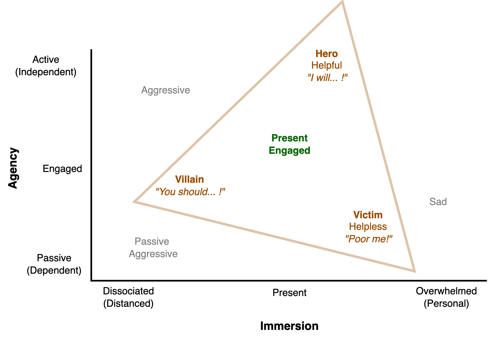

# Social Dynamics

See also [personality](../psychology/personality.md) and [desire](../systems/systems.md).

[toc]

## Harmony

Three approaches to maintain harmony.

|          | Diversity                         | Purity                                    | Elasticity                          |
| -------- | --------------------------------- | ----------------------------------------- | ----------------------------------- |
| **Tool** | Appreciate difference, uniqueness | Appreciate purity, uniformity, conformity | Resolve tensions                    |
|          | Avoid conflict                    | Avoid difference                          | Avoid distance. Keep communicating. |
| **Risk** | Lack of alignment, cohesion       | Exclude minorities                        | Endless cycle of adjustment         |

### Diversity

See [neurodiversity](../psychology/neurodiversity.md).

Benefits

- High variance of ideas. Novel perspectives.
- Equality in opportunities.

Requirements for a diverse workspace.

- Psychological safety. 
  - Learn from failure.
- Social inclusion.
- Welcome difference, rather than striving for conformity.
  - Make it easy to challenge what is "normal".
  - Embrace growth and learning from each other. Especially when the team changes.
  - Be curious, rather than judging.

## Progression

Social relations may change abruptly or gradually.

Events

- First impressions. E.g. the start of a project or meeting.
- New expectations. E.g. when delivering news.

## Antipatterns

Criticism

- Attribute blame to personality
- Overgeneralization (always and never)

🙄 Contempt

- Criticizing while looking down on the other

🛡️ Defensiveness

- Taking a defensive stance, whataboutism
- Counterattacking. “But you also did ...”

🧱 Stonewalling

- Completely shutting the other one off
- Extreme Distancing

## Drama Triangle

[Wiki](https://en.wikipedia.org/wiki/Karpman_drama_triangle) A *reactive* defense mechanism. Three roles that reinforce each other. They can be genuine or played. The latter is associated with hidden expectations.

1. Victim. Subject of problems. Something was taken from them, without their consent. Hence they seek justice. "Everything is so hard"
2. Villain (persecutor). Indicator of problems. Blame, judgingment, angry, authoritarian. *"It's all their fault!"*
3. Hero (rescuer). Solver of problems (symptoms). Enabling. *"Let me help you."*

Dyadic completion. If there is a victim, then the automatic response is to assign (blame) a villain.

## Satir communication stances

|                  | Focus                            | Value                  | Example          |
| ---------------- | -------------------------------- | ---------------------- | ---------------- |
| 🫵 **Blamer**     | External attribution of problems | Blame > responsibility | "They did it!"   |
| 🙏🏻 **Computer**  | Overly reasonable                | Mind > heart           | "Let's think"    |
| 💭 **Distracter** | Avoid conflict                   | Harmony > tension      |                  |
| 🪷 **Placater**   | Apologize, pray                  | Aid > aggression       | "Please help me" |
| 🤡 **Leveler**    | Downplay problems                | Peace > panic          | "Just be calm"   |

