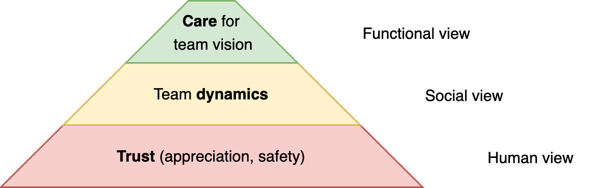

# Performance of Team Members

Performance evaluations are standard in many organizations. Usually they are done by a manager.

Approaches

- Focus on performance. *What did they achieve? In what ways did they contribute?*
- Focus on potential. *What is their capability?*

The former may be followed up by a improvement plan. *What is impeding performance?*

The latter considers knowledge, skill, experience and personality. It emphasises future value over success in the past environment.

**Anti-patterns**

- Focus on evaluation and control, rather than working actively to improve performance.

## Performance models

The following perspectives provide questions that can be discussed. Ideally the answers are used as input for planning sessions. See [team performance](team-performance.md) and [team success](team-success.md).

### Team-based Perspective

This focusses on the question: *Does the subject fit well in the team?*

Trust

- *Is the subject **trustworthy**? Is there toxic behaviour?*

Team dynamics

- *Does the subject **contribute** to the team (product)?*
- *Is the **quality** of contribution high?*
- *Does subject able to communicate and **collaborate** properly?*

Care for team vision

- *Does the subject **engage** actively, in line with the team vision?*
- *Does the subject engage in **improvement**?*

### Performance-based Perspective

This focusses on the question: *Does the subject deliver enough value?*

Capability

- Is the subject **capable** of participating based on their role?

Production

- Is the subject able to **produce** results?
- Is the **quality** of results high?
- Does the subject **enable** others to produce results?

Delivery

- Are the results leading to the right **outcomes**?
- Is the **delivery** of results reliable and predictable?

