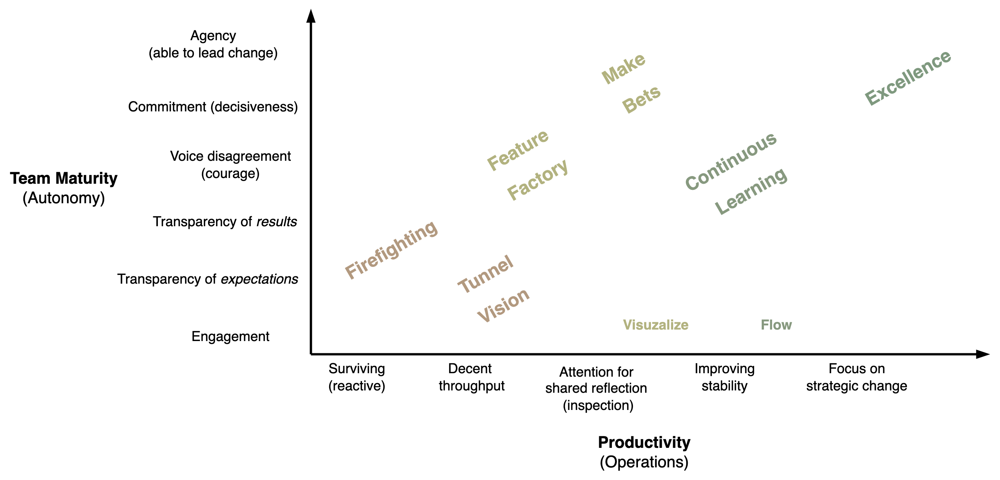

# Team Performance

Team performance is complex and controversial concept. Comparing the performance of different teams is difficult. It is a mix of value delivery, productivity and capability. See [teams](teams.md) for other factors, such as team health, maturity and satisfaction.

[toc]

## Overview

Team performance focusses on production: planning and execution. It makes uses of capabilities to deliver a service to a customer that benefits from it. For businesses this results in profit.

Striclty speaking, **performance** is captured by productivity and the quality of the product. Capability can be measured by *agility*: the speed at which the organization can realize new ideas and deliver results. It consists of organizational capability and technical capability.

- Team **succes** can be defined as a mix of performance and team health (satisfaction).

|                   | ⚙️ Capability                                                 | 📦 Production                                                 | 👤 Delivery            |
| ----------------- | ------------------------------------------------------------ | ------------------------------------------------------------ | --------------------- |
| **Key factor**    | Agility, Maturity                                            | Productivity                                                 | Value                 |
| **Key metric**    | Lead time ([TTM](https://en.wikipedia.org/wiki/Time_to_market)) | Flow                                                         | Revenue (ROI)         |
| **Other metrics** | Decisiveness                                                 | Throughput, [MTTR](https://en.wikipedia.org/wiki/Mean_time_to_repair) | Customer satisfaction |
| **Ideal growth**  | Linear                                                       | Stable                                                       | Exponential           |

The following roles provide **accountability**:

- Product manager. *Build the right thing.* *What is produced.*
- Engineers. *Build it right.* *How it is produced*

There are many other roles. E.g. problem solving, removing impediments and coaching.

### Value Delivery

>  Deliver value ≠ solving problems

Delivery is contingent on a good view of what would be valuable. Product delivery is preceded by product *discovery*. See [results](../labour/realization.md) and [goals](../subject/goal.md).

In general, a team aims to deliver *value* to stakeholders. The definition of value is context-dependent. There can be an emphasis on current or potential value. The latter consists of growth and unrelalized value. See [realization](../labour/realization.md).

## Succes

The strongest signal is when you can feel that the team is happy or productive. Note that a team can function well, despite a difficult environment. Some major signals are:

1. **Vibe**. There is a pleasant vibe in the team. You can feel that the team is happy. Usually this requires physiological safety.
2. **Expectations**. There is *transparency* on expectations. This includes expectations from stakeholders and from team members themselves.
3. **Team results**. There is *transparency* and reflection on on team results. They are compared to original goals.
4. **Resilience**. The team is able to deal with setbacks.

In addition, there are more fine grained signals:

- Individual team members are content within their team and with each other. The team works in harmony.
- There is transparency w.r.t. work, roles and responsibility.
- Conflict is addressed openly.
- The team takes ownership of short- and long-term goals.
- There is accountability of results.
- Stakeholders trust the team.
- Team members find purpose or meaning in their work.

### Cost of Succes

Succes has several risks. It is not guaranteed to be sustainable. 

- The nature of these risks can be either long-term consequences or immediate side-effects.

- It can result in increased stress, competition and stagnation.

#### Risks

**Immediate issues**, as side-effect of succeeding.

- Effects on employees
  - Alienation due to standardization and scale. Less personal involvement and care.
  - More responsibility due to the organization depending on the product.
  - More responsibility due to customers depending on the product.
  - Declining collaboration, due to increased competition of team members..
- Technical problems
  - Security and compliance issues after changing too rapidly.

Limited **sustainability**. Lower agility, higher operating cost.

- Business agility

  - Decreased profitability after attracting competitors.
  - Inability to adapt to market changes, after over-indexing on a specific solution.
  - Becoming extremely conserative and risk-averse, after reaching a local optimum.

- Mismatch in capability

  - Higher expectations of the team from management.
  - Higher expectations of the product from customers.

  - Technical debt after prioritizing short term performance over long term performance.
  - Higher complexity. Higher maintenance cost.

## Improvement

> Team performance converges

Team performance tends to flow. It can be brought up to a stable average. Afterwards it will naturally go up and down over time. It is is influenced by many external factors.

This inherent instability is what makes it important to strive for continuous improvement. From reacting to change to acting pro-actively.

Note that good metrics depends on the context. Metrics such as output (volume), resource utilization and number of incidents are considered anti-patterns.

Typical phases of each factor.

- Value delivery evolves form producing something to producing something valuable, consistently, in line with organizaitonal strategy.
- Value production evolves from firefighting to strategic production. Move from firefighting hats to cowboy hats to engineering hats.
- Organizational capability evolves from reacting to change to pro-actively adapting.

Organizational capability is closely related to team maturity. They emphasise different sides of collaboration and resilience.

Any two dimensions can be visualized in a map.

## Capability

Capability consists of organizational capability and technological capability.

- Organizational capability considers the individual team and the organization that it is a part of. This includes team maturity and agility. It may cover the dynamics between team members, their development and thier satisfaction.

Social dynamics

Factors

- Team members and their dynamics. Team member satisfaction, team maturity.
- Underlying factors: culture, principles, process

