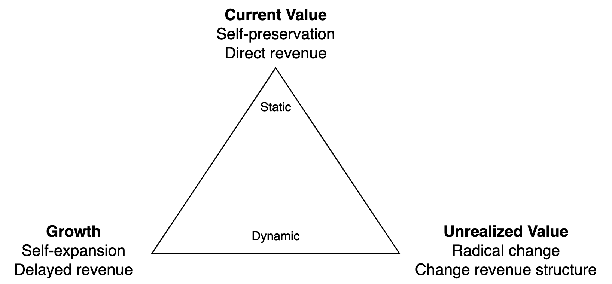
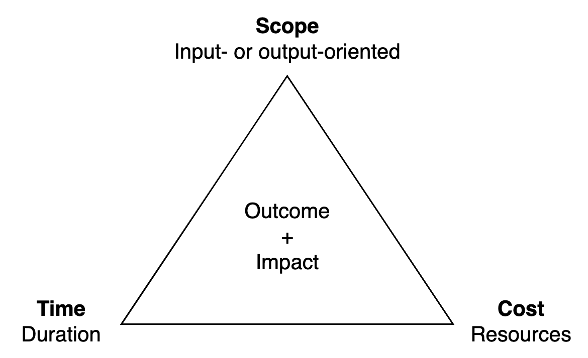

# Team Performance

Team performance consists of the delivery of value, now and in the future. It touches the capability to keep doing this, even when the environment changes. This document emphasises value delivery. See [teams](teams.md) for other factors, such as team maturity, team satisfaction and the team's environment.

[toc]

## Overview

> Team performance converges

Team performance tends to flow. It can be brought up to a stable average. Afterwards it will naturally go up and down over time. It is is influenced by many external factors.

This inherent instability is what makes it important to strive for continuous improvement. From reacting to change to acting pro-actively.

The performance of teams and departments is the result of three key factors.

|                    | Value Delivery                      | Value Creation                                               | Value Enabling                                               |
| ------------------ | ----------------------------------- | ------------------------------------------------------------ | ------------------------------------------------------------ |
| **Core**           | 📦 Products & services               | ⚙️ Production                                                 | 🕸️ (Organizational) Capability                                |
| **Intent**         | *Build the right thing*             | *Build it right*                                             | *Ability to build*                                           |
| **Accountability** | The value chain                     | Quality of products                                          | Ability to *act*                                             |
| **Metrics**        | Revenue, ROI, customer satisfaction | [MTTR](https://en.wikipedia.org/wiki/Mean_time_to_repair), deployment frequency | [TTM](https://en.wikipedia.org/wiki/Time_to_market), organizational health |
| **Growth**         | ↗️ Monotonic growth, acceleration    | ➡️ Operate with constant velocity                             | 🔄 Shift direction. Stay aligned.                             |
| **Result**         | *What is produced*                  | *How it is produced*                                         | *Capability to produce*                                      |
| **Focus**          | Outcome, predictability             | Throughput & quality                                         | Adaptability, coordination                                   |

Note that good metrics depends on the context. Metrics such as output (volume), resource utilization and number of incidents are considered anti-patterns.

Typical phases of each factor.

- Value delivery evolves form producing something to producing something valuable, consistently, in line with organizaitonal strategy.
- Value production evolves from firefighting to strategic production.
- Organizational capability evolves from reacting to change to pro-actively adapting.

### A Machine

Value creation and organizational capability aim to form a well-oiled machine. A product manager aims to utilize this machine to realize a vision, which results in value for customers.

## Value Delivery

> Deliver value ≠ solving problems

In general, a team aims to deliver *value* to stakeholders. The definition of value is context-dependent. There can be an emphasis on current or potential value. The latter consists of growth and unrelalized value.

### Discovery & Delivery

Delivery is contingent on a good view of what would be valuable. Product delivery is preceded by product *discovery*. See [results](../labour/realization.md) and [goals](../subject/goal.md).

### Delivery Methods

Delivery of value entails effectiveness, efficiency and predictability.

Delivery is usually done by completing projects. Projects have a duration, scope and cost.

## Value Creation

Value creation could involve anything that is necessary to provide a product or service. A typical example is engineering.

## Organizational Capability

Organizational capability considers the individual team and the organization that it is a part of. This includes team maturity and agility. It may cover the dynamics between team members, their development and thier satisfaction.

Social dynamics

Factors

- Team members and their dynamics. Team member satisfaction, team maturity.
- Underlying factors: culture, principles, process

