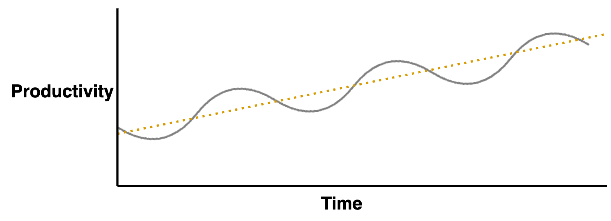

# Team Productivity

A model for team productivity, based on the output of a team. The team's ability to finish its tasks. This view works for independent teams, but does not take into account value delivery (for customers) or external dependencies. See also team [productivity](team-productivity.md) and [success](team-success.md).

Productivity evolves through several phases, either back-and-forth or in a cycle. The typical phases are:

1. 🔥 **Firefighing**. Activities are split between resolving incidents and training new hires. The backlog keeps growing.
2. ⚖️ **Focus**. WIP is limitted to improve lead time and consistency. Work is shared more effectively in the team. Impediments are resolved earlier.
3. ⚙️ **Flow**. The team is stabilizing and cycle time is improving. The team *just* needs time to pay off technical debt.
4. 🚀 **Innovation**. There is room work strategically. The balance between operations and changes shifts.

## The Cyclic Nature of Productivity

The instable phases result to a characteristic pattern, not unlike to boom and bust cycles in economics. Over-optimizing for growth and innovation will fail eventually, and result in a period of underperformance.

Out of the five phases, the innovation phase is the most unpredictable. The absense of clear challenge creates freedom but also doubt. High performing teams may suffer due to:

- Natural entropy caused by new tooling, processes or scale.
- External changes that disrupt the team.
- Organizational pressure to focus on low-performing teams. Team members being be re-allocated.
- Performance is penalized by higher expectations or workload.
- Experiments are seen as a opportunity to cut costs.

This provides two paths forward.

- Focus on innovation and growth. Plan to evolve the team after a limited period of innovation - and continue with phase 1.

- Be conservative and spend a minority of effort on innovation. Attempt to keep a balance between operations and innovation.

