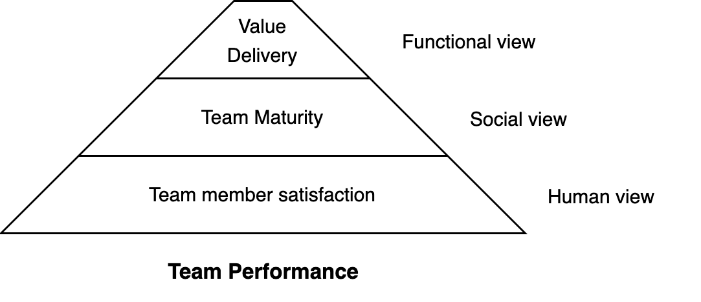
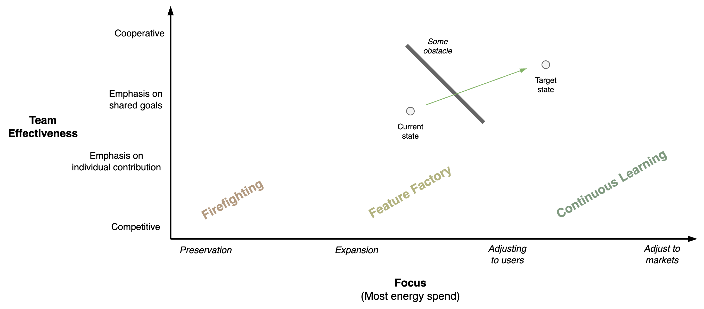

# Teams

A team is a set of players that work together to achieve a shared goal.

[toc]

## Overview

A team is a group of individuals that works together with a specific purpose. The functioning of a team depends on its structure, its members and the environment. Diversity is given by individual personality differences and chosen roles. 

Decision making may happen by agreement, consensus or hierarcy. It can be reactive or pro-active.

Typical roles are:

- A leader and followers.
- Juniors and seniors.

> Authority implies responsibility.

A (servant) leader is not just responsible to lead its followers, but more so to help (facilitate) them. The usefulness of the leader *justifies* their position.

## Succes & Sustainability

Team performance relates to the expectations of it's functioning. It's input and output. It is contingent on two layers.

- The satisfaction of team members. Whether members want to engage in the team.
- Team maturity. Whether the team is stable and works empirically.

### Performance

> Deliver value ≠ solving problems

In general, a team aims to deliver *value* to stakeholders. The definition of value may change over time and depends on the needs of the stakeholders.

A team needs to balance effectiveness, efficiency and predictability.

Based on the broader organization, the team may be accountable to a section of a value chain. The scope of a team may be oriented towards discovery, delivery, or impact. See [results](../labour/realization.md) and [goals](../subject/goal.md).

### Health

Psychological safety is not an absense of conflict, but rather the ability to address it.

#### Success

*What make a team good?*

The strongest signal is when you can feel that the team is happy or productive. Note that a team can function well, despite a difficult environment. Some major signals are:

1. **Vibe**. There is a pleasant vibe in the team. You can feel that the team is happy. Usually this requires physiological safety.
2. **Expectations**. There is *transparency* on expectations. This includes expectations from stakeholders and from team members themselves.
3. **Team results**. There is *transparency* and reflection on on team results. They are compared to original goals.
4. **Resilience**. The team is able to deal with setbacks.

In addition, there are more fine grained signals:

- Individual team members are content within their team and with each other. The team works in harmony.
- There is transparency w.r.t. work, roles and responsibility.
- Conflict is addressed openly.
- The team takes ownership of short- and long-term goals.
- There is accountability of results.
- Stakeholders trust the team.
- Team members find purpose or meaning in their work.

#### Dual Model

Two dimensions: team maturity and team performance. The former revolves around collaboration and empiricism. The latter revolves around the result of work.

Team maturity

- Trust. Vibe. Can people sit in a room together?
- Psychological safety. Do people address conflict?
- Inspect & adaption of *execution* of work. Is work being done to *preserve* the organization?
- Inspect & adaption of *improvement*. Is work being done to *expand* the organization?
- Inspect & adaption of radical (political) *change*. Is the team able to *act* and change their identity (structure)?

Team performance

- Surviving. The team reacts to its environment.
- In control. The team acts pro-actively.
- Focussed on organizational objectives.
- Predictability.

Note the similarity to [organizational](../systems/lifecycle.md) desires.

### Discovery

1. Look & **feel**. Use intuition.
2. **Listen** to customers, stakeholders and employees.
3. Monitor effectiveness, predictability and efficiency.
4. Reflect on environment-specific factors such as autonomy, maturity, health, motivation, resilience.

**Red flags**

Reflect:

- Is there trust?
- Is conflict acknowledged? How is it addressed?
- Is there a shared goal?
- Is there miscommunication?
- Are risks transparent?

### Maturity

Team maturity is difficult to standardize. The following dimensions are important for autonomous, cross-functional, self-organizing teams. This can help to select areas to improve. [Read more](https://martinfowler.com/bliki/MaturityModel.html).

- Team health. E.g. psychological safety, trust, transparent expecations and results, resilience.
- Team effectiveness. From competitive to cooperative. 
- Result-orientation. At what part of the value chain is the team focussing? Are they firefighting or pro-actively solving problems?

Maturity of autonomous teams.

1. Able to **survive**. Focus on fire-fighting.
2. In **control** of daily operations. From reactive to pro-active.
3. Able to build improvements. E.g. functional increments.
4. Able to build product increments. I.e. features that are production-ready.
5. Predictable **delivery** of features to customers.

After this, there range of options increases.

- Able to make **commitments**.
- Acting in line with the **organizational objectives**, together with other teams.
- Able to incorporate **feedback** from users and markets. Continuous improvement.

### Anti-patterns

1. A lack of vision results in unclear and diverging goals.
2. Poor incentives promote resource utilization, which results in local optimization.
3. Unclear goals contribute further to a bias resource utilization. This emphasizes (individual) productivity over long-term outcomes.
4. These dynamics make it difficult to make commitments and hold the team accountable.
5. As a result, progress is hampered.

### Optimizing Performance

Performance evaluation / reflection / planning for autonomous teams

Note: not a replacement for one-on-one performance evaluations with a manager

Attitude

- Growth mindset, learn how to help each other
- Team performance > individual performance

Phases

- Discovery
    - What can we expect? / Where are we now?
    - Objectives. What should we expect? What do we want to achieve in the next quarter?
    - Results. Which results will show that we've reached these objectives?
    - What are the obstacles?
- Delivery
    - Develop a plan to reach these results.
        - E.g. how do we distribute work
    - And/or how to do this in the future.

### Health Indicators

Perspectives

- Breakdown by activity: making plans, following plans and adapting plans.

- Breakdown by context: team view, functional view, strategic view.

For a typical software development team, this could result in the following metrics. See also the [Spotify health model](https://engineering.atspotify.com/2014/09/squad-health-check-model/).

|                     | Quality                  | Resilience                                   |
| ------------------- | ------------------------ | -------------------------------------------- |
| **Human view**      | Team dynamics and health | Ability to deal with setbacks.               |
| **Functional view** | Daily operation          | Ability to deal with disruption.             |
| **Strategic view**  | Ability to plan ahead    | Ability to adapt. Consistency over time      |
| **Execution view**  | Quality of projects      | Predictability. E.g. lead time of increments |

The following table depicts a visual interpretation.

- Similar columns are placed next to each other to highlight possible correlation.
- The column *expected* is filled in optimistically.

| Perspective         | Metric                       | Expected                              | Currently                                | Recently                                 | Historically                             |
| ------------------- | ---------------------------- | ------------------------------------- | ---------------------------------------- | ---------------------------------------- | ---------------------------------------- |
| **Human view**      | Team health                  | good | medium | good    | good    |
|                     | Resilience                   | good | medium | bad       | good    |
| **Functional view** | Unplanned operations         | good | good    | medium | bad       |
|                     | Standard operations          | good | medium | medium | medium |
| **Strategic view**  | Planning                     | good | medium | bad       | medium |
| **Execution**       | Lead time of increments      | good | medium | bad       | medium |
|                     | Quality of finished projects | good | good    | medium | medium |

Examples for team health.

|                 | good       | bad        |
| --------------- | ------------------------------------------- | ----------------------------------------- |
| **Autonomy**    | We feel in control                          | We just follow orders                     |
| **Team health** | We are motivated en enjoy working together. | Individuals are able to cope.             |
| **Learning**    | We learned things recently.                 | We don't have time to invest in learning. |

Examples for strategic health.

|                             | good | bad |
| --------------------------- | ------------------------------------- | ---------------------------------- |
| **Mission**                 | We know where we're heading.          | We have many priorities.           |
| **Unplanned operations**    | We are able to deal with disruptions. | We are constantly disrupted.       |
| **Planned operations**      | We feel in control.                   | We are always short of resources.  |
| **Lead time of increments** | We deliver quickly.                   | We keep getting interrupted.       |

#### Models

Models that provide insight and can be used to predict effectiveness.

Lencioni model (five dysfunctions of a team)

1. Absence of **trust**. Can team members be open/vulnerable?
2. Fear of **conflict**. Is conflict suppressed?
3. Lack of **commitment**. Dedication.
4. Avoidance of **accountability**. Do team members hold each other accountable?
5. Inattention to - collective - **results**. Versus local/personal results.

Google model. [src](https://rework.withgoogle.com/blog/five-keys-to-a-successful-google-team/)

1. **Psychological safety** – Feeling able to take risks without feeling insecure or embarrassed.
2. **Dependability** – Being able to count on each other to deliver high-quality work on time.
3. **Structure & clarity** – Having clear goals, roles, and plans for each member and the group as a whole.
4. **Meaning of work** – Working on something personally important to each team member.
5. **Impact of work** – The belief that the work being done matters.

T7 Model of Team Effectiveness

- Internal factors
    - Task executed successfully
    - Thrust: common purpose
    - Trust in each other
    - Talent - collective skills
    - Teaming - operate effectively
- External factors
    - Team leader fit
    - Team support from the organization

## Way of Working

For teams and departments.

**Structure**

- Size of teams, departments.
- Diversity. Generalists or specialists.
- Power structure. Separation of roles. E.g. head of product, R&D, HR.

**Communication**

- Format: textual - verbal
- Clustering: pairing - group meetings
- Interaction: with nearby teams - with other departments
- Awareness of each other's work
- Consistency of performance

**Purpose**

- Internal incentives (e.g. passion) or external incentives (e.g. compensation).
- Focus on individual performance or team performance.
- Idealistic or pragmatic (e.g. commercial) goals.

**Planning**

- Oriented towards the what or the how
- Oriented towards initiatives or outcomes
- Oriented towards large milestones or small increments.
- Frequency of planning. Pace of change.

**Operation**

- Ratio between BAU or change.
- Ratio between unplanned or planned work.
- Amount of standardization and experimentation.

**Reflection**

- Frequency of reflection.
- Importance of commitments.
- Ambition of commitments: optimistic or realistic.
- Accountability of commitments.

