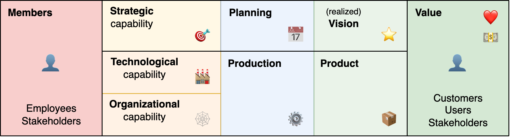

# Teams

A team is a set of players that work together to achieve a shared goal.

[toc]

## Overview

A team is a group of individuals that works together with a specific purpose. The functioning of a team depends on its structure, its members and the environment. Diversity is given by individual personality differences and chosen roles. 

Decision making may happen by agreement, consensus or hierarcy. It can be reactive or pro-active.

> Authority implies responsibility.

A (servant) leader is not just responsible to lead its followers, but more so to help (facilitate) them. The usefulness of the leader *justifies* their position.

### Team Performance

A successful team is happy, stable and effective. See [team success](team-success.md).

Team performance relates to the expectations of it's functioning. It's input and output. It is contingent on two layers.

- The satisfaction of team members. Whether members want to engage in the team. Whether they feel safe and dare to speak up.
- Team maturity. Whether the team is stable and works empirically.

See [team performance](team-performance.md).

External factors

- Trust. How much do stakeholders trust the team? How much transparency do they experience?

### Health

Psychological safety is not an absense of conflict, but rather the ability to address it.

#### Dual Model

Two dimensions: team maturity and team performance. The former revolves around collaboration and empiricism. The latter revolves around the result of work.

Team maturity

- Psychological safety
  - Vibe. Can people sit in a room together? Are they communicating authentically?
  - Courage. How people address conflict? Do people voice disagreement?

- Transparancy
  - Transparancy of expectations. Towards team members and stakeholders.
  - Transparancy of results. Reflection of results and decisions.

- Autonomy
  - Decisiveness. Speed of decision making. Willinness to make difficult decisions.
  - Agency. Able to implement (radical) change. Is the team able to *act* and change their identity (structure)?

Group performance. Value delivery

- Surviving. The team reacts to its environment.
- In control. The team acts pro-actively.
- Focussed on organizational objectives.
- Predictability.

Note the similarity to [organizational](../systems/lifecycle.md) desires.

### Discovery

1. Look & **feel**. Use intuition.
2. **Listen** to customers, stakeholders and employees.
3. Monitor effectiveness, predictability and efficiency.
4. Reflect on environment-specific factors such as autonomy, maturity, health, motivation, resilience.

**Red flags**

Reflect:

- Is there trust?
- Is conflict acknowledged? How is it addressed?
- Is there a shared goal?
- Is there miscommunication?
- Are risks transparent?

### Maturity

Team maturity is difficult to standardize. The following dimensions are important for autonomous, cross-functional, self-organizing teams. This can help to select areas to improve. [Read more](https://martinfowler.com/bliki/MaturityModel.html).

- Team health. E.g. psychological safety, trust, transparent expecations and results, resilience.
- Team effectiveness. From competitive to cooperative. 
- Result-orientation. At what part of the value chain is the team focussing? Are they firefighting or pro-actively solving problems?

Maturity of autonomous teams.

1. Able to **survive**. Focus on fire-fighting.
2. In **control** of daily operations. From reactive to pro-active.
3. Able to build improvements. E.g. functional increments.
4. Able to build product increments. I.e. features that are production-ready.
5. Predictable **delivery** of features to customers.

After this, there range of options increases.

- Able to make **commitments**.
- Acting in line with the **organizational objectives**, together with other teams.
- Able to incorporate **feedback** from users and markets. Continuous improvement.

### Anti-patterns

1. A lack of vision results in unclear and diverging goals.
2. Poor incentives promote resource utilization, which results in local optimization.
3. Unclear goals contribute further to a bias resource utilization. This emphasizes (individual) productivity over long-term outcomes.
4. These dynamics make it difficult to make commitments and hold the team accountable.
5. As a result, progress is hampered.

### Optimizing Performance

Performance evaluation / reflection / planning for autonomous teams

Note: not a replacement for one-on-one performance evaluations with a manager

Attitude

- Growth mindset, learn how to help each other
- Team performance > individual performance

Phases

- Discovery
    - What can we expect? / Where are we now?
    - Objectives. What should we expect? What do we want to achieve in the next quarter?
    - Results. Which results will show that we've reached these objectives?
    - What are the obstacles?
- Delivery
    - Develop a plan to reach these results.
        - E.g. how do we distribute work
    - And/or how to do this in the future.

## Models

Models that provide insight and can be used to predict effectiveness.

Lencioni model (five dysfunctions of a team)

1. Absence of **trust**. Can team members be open/vulnerable?
2. Fear of **conflict**. Is conflict suppressed?
3. Lack of **commitment**. Dedication.
4. Avoidance of **accountability**. Do team members hold each other accountable?
5. Inattention to - collective - **results**. Versus local/personal results.

Google model. [src](https://rework.withgoogle.com/blog/five-keys-to-a-successful-google-team/)

1. **Psychological safety** – Feeling able to take risks without feeling insecure or embarrassed.
2. **Dependability** – Being able to count on each other to deliver high-quality work on time.
3. **Structure & clarity** – Having clear goals, roles, and plans for each member and the group as a whole.
4. **Meaning of work** – Working on something personally important to each team member.
5. **Impact of work** – The belief that the work being done matters.

T7 Model of Team Effectiveness

- Internal factors
    - Task executed successfully
    - Thrust: common purpose
    - Trust in each other
    - Talent - collective skills
    - Teaming - operate effectively
- External factors
    - Team leader fit
    - Team support from the organization

