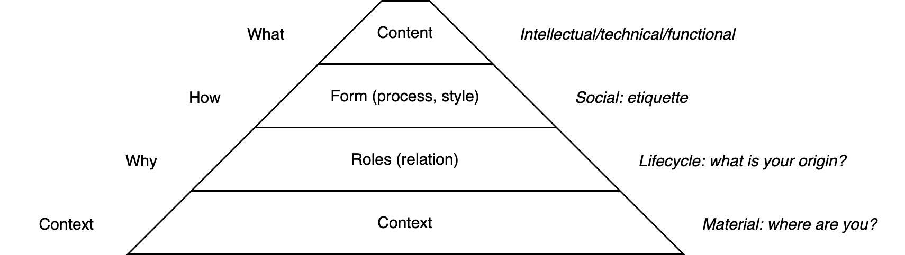

# Trust

Trust consists of

- Credibility
- Empathy
- Reliability
- Self-interest (as opposed to greater good)

Human communication is inherently ambiguous. It consists of multiple layers. 

1. The initial message (**content**) needs to travel from one context (person) to another.
2. The message is surrounded by a **form**. The style of communication. E.g. greetings and goodbyes.
3. The style depends on the **relation** between the actors. How their roles relate to each other and how they know each other. Whether they will keep interacting in the future.
4. On top of this there is an enourmous amount of **context**. The environment of the actors.

Note how this relates to [contracting](coaching.md) conversations.

## Confidence

Confidence is about uncertainty. In the presence of uncertainty, one can have faith.

Expectations can be optimistic, realistic or pessimistic. People can have confidence in themselves and in others.

Trust consists of reliability and integrity.

## Intent & Side-effects

