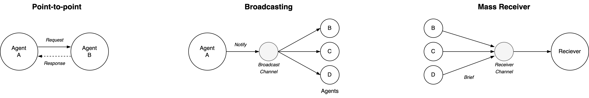
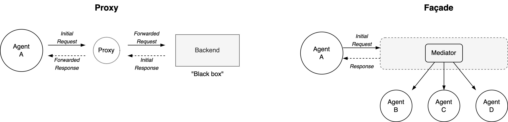
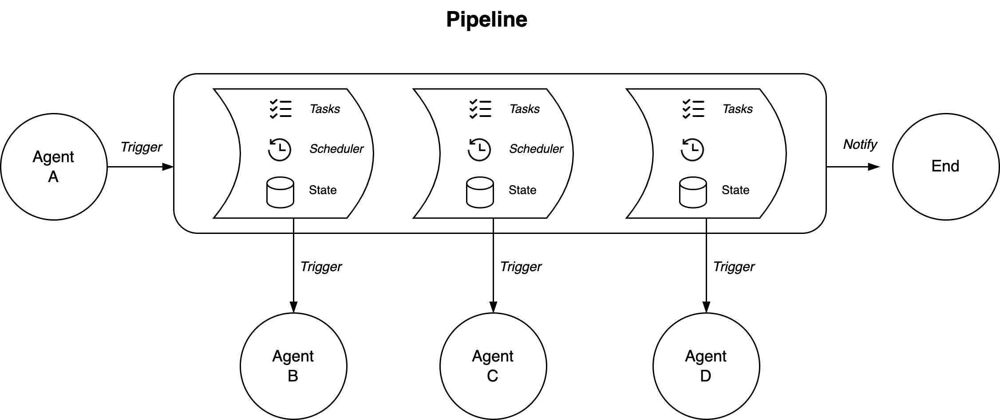
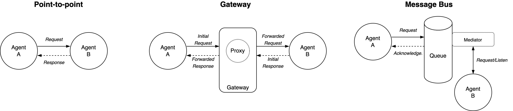
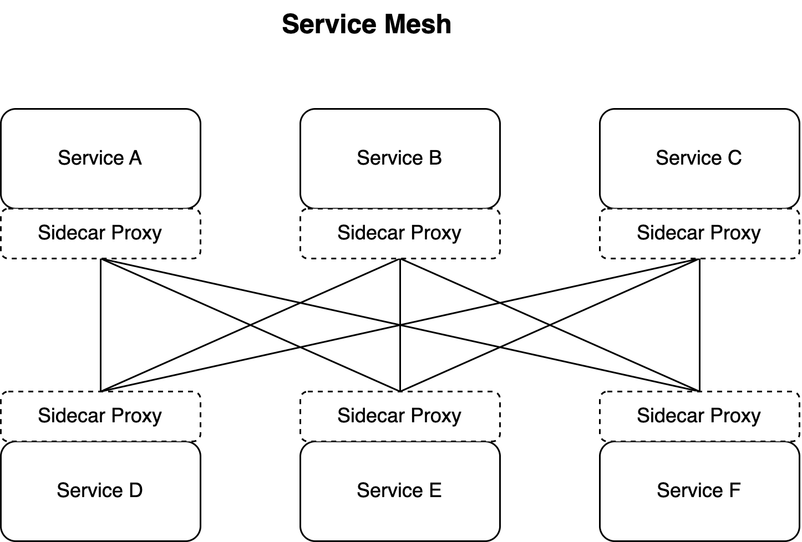

# Communication Patterns

There are [a few](https://en.wikipedia.org/wiki/Enterprise_Integration_Patterns) fundamental integration styles, namely:

- *File Transfer, Shared Database, Remote Procedure Invocation* and *Messaging*.

These all involve sending data over a communication channel. This document uses the term "messaging" the broadest sense.

[toc]

## Messages

Messages can:

- Include data or be merely notifications.
- Be a request or a demand towards a receiver.
- Be *pushed* or *pulled*.

This can involve different types of components

- A channel over which messages are send.
- A queue (or buffer) where messages are stored.
- A client and a server. A client initiates a request and the server returns a response. E.g. a traditional HTTP server.

Operations on a messages can be:

- Transparent, i.e. a passthrough.
  - A logger or wiretap.
- Routing or filtering. Forwarding messages to specific destinations.
- Transformation.
  - Combining groups of messages. E.g. a splitter or aggregator.
  - Changing individual messages. E.g. the payload or structure (headers).

## Messaging Patterns

### Fundamental level

- **Producer-consumer**. One-to-one (point-to-point) messaging. An abstraction of the client-server relationship. A consumer (client) consumes a *service*, which is provided by the producer (server).
  - The client-server roles can be reversed, e.g. in case of *callbacks*.
  - A gateway, hub or bridge can decouple the consumers and the providers from each other. The gateway contains proxies that represent the original provider service.
- **Publisher-subscriber**. One-to-many messaging. E.g. using a message or event bus.
  - One publisher (subject) broadcasts to many subscribers ([observers](https://en.wikipedia.org/wiki/Observer_pattern)).
  - As an addition, the publisher can be made agnostic of the subscribers by using [topics](https://en.wikipedia.org/wiki/Publish%E2%80%93subscribe_pattern). E.g. radio-broadcasting on multiple channels.

### Applied level: Adapters

Decoupling of producer and consumer services can be done using adapters.

- **Proxy**. An imperfect substitution. Restrict access to the original backend service. It may contain mediation.

- **Façade**. A simplified representation that hides the complexity of the internal systems. A mediation layer provides access.

- **Pipeline**. A sequence of calls, which makes up a long-lived process. The initiator has insight into the internal stages of the pipeline.
- Synchronous. A traditional client-server setup.
  
- Asynchronous. Messages can be collected in a [queue](https://en.wikipedia.org/wiki/Message_queue). A [scheduler](https://en.wikipedia.org/wiki/Scheduling_(computing)) may assign short-lived workers to execute tasks.

### System Level

Patterns for managing an environment of many independent services.

- **Point-to-point**. Anarchy. Each connection between agents is a unique arrangement.
- **Gateway**. A central bridge that provides a standardized interface for consumers and providers.
- **Message bus**. A central broadcasting channel for publishers and subscribers.
- **Service Mesh**. A ready-made network of sidecar proxies. All communication (traffic) is protected end-to-end.

