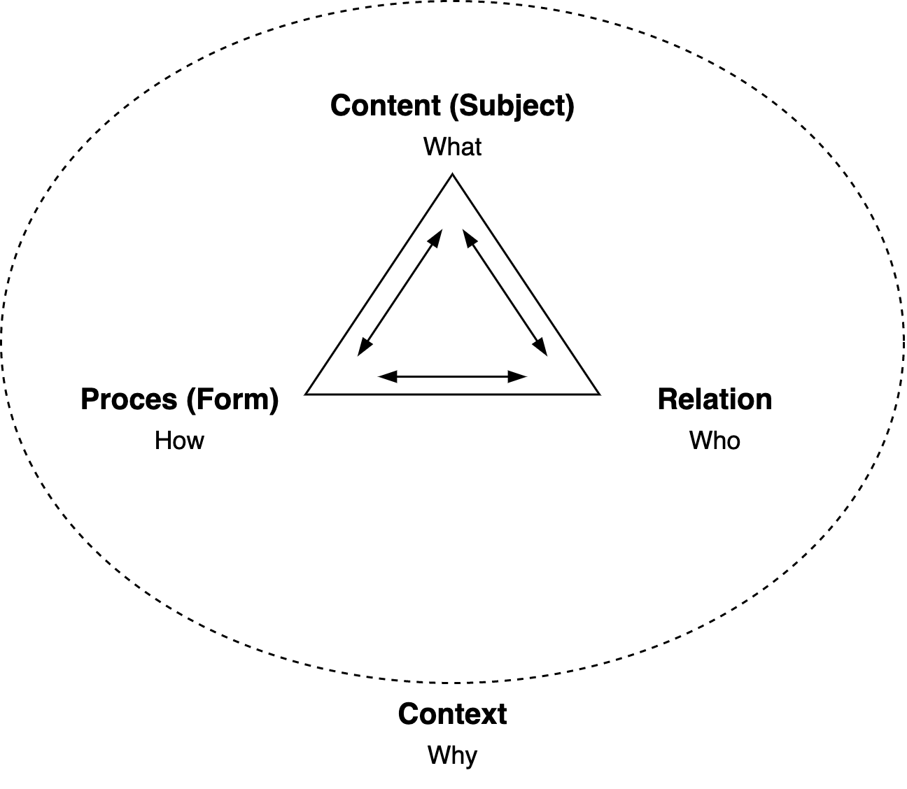

# Human Communication

These models are valid for specific circumstances. E.g. professional communication in a corporate setting.

[toc]

General principles

- "Right" communication depends on the listener.
    - Communication is context-dependent.
- There is always communication. Even being absent or silent sends a message.
- Human communication is extremely noisy.


## Why: Attitude & Relation

**Attitude**

To make communication more effective.

- Optimism and trust is more productive (for collaboration) than pessimism and distrust.
    - Most behaviour can be explained by positive intent and [bounded rationality](https://en.wikipedia.org/wiki/Bounded_rationality)

- Make reversible decisions *eagerly* and irreversible decisions *conservatively*.
- Lazy evaluations. Collect information before stopping at a decision.
    - Lead with Why, rather than How.
    - Align and decide on the problem, then the solution, and only then the implementation.
    - Allow the other to change their position.
- Assume that there are multiple unknowns.
- Address ambiguity and uncertainty. Call it out.
    - Acknowledge emotions and make them explicit, rather than suppressing them


**Context: Relation**

Which role you are expected to take. This is determined by your history and the start of the interaction.

- Leader. Steering, setting examples and standards. Being responsible.
- Facilitator.
- Mediator, negotiator.
- Coach, mentor.
- Teacher.
- Expert. Advising. Give an objective opinion.
- Manager. Asking questions, deciding


**Forms of communication**

- Email. Ideals for broadcasts (one-to-many). Suitable for one-directional communication such as status updates.
- Phone call. Ideal for quick feedback.
- Meeting. Multi-purpose. E.g. explore options, improve group relationship, determine the right approach.
- In-person meeting. Emphasis on attitude and off-topic subjects.


## How: Behaviour

### Models

#### Communication Triangle

Flow: move naturally between corners.




#### Subjectivity: In/Out/Other-side

> "Good" communiction depends on all three components

Miscommunication is often caused by mistranslations.

Components

- Inside. E.g. beliefs, emotions, thoughts, physical sensation.
- Outside. Content, voice, body language.
- Other-side. Any filters/biases of the other.

Relation

- Transparency: from inside to outside.
- Feedback: from other to outside.


#### Communication styles

- Ideal behaviour: switch between these based on context and need.

| Pushing                                            | Pulling                                                  |
| -------------------------------------------------- | -------------------------------------------------------- |
| Taking space                                       | Giving space                                             |
| Goal/content-oriented                              | Relation-oriented                                        |
| Persuading, asserting, incentivizing (sanctioning) | Bridging (involving, listening, disclosing), attracting. |


#### Level of assertiveness

- Ideal behaviour: find a balance based on each other's boundaries.

| Sub-assertive       | Assertive              | Aggressive            |
| ------------------- | ---------------------- | --------------------- |
| Indirect            | Direct + respect       | Direct - respect      |
| Relation > goal     | Relation + goal        | Goal > relation       |
| Lowering boundaries | Maintaining boundaries | Going over boundaries |
| Too agreeable       |                        | Too defensive         |


#### Mediation & Negotiation

The difference between these can be a matter of framing. 

- Ideal behaviour: depends on the role: from collaborating to competing.
- Find a fair deal. Mutual gain, objective criteria.

| Bridging           | Mediation            | Negotiation         |
| ------------------ | -------------------- | ------------------- |
| Learn and relate   | Mutual gain. Win-win | Zero-sum game       |
| Explore needs      | Shared goal.         | Individual goals    |
| Emphasize relation | Emphasize interests  | Emphasize positions |


## What: Direct Messaging

### Message Structure

#### Four-sides Model

Messages send from a sender to a receiver consist of [four aspects](https://en.wikipedia.org/wiki/Four-sides_model):

- Factual aspect
- Relational aspect
- Self-revealing or self-disclosing aspect
- Appeal. A wish or want.

Aligning these aspects keeps the message pure and avoids miscommunication. Mixed messages may be interpreted in an unexpected way.


### Messaging Types

#### Delivering News

...


#### Giving Feedback & Making Requests

> Giving feedback = disclosing information about yourself

Principles

- Let the other come up with a solution, rather than handing one directly to them. This increases follow-through.
- Separate the observation and your interpretation. Avoid judgement.
- Requests questions where "no" is an acceptable answer - in contrast with *demands*. When the answer is no, then empathize with the other's needs, rather than strengthening the request.


Recipe.

1. **Event** (objective). Describe your observation of a signal.
2. **Effect** on yourself (subjective). Meaning, your interpretation.
3. **Pause**. Give the other space to accept, interpret and react.
    - Ensure there is alignment. Verify that the other can relate to your view?
4. **Desired** effect. Definition of success. What you need.
5. Suggestions or a **request**.


Template: alternative forms.

```markdown
- event-effect-pause
- observation-effect-you
- observation-feeling-need-request
```


##### Anti-patterns

Compliment sandwich. Pack criticism in between seemingly softening compliments, instead of being straightforward and sincere.


#### Receiving Feedback

Steps

- **Listen** to the message itself.
- **Interpret**. Feel the consequences. What's the result if this this hypothesis would be true?
- **Clarify**. Ask questions.
- **Evaluate** whether the message is useful.


See also

- Handling complaints


## References

[1]: Stone	"Difficult conversations: How to Discuss What Matters Most"
[2]: Fisher	"Getting to Yes: Negotiating Agreement Without Giving In "
