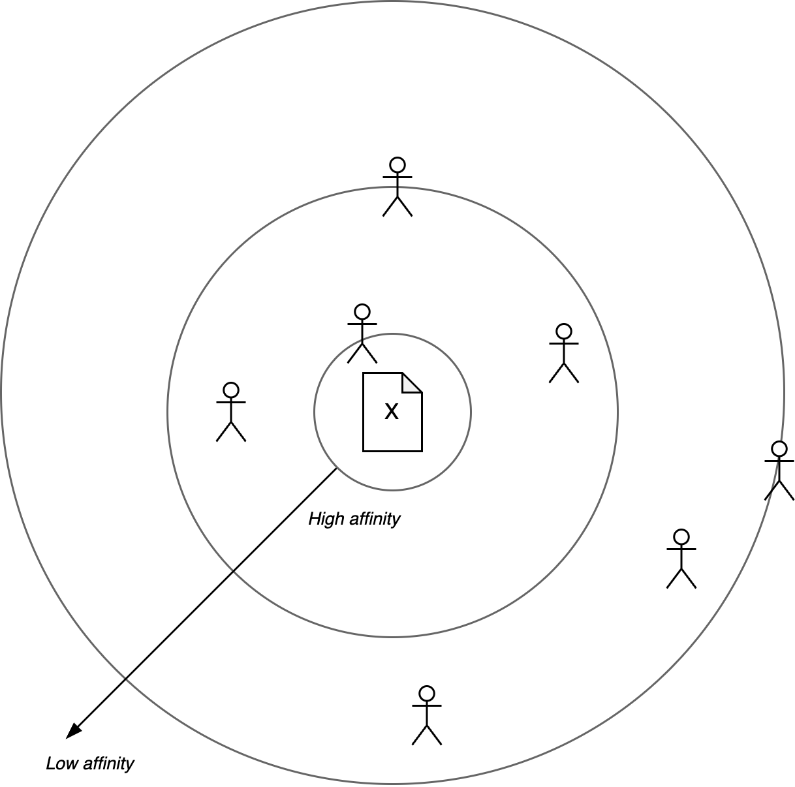
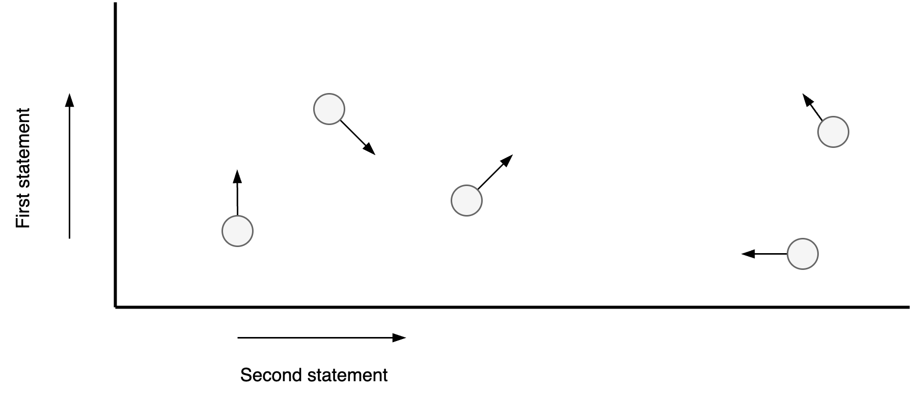

# Coaching Techniques

[toc]

## Contracting

The contracting phase aims to align expectations and give the coachee and coach a headstart. A contract is an informal or formal agreement on what to expect from each other. A less formal term would be *alliance*.

> Trust comes before agreement.

Start with developing a relation and building up trust. Initial agreements can be made on a abstract level. E.g. alignment on certain values or agreement on a title. Later agreements can be more specific.


**Coach contract**

Contract between coach and the coachee. The latter can be a team.

```markdown
1. Introduction. what do you want to get out of this?
2. Context. Park the content 🅿️. What is important in these conversations?
3. Relationship. What do you need from each other?
4. Responsibility. How can we ensure that we keep these agreements? How can we make this easier?
```

**Team contract**

Contract between team members

```markdown
1. Introduction. What do we want to get out of this?
2. Context. What is important in these conversations?
3. Relationship. What do you need from each other?
4. Responsibility. How can we ensure that we keep these agreements? How can we make this easier?
```


## Prompts

Inquiring

```
What is ___ like for you?
What does that say about you?
What has just happened?
```

Statements

```
I notice/sense ...
I'm hearing/feeling ...
```


## Templates

**Compass**

Purpose: zoom in towards core values and motivation.

```markdown
- Context
- Static reality
 - Obstacles
 - Competence
 - Values
 - Ambition | big A
- Potential
 - Goal | petit a
```

**Qualities & Allergies**

>  Each obstacle implies a strengths. 

Purpose: understand extreme forms of behaviour. See [communication-principles](./principles.md) and also [personality](../psychology/personality.md).

```markdown
List of

- Quality (a trait)
  - Pitfalls of the quality. When there is too much of the quality.
  - Challenge: how to overcome the pittfall.
  - Allergy: the opposite of the quality.
```


**Needs (Maslow)**

Purpose: understand where desires come from. See [desires](../psychology/desires.md).

```markdown
List of

- Inherent needs
  - Value. Based on difference.
  - Desire. Change difference.
  - Fear. Perceived risks.
```


**Actionable**

```
How likely do you feel/think this is to succeed? What would you need in addition?
How motivated are you on a scale from 0-10? Why not higher/lower?
```

**Challenging**

Prompts

- Empathy. *"Seems like he had a reason for saying that."*
- Dissociate. *"You are aware of the thought of X"*
- Out of the box. *"What would need to be true for you to belief this?"*


### Prompts

```markdown
What kind of person do you want to be in your (work-)relationships?
What do you feel?
```


Dealing with sensitive / emotional topics. Don't start with investigation or solutioning.

```
RAIN
1. Recognize. "This seems important to you."
2. Allow. Let the coachee express it. Venting
3. Investigate. Deconstruct it: events, feelings, needs.
4. Move forward. Find ways to improve.
```


### Exercises

#### Constellation

Reveal the system back to itself.

Given a statement X, ask the following questions.

1. How much do you recognize X?
2. How much do you want to change your position?



With multiple dimensions. The circles indicate positions. Arrows can be added to incite desired change.

