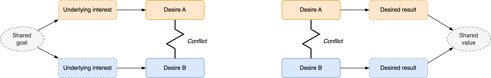

# Coaching

Coaching is about providing a soundboard, through questioning (feedback). It's oriented towards potential and results. For more details, see:

- [Coaching techniques](./coaching-techniques.md)
- [Coaching teams](./coaching-teams.md)

See also [goals](../organization/goals.md), [purpose](../collaboration/activity/purpose.md) and [retrospectives](../teams/retrospectives.md).

[toc]

## Overview

> Help people (teams) move from who they are now, to who they’ll be in the future, in a way that maximizes well-being.

Coaching revolves around the preferences of the coachee. It consists of a series of [conversations](../collaboration/conversations.md). Hence it implies [trust](../collaboration/trust.md). In these conversations:

- The coach helps the coachee to see new perspectives and potential.
- The coachee decides how to incorporate this.

Coaching does not imply a problem. It is not a medical intervention. It can be used to improve or maintain performance.

Two main modes are: critical and supporting. These map to [thinking](../collaboration/proposals.md) in problems or opportunities. Note that the difference is more than just reframing problems as opportunities. Rather, is about appreciating positive aspects, and their potential.

|               | Critical Coach                    | Supporting                                              |
| ------------- | --------------------------------- | ------------------------------------------------------- |
| **Lens**      | Problem-oriented.                 | Opportunity-oriented. Improve what goes well.           |
| **Core**      | Challenge. Change (fix) problems. | Empathy. Appreciation of what goes wel, inspire growth. |
| **Attitude**  | Avoid failure, do better          | Learn from experience                                   |
| **Obstacles** | Fight obstacles                   | Deconstruct obstacles                                   |
| **Energy**    | Pushing, sprinting                | Growing, step by step                                   |

In contrast to therapy, coaching assumes that the subjects are healthy. It does try to heal or diagnose clients. It acknowledges problems, but does not dive in to deconstruct them. It guides clients to improve on their own pace, without needing to solve a crisis.

**Avoiding problems**

It important that the supporting coach does not avoid problems or discomfort. There is a place to acknowledge reality and any resulting feelings. From there one can more forward.

A coach can help to reframe problems. Any problem implies a challenge. Coping mechanisms from coachees may point to a hidden strength (to endure). For example, fear may signal care for someone else.

- A side effect of this is that the coachee starts from a solid base: a understanding of their stengths.

**Rejecting problems**

Factors thay may prevent people from addressing problems.

- 👈 Patterns of blame or victimhood. Over-emphasise problems. Lingering too long in negative emotions. Inability to take initiative.
- 🥶 Too much presssure to change. Being in a frozen state.

### Intent & Purpose

Help the coachee achieve the what they want.

Coaching is not limited to planning and goal-setting. It may range from:

- Empathy, recognition
- Provide a soundboard
- Provide a new perspective
- Challenge perceived obstacles
- Show blind spots
- Explore potential
- Choose a next step
- Plan a next step

### Method

Coaching is **result**-oriented. This means:

- Start with a desired result, based on the preference of the coachee. Note that desires may change over time.
- Optimism rather than pessimism.
  - Explore core desires rather than fears.
  - Focus on potential. Explore options rather than obstacles.
  - Emphasize what is possible, instead of what is not.
  - Emphasize what worked well over failures.
  - Start half a step ahead, rather than miles away from what's realistic.
- Practical steps rather than theory and analysis.
  - Don't over-analyze problems

- End conversations with an action point.
- Let the coachee come up with solutions. Then explore these.
  - Don't provide solutions.

**Requirements**

Necessary conditions.

- Trust. Which requires:
  - Confidentiality.
  - Compassion. A genuine optimistic view of the coachee.
  - Clarity.
  - Transparency about context, motivation, interests, other parties.
  - Request approval when approaching boundaries. E.g. for personal questions, giving suggestions.
- Agreement on the coach-coachee relation.
- Sessions
  - Intake session to align expectations and set an initial objective. Check the expectations with respect to coaching itself.
  - Repeated conversational sessions that end with action points.

### Alignment Coaching

Alignment may be needed if there is tension. A certain layer of [trust](../collaboration/trust.md) is needs to be established before you can discuss sensitive topics.

### Conflict Tree

Tension may originate from a conflict between desires or positions. Question this conflict by either

- Discovering underlying interests, which may originate from shared goals.
- Discover desired outcomes, which may lead to shared values.

## Context

### Power dynamics

Coaching requires confidentiality. Avoid conflicting interests.

**Anti-pattern**

Coach as a middlemen, between the employee and manager.

### Supporting roles

Differences between coaching, mentoring and consulting.

**Focus**

Differences in focus:

- Coaching: intersection of the subject and a *context*. E.g. an organization.

- Mentoring: intersection of the subject and a *domain*. E.g. a sport or craft.

**Behaviour**

Differences in problem solving:

- Coaching: Help the subject to solve a problem.
  - Or, challenge the obstacle itself.
- Mentor: Show alternative approaches to a problem.
- Consultancy: Provide *a* solution for a problem. In addition to aligning and emphasizing the need for solutions.

|                 | Coach                             | Mentor                              | Consultant                       |
| --------------- | --------------------------------- | ----------------------------------- | -------------------------------- |
| **Focus**       | Personal (empathy)                | Domain                              | Diagnose problem                 |
| **Goal**        | Explore, improve self-awareness   | Training                            | Advice, second opinion           |
| **Attitude**    | Beginner's mind                   | Expert                              | Unbiased expert                  |
| **Method**      | Active listening *What, how* | Teach, explain,  use analogies | Specific questions *5x Why* |
| **Questioning** | Ask open questions                | Answer questions                    | Provide advice                   |
| **Mode**        | Facilitate subject                | Lead subject                        | Provide service to subject       |
