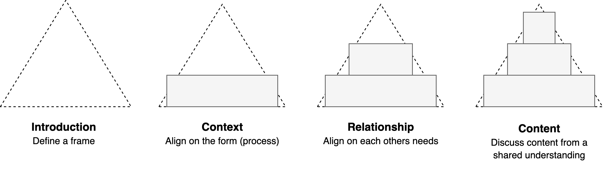

# Context in Communication

Also see [communication styles](./communication-styles.md).

[toc]

## Overview

> Words are irrelevant.

Communication is contextual. The context is more important than framing or content. 

- E.g. "no" can mean a lot of different things.
- The relation between people has a stronger effect on the meaning of sentences, than the sentences itself.

This document presents *classes* of reactions. Concrete example are added for clarification, but they are just that, examples.

### (Non)Violent Communication (NVC)

In this context, *violence* is a dimension from `calm, considerate, respectful` to `intrusitve, challenging, aggresive` communication. Violence means putting a burdon on the other. For example, a a question can be given as an invite or a demand. The latter requires a response (positive or negative) or a rejection from the other.

Another example is the act of "making your problem someone else's problem". This puts a burdon on another. Whether this is the right thing to do depends on context.

- This can be subtle as sharing doubts. *"I'm having doubts about our collaboration"*
- This can be done aggresively, e.g. through criticism. *"You're not doing ..."*

Both of these example imply a succesion. E.g. taking a wish into consideration.

### Asking

#### Context

Questions can be preceded by intent. These are affected by the security of a relationship.

1. Share an observation.
2. Express a feeling.
3. Disclose needs.

#### Form

Levels of asking. From less violent (intrusive) to more violent.

1. Suggestion
2. Request
3. Demand
4. Command

### Listening

From acknowledging to questioning someone.

- Acknowledge. *"I'm glad you said this."*
- Clarify. *"And was that ...?"*
- Permit. *"Tell me more"*
- Validate. *"I belief you."*
  - Recognize. *"I've felt that as well."*

Move away

- Reflect. *"I seems ..."*
- Explore. *"What else?"*

Judge

- Evaluate. *"I agree with this part."*
- Challenge. *"I disagree"*
- Reject. *"You're mistaken."*

#### RAIN

A non-violent style to have emotional conversations, with others or yourself.

1. Recognize
2. Allow
3. Investigate
4. Nurture

### Truth

Truth can mean different things.

- When building sharing context: *transparency*
- When disclosing: *honesty*
- When hiding something: *confess*

> Doubts are just a signal

- Sharing doubts puts a burdon on the listener. The listener needs to determine what to do with this information.
- Sharing needs gives the listener the option to be considerate.

