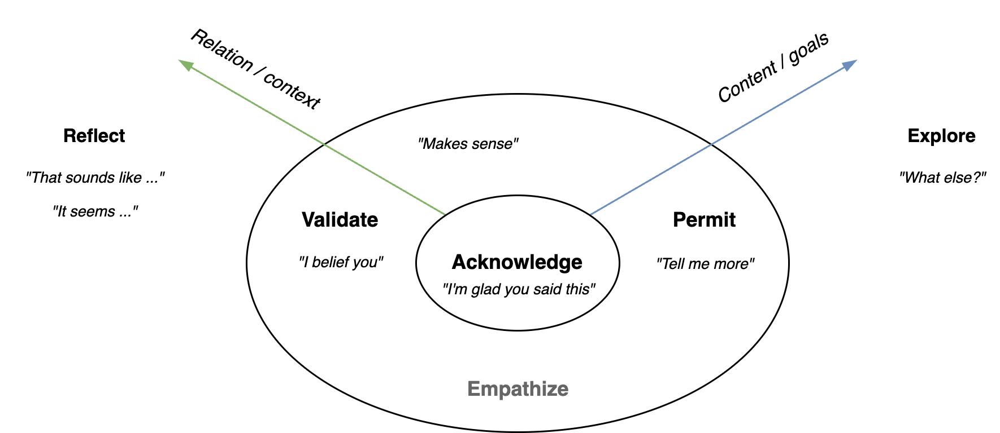

# Conversations

This document focusses on coaching and planning conversations.

[toc]

## Introduction

Note

- First impressions have a strong effect on each other's perception and attitude.
- It takes time and effort to gain trust. Deep personal questions can be inappropriate if there is not enough trust.
- Conversations are about flow, rather than about steps.

For coaching conversations

- The other decides when they're ready to move further.
- Provide choices to the other. Request approval before giving advice, making suggestions, asking personal questions or changing topics.
- Verify assumptions.

## Flow

Principles

- Natural lanuage and nonverbal communication is ambiguous.
- Communication requires trust.

Moving between different topics requires care, especially for difficult converstations.

Conversations tend to move. E.g.:

- From superficial to deep topics.
- From casual to personal topics.
- From passionate topics to goodbyes.

The style may change, as more trust is build up.

- From playful to serious.
- From formal to personal.

Conversation is based on trust and shared understanding.

Continue: dive in

Pivot away: shift topic

Sections

- Deliver information. Share experience.

  - Local observations.
  - Disclose thoughts or feelings
  - Show appreciation. Opinions or judgement.
  - Share related experiences.

- Invite information. Involve the other.

  - "Tell me more"

  - "What about you?"

  - "What did you mean with ...?"

- Active listening.

> No is the beginning of a discussion

Don’t start arguing. Instead:

1. Understand their reason for saying no. *"What makes you say no?"*
2. See what is possible. *“You seem hesitant. What makes you consider it?”*

Then

1. Facilitate. Make a suggestion. *“If x then we could y”*
2. Inspire. *“Image that x. We could do z!!”*

**Anti-patterns**

- Too much questioning
- Too much pivoting
- Boasting. 1-upping. Pivot to your own achievements after someone shares theirs.

## Topics

Individuals can be strongly goal-oriented, people-oriented or thought-oriented. In conversations the emphasis may lie on these respective styles. See [personality](../psychology/personality.md) and [DISC](https://en.wikipedia.org/wiki/DISC_assessment).

Converstations can move between content, form, relation and context. See [communication triangle](pyramid.md).

## Types

Group conversation types.

- Social small talk. Current events, sports, hobbies.
- Catching up. Mention milestones.
- Storytelling. E.g. personal experiences.
- Emotional support.
- Opinions and debates.
- Advice-seeking.
- Planning and organizing.

|              | Small Talk          | Passionate Talk  | Deep Conversation     |
| ------------ | ------------------- | ---------------- | --------------------- |
| **Content**  | Anything            | Specifics        | Personal experiences  |
| **Form**     | Casual, superficial | Directed         | 1:1                   |
| **Relation** | Non-personal        | Shared interest  | Trust & vulnerability |
| **Pace**     | Fast                | Energetic        | Careful               |
| **Scope**    | Explore             | Continue further | Dive deep             |

## Models

### Small talk

Move from small talk to deep conversations (and back)

1. Greeting. Make contact. Acknowledge each other. Set expectations.
2. Content.
3. Goodbye.
   1. Start signalling towards ending the conversation.
   2. Commit to future actions.

Attitude

- Be interested, rather than trying to be interesting. Notice something that attracts you.
- Connection > perfection
- Emphasize non-verbal communication over literal text.
- Dance around. Play. Use tension and release.

The form can vary from formal to exageration, irony or sarcasm.

Typical phrases

- *"Tell me more"*
- *"What did you mean with ...?"*

Break the ice

- Break the tension. Take a step towards familiarity.

Unbreak the ice (anti-pattern)

- Close of a conversation. Leave the other stunned.

## Active Listening

Listening and empathy.

Agreeing and disagreeing. With details or intent. Note: all of these can be communicated without words.

### Professional conversations

Each level should be sufficient, before moving to the next level. Jumping to the last step may cause misunderstanding.

1. Small talk
2. Relation
3. Personality
4. Expertise
5. Style
6. Content
