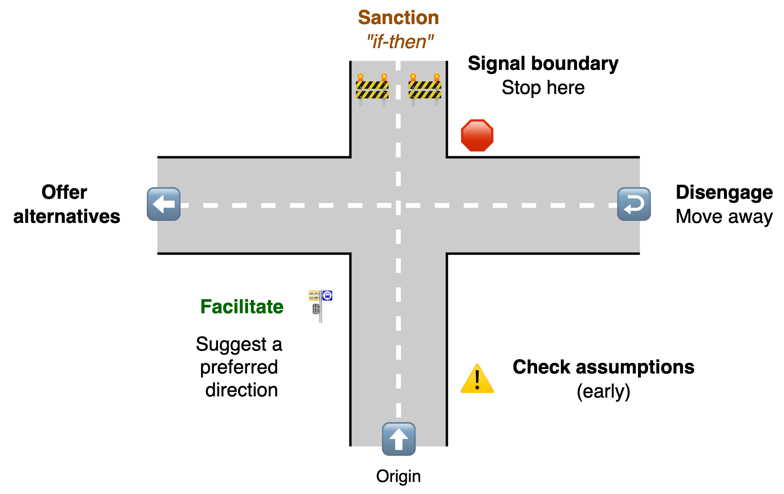
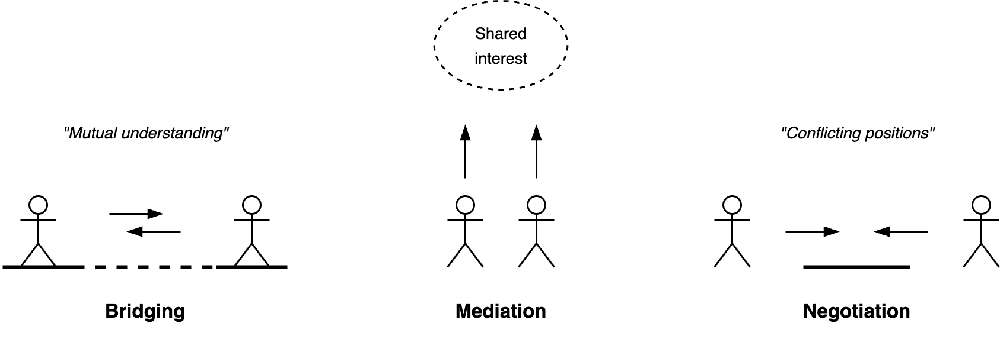

# Influencing

[toc]

## Deep Conversation

Communication can focus on moving forward (towards a goal), connecting to each other, or to slow down and reconsider. See [change](../../subjects/change.md). Also see [styles](https://www.zuidema.nl/blog/stijlflexibiliteit-welke-stijl-zet-jij-in-om-effectief-te-communiceren).

**Communication styles (deep conversations)**

| Focus    | Direction    | Communication styles      | Space         |
| -------- | ------------ | ------------------------- | ------------- |
| Content  | Move forward | Push, command 🫳           | Take space    |
| Relation | Connect      | Pull, invite 🫴            | Welcome space |
| Context  | Slow down    | Avoid, diffuse, disengage | Create space  |

### Pushing

Communication styles that help you move forward. Take in space. Emphasize ratio. Focus on content.

- **Asserting**. Make deliberate statements. Do this carefully, with precision. E.g. use:
  - Evualuations. *"That was good"*
  - Expectations. *"I expect X when Y"*
  - Consequences. "If X, then Y"
- **Persuading**. Use layers of arguments to strenghten your case. E.g. use
  - Proposals. *"I propose that ..."*
  - Reasons and facts. *"Because ..."*

Shared understanding --- persuade / change direction purpose

|            | 💡 Asserting           | 🗣️ Persuading                     |
| ---------- | --------------------- | -------------------------------- |
| **Method** | Statements            | Reasoning                        |
| **Focus**  | Shared understanding  | Judgement. Actions and decisions |
| **Scope**  | Context. Where we are | Goal. Where to go                |

### Pulling

Communication styles that emphasize connection. Invite the other to come closer.

|              | 💡 Overcome difference                      | 👂 Reduce difference     |
| ------------ | ------------------------------------------ | ----------------------- |
| **Why**      | Find a shared purpose. Find common ground. | Connect to each other.  |
| **What**     | Inspire, motivate                          | Empathize               |
| **Attitude** | Enthusiasm                                 | Curious,                |
| **Style**    | High energy, great ideas                   | Intimate, compassionate |
| **Method**   | Tell stories, envision possibilities.      | Ask, listen, disclose.  |

Connecting to the other may involve:

- Active listening. Verbally and non-verbally. Asking follow-up questions.
- Summarizing or paraphrasing what was said.
- Mentioning what you see. Suggesting evaluations.
- Disclosing. Express what you feel.

## Saying no: Setting Boundaries

Asserting yourself can be done in several stages. The following examples assumes that another is intrud

1. Check assumptions. Ask for intent.
2. Suggest an direction you like. Pro-actively.
3. <u>Facilitate</u>. Suggest what you do want.
4. 🛑 Signal the boundary. Clarify *your* need.
   1. 🚧 <u>Sanction</u>. Share consequences. Your value or need.
   2. If nesesary, check if the boundary is clear.
5. Uphold the boundary. Either:
   1. ⬅️ Offer an alternative.
   2. ↩️ Disengage completely

## Bridging, Mediating, Negotiating

The difference between these can be a matter of framing.

- Ideal behaviour: depends on the role: from collaborating to competing.
- Find a fair deal. Mutual gain, objective criteria.

|          |              | Bridging         | Mediation            | Negotiation         |
| -------- | ------------ | ---------------- | -------------------- | ------------------- |
| **Why**  | **Purpose**  | Explore needs    | Shared goal.         | Individual goals    |
| **What** | **End-goal** | Learn and relate | Mutual gain. Win-win | Zero-sum game       |
| **How**  | **Emphasis** | Relation         | Interests            | Emphasize positions |

Framing messages allows positive and negative aspects be emphasized.

| Collaboratively                                  | Competently                                                  |
| ------------------------------------------------ | ------------------------------------------------------------ |
| I think you're right.                            | I knew that already                                          |
| I like that idea.                                | That's unrealistic.  That will take forever. I can't do that. |
| I thought X. Can you show me what I'm missing?   | You are wrong.                                               |
| I see some challenges. How would you approach X? | X is a blocker.                                              |

**Addressing Conflict**

- Don't offer a compromise too soon. First aim for a shared understanding of both perspectives. Ensure that the other party understands your problem. Move away from a negotiation-oriented conversation to an open, learning conversation.

**Negotiating**

- Distinguish people from problems.
- Emphasize intent and value, rather than positions.
- Show/develop multiple options with varying benefits.
- Use objective criteria, to cultivate an attitude of fairness.

