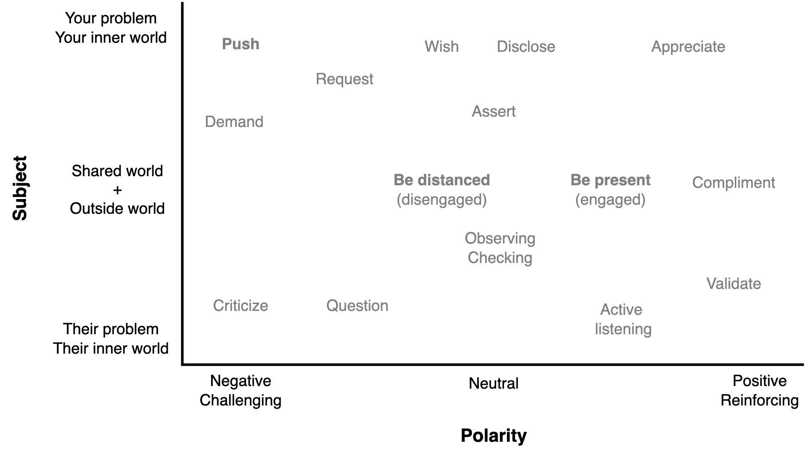
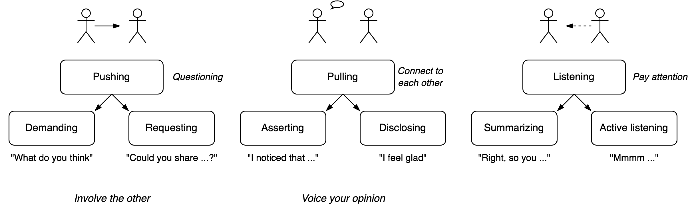

# Non-violent Communication

*Violence* is defined is a dimension from `calm, considerate, respectful` to `intrusitve, challenging, aggresive`. Violence means putting a burdon on the other. To make your problem someone else's problem.

Some forms are:

1. **Pushing**. Push your problem onto someone.
2. **Being**. Be with each other. Make comments. Without needing change.
3. **Supporting**. Share someone else's problem. Provide support.

Being is the least intrusive. It emphasises listening.

|            | Pushing               | Being                    | Supporting                      |
| ---------- | --------------------- | ------------------------ | ------------------------------- |
| **Core**   | Questions             | Comment                  | Provide                         |
| **Method** | Demand, request, wish | Assert, disclose, listen | Advice, perspective, validation |

A question can be given as a demand or an invite.

- A question is an *assignment*. The other can respond by answering correctly, incorrectly or rejecting the question.

- A wish is an optional assignment. The other may or may not acknowledge it.
- An assertion is neutral. You can share an observation or feeling. The can make interpret it how they see fit.

Listening may involve

- Paying attention. Reacting non-verbally.
- Summarizing, paraphrasing and checking.
- Noticing the indent or underlying meaning.

Helping may involve

- Providing support
- Giving advice
- Validating

From the perspective of one's inner world.j

- Disclose exposes one's identity
- Listening informes someone's identity
- You can act based on your destiny or help someone's destiny.

## Challenging

Requests and opinions can be challenged. One can use coaching or confronting stances. A few examples:

- Agreeable. *"I feel you, but also consider ..."*
- Polite. *"You mentioned X. Can we discuss that?"*
- Objective. *"Let's explore this from the perspective of ..."*
- Direct. *"I do see an alternative."*
- Assertive. *"That is not comletely true."*
- Aggressive. *"That is completely wrong."*
- Personal. *"You are mistaken."*

Conflict can be escalated.

