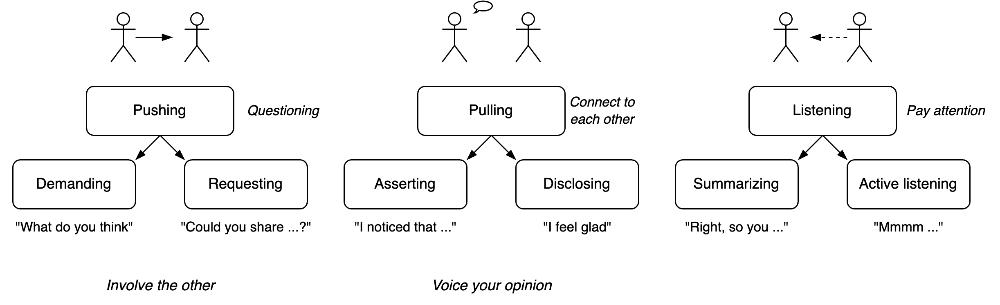

# Communication Styles

[toc]

## Overview

Communication is dynamic, rather than static. It flows between pushing and pulling, and between goals and relation. You can take space and later give it back.

Communication changes when moving in and out deep conversation.

## Casual Conversation

Styles

- 🔦 Question the other. Demand a reaction.

- 💭 Voice your thoughts or feelings. Disclose your opinion or make assertions about the environment.

- 👂 Be interested. Be aware of non-verbal communication.

A question can be given as a demand or an invite.

- A **question** is an *assignment*. The other can respond by answering correctly, incorrectly or rejecting the question.

- A **wish** is an implicit assignment. The other may or may not acknowledge it.
- An **assertion** is neutral. You can share an observation or feeling. The other may or may not hear it.

**Communication styles (casual conversations)**

| Focus    | Direction    | Communication styles | Space         |
| -------- | ------------ | -------------------- | ------------- |
| Content  | Move forward | Push, question 🫳     | Take space    |
| Relation | Connect      | Pull, invite 🫴       | Welcome space |
| Relation | Empathize    | Listening 👂          | Create space  |

## Facilitating

>  Listening means showing interest

Facilitating styles

- Active listening. Non-verbal communication. E.g. nodding.
- Repeating
  - Summarizing
  - Paraphrasing. And then checking. And then re-paraphrasing. *"Such and so. Is that right?"*
  - Requesting.
    - *"Can you say that again?"*
    - *"Can you summarize that in one sentence?"*
  - Proposing. *"We could do ..."*

- Checking. *"Did you mean ...?"*

Levels of listening.

1. Paying **attention**. Non-verbal signals.

2. Summarizing, **paraphrasing** and checking.
3. Capture the **intent** behind a message, rather than the message itself.
4. Strategic listening. Become aware of second-order effects.
