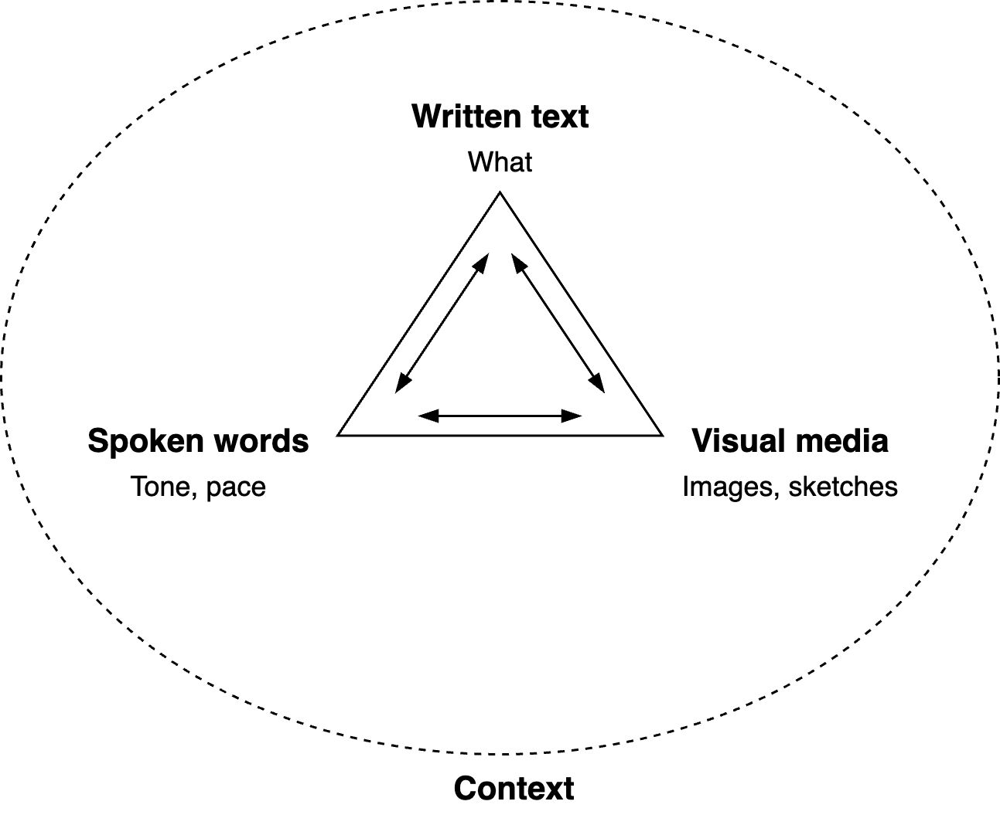

# Communication Triangles

[toc]

## Overview

Dimensions

- Result-oriented or people-oriented.
- Focus on the present, focus on the future.
- Command or invite.
- Form or content.

Communication consists of several layers.

- ✉️ The message. The content.
- 🎁 Packaging
- 🚚 Delivery
- 🌐 Context

## Components

Communication consists of more than [messages](messaging.md) (i.e. content). Two pillars are necessary in order to communicate a message: *process* and *relation*.

- Process (form). Shared expectations of how to communicate. Any etiquette and formalities.
- Relation. The bond between the participants. How they feel about each other. Including their history and power dynamics.

A fourth component is *context*. This affects the meaning of each point.

**Conversation Flow**

Move naturally between corners for a good, balanced conversation flow. Avoid dwelling too long on a single aspect.

## Form

Effective communication combines different forms. Note that part of an audience will relate more with message in specific forms.

**Perspectives**

First, second, third position.

1. The self. I, how I see/feel/hear it.
2. The other, with whom I interact.  How they see/hear/feel
3. An outside view. Someone who’s not involved. “Objective”

## State of Mind

Layers

- State of  mind. Self esteem. *How you feel about yourself.*

If you’re happy with yourself then you will relate.

If you're sad then you'll close off.

