# Documentation

[toc]

## Audience & Author

> Writing is for other people

Writing is a way to communicating with an audience. It has several functions:

- Past events: documenting
- Now: deconstructing, exploring
- Future events: delegating

In addition, it may serve as a tool clarify and process the author's thoughts.


**Types of documentation**

Documentation should not only be written for a specific audience, but it should also have a specific [functionality](https://documentation.divio.com/).

|               | [Tutorial](https://documentation.divio.com/tutorials/#tutorials) | [How-to guide](https://documentation.divio.com/how-to-guides/#how-to) | [Reference](https://documentation.divio.com/reference/#reference) | [Explanation](https://documentation.divio.com/explanation/#explanation) | Specification                        |
| ------------- | ------------------------------------------------------------ | ------------------------------------------------------------ | ------------------------------------------------------------ | ------------------------------------------------------------ | ------------------------------------ |
| *oriented to* | learning                                                     | a goal                                                       | information                                                  | understanding                                                | formalization                        |
| *must*        | allow the newcomer to get started                            | show how to solve a specific problem                         | describe the machinery                                       | explain                                                      | be testable                          |
| *its form*    | a lesson                                                     | a series of steps                                            | dry description                                              | discursive explanation                                       | requirements                         |
| *analogy*     | teaching a small child how to cook                           | a recipe in a cookery book                                   | a reference encyclopaedia article                            | an article on culinary social history                        | the definition of a Pizza Margherita |

- Tutorials and explanations are educational and thus suitable for learning.
- How-to guides and references are informational and more suitable for work.

- FAQs don't fall in a single class. Often they combine answers from various sources.


**Maintaining Documentation**

This is even harder than writing good documentation. A standard way to maintain high quality is to continuously update documentation. Whenever an aspect of the subject is changed, ensure that the result is reflected in the documentation.

## Structure

**Views**

Documentation (and visualizations) can be created at different [levels of detail](https://en.wikipedia.org/wiki/C4_model). E.g.

1. Context. How it relates to the outside world.
2. The messy middle
    1. Behaviour of the system itself. How it changes.
    2. Components and the relations between them. What the responsibilities are.
3. Inner workings of a given component.

**Ordering**

Explanations can be top-down (high level first) or bottom-up (low level first).

- The first is intuitive, but requires the repeated use concepts that are not well-defined (yet).
  - Start with *What* and *Why* instead of the *How*.
- The second allows you to start from fundamental principles, but requires a bit up-front investment from the reader
  - There is a risk of missing the global point.

**Complexity**

Multiple levels of documentation, ordered by level of natural language (increasing).

1. Module level.
    - Clean, clear, readable code. From high level to low level. E.g. self-explanatory variable- and file-names.
    - Inline comments and doc-strings.
    - Up-to-date, readable **tests** that act as a specification.
2. Application level. High cohesion.
    - Self-contained repositories with a readme.
3. System level. Relations between multiple components. E.g. a wiki.

**Comments**

Comments are metadata. They do increase maintenance. In contrast to programming languages, they do not have syntax or grammar restrictions. They can be tailored towards the audience, e.g. in a native language rather than english.

A few categories:

- Functional comments: `TODO`, `SMELL`
  - These can be useful even if they are never addressed. They visualize code quality and warn contributes about missing or broken functionality.

- Documenting why vs. what.
- Giving examples
- Giving references (to external documentation)

The Why consists of the following categories:

- Context
  - Negative information (what is not happening).
  - Rationale, history
- Performance
- Use-cases, side-effects
- Tips


## Templates

See also [requirements engineering](requirements-engineering.md).


**Product-team: Summary**

```markdown
- **Product Portfolio**. E.g. the main product and any features that complement it.
    - Purpose. Why does this product need to exist.
    - Boundary: Any contracts and in/out-bound connections.
    - Context: Where are the products and services used?
- **People**. The team, stakeholders, customers and users.
- **Dependencies and relations**
- **Team Goals** - and how they relate to departmental goals.
    - Purpose.
    - In which direction is the team moving?
    - What problems are customers currently facing?
    - What problems is the team or product facing?
- **Planning**. What is changing?
    - Desired States. What are the target conditions.
    - Initiatives. What actions can be taken to achieve these?
    - Roadmap. When will these actions be taken?
```


**Product-team: Table of Contents**

Note that this is optimized for a single product-team. In practice other teams should be taken into account.

```markdown
# {Team Name}:

## {Product Name} (Public documentation)
(User-oriented)
- Overview. Summary and links.
 - Product Description. Lists of features.
 - List of services that complement this product.
 - Contact information.
- FAQ. Links to guides.
- "Components". The interface should be consistent/long-living, while the inner structure may change more often.
- How-to guides.
- Tuturials.
- Wiki / reference.


## Internal documentation
Designed for internal use by team members.

**Living documentation**
Technical product/platform setup and configuration.
 - Functional design. E.g. architectural designs, functionality that is not yet build.
 - Inventory/resources
     - _(Overview of)_ Components.
     - _(Overview of)_ Repositories. Configuration and code.
     - _(Overview of)_ Infrastructure & pipelines.
 - Components. E.g. products, tools libraries.
   - Outside View. 
     - Description/Purpose.
     - Boundary. Inputs and outputs. E.g. resources and added value.
   - Specific Runbooks. Guides that are explicitly maintained.
 - Operations
   - Generic operational and support tasks.
   - Way of working. E.g. a definition of done.
 - Dependencies

Planning / Strategy.
 - Signals, (candidates for) initiatives, goals.
 - Desired/targets states.
   - Links to product backlogs and departmental backlogs.

Contacts.
 - Team members and stakeholders.
 - Dependencies.
 
**Ad hoc documentation**
Ad hoc guides. Historical guides that do not have to maintained.
 - Meeting Notes.
 - Past decisions and initiatives.    
 - RCA's.

Archive. Deprecated pages.
```


**Periodic Status Update**

Purpose: a short overview of what's changing. Can be used as preparation for a status meeting.

 ```markdown
 **Focus / Core**
 E.g. OKRs, health indicators.
 
 **Last Week / Month**
 - The three most relevant points
 
 **This Week / Month**
 - The three most relevant points
 
 **Risks**
 Any noteworthy risks. Ranging from emergent to nightmarish.
 
 **Notes**
 Anything else that's relevant. E.g.
 - What is the latest good news?
 - What did we learn recently?
 ```

### Systems

To visualize systems, long-running processes, value chains and pipelines. See also [systems-management](systems-management.md).

**Outside view**

System as a black box. Focus on inputs and outputs.

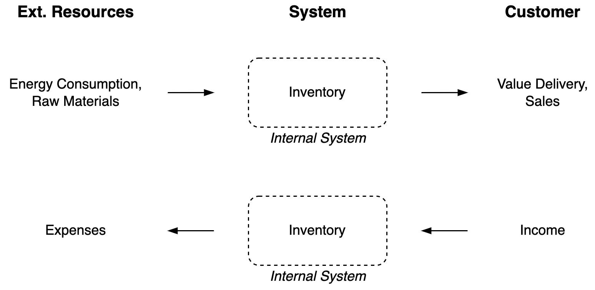

**Value Chain(s)**

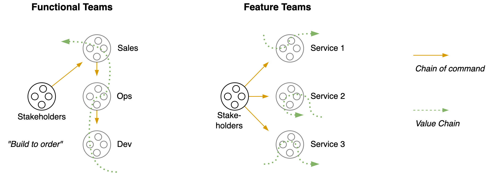

**Functional view**

Activities and communication

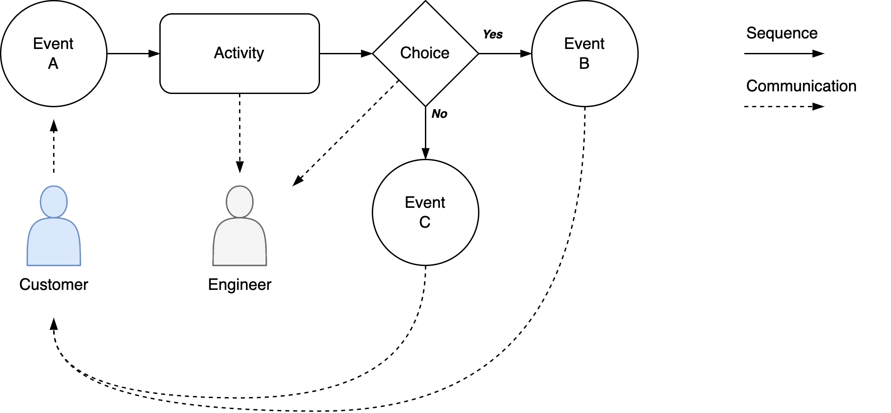

**Ownership / Responsibility**

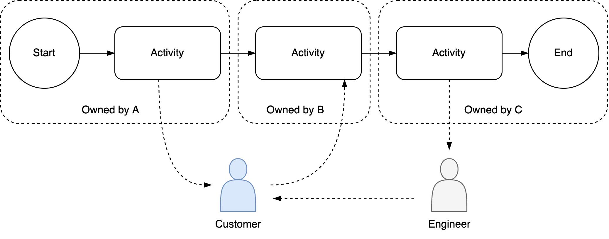

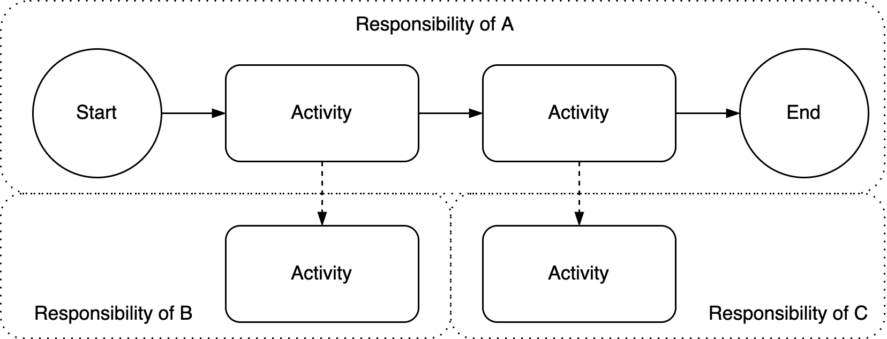

**Commoditization of Components**

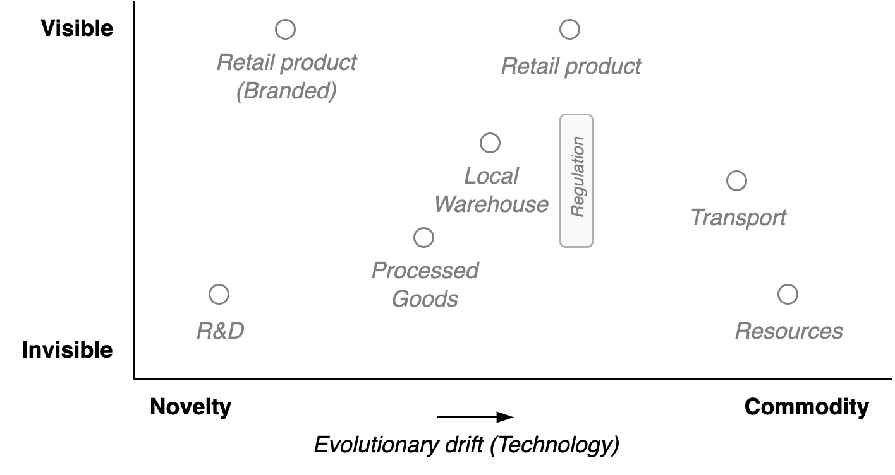

### Roadmap & Planning

**Goals**

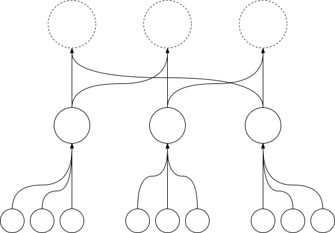


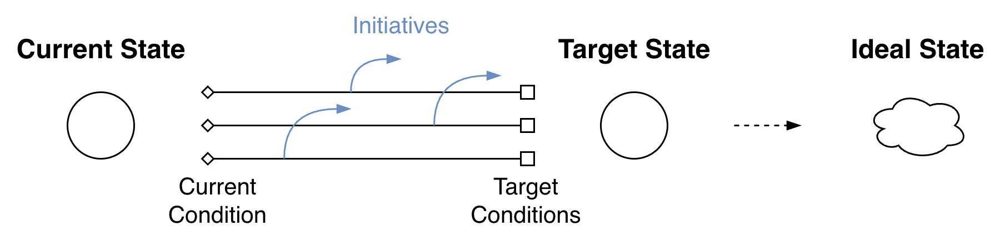


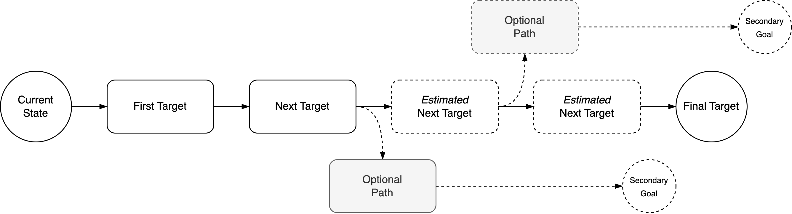


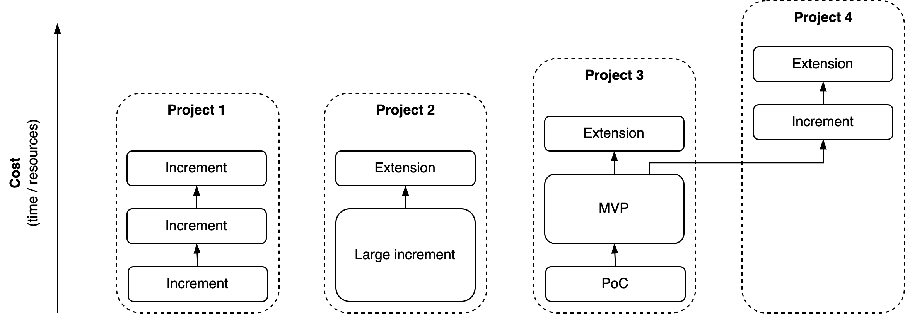

**Kanban Board**


### Processes

**Queues**

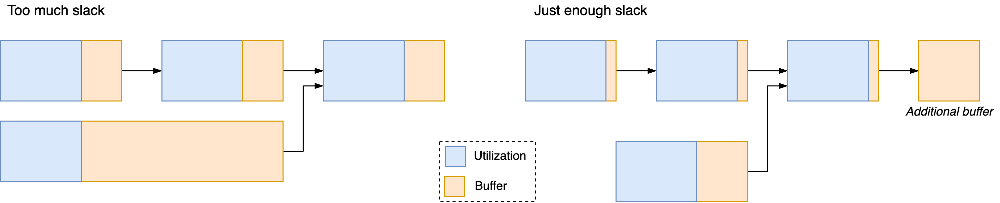

**Resource Contention**

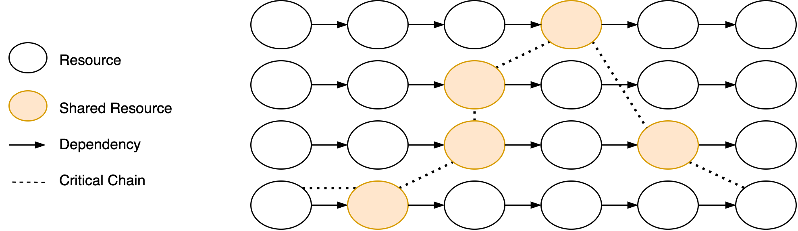
