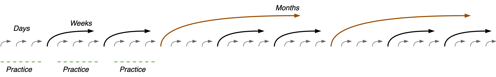
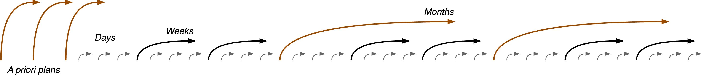

# How to Plan Less

[toc]

## Overview

> No plan survives first contact

The main challenge of planning is to keep them relevant. Most environments have inherent uncertainty that can only be resolved through exposure.

> Planning > making plans

The key to good plans is to excel at planning. Updating your plan continuously. Second, plans can be made resilient by mixing abstract (strategic) and specific objectives.

## Context

Factors

- Presense of an existing mission or organizing principle. *Why are you here?*
- Time-scale and scope. Planning for hours or decades.
- Trust and alignment. Incentives.

## Practice

If there is no explicit mission you start with developing a **practice**. If you have no clue where to start, then start by observing and walking around.

- E.g. use 5 min. to plan the next 2 hours. Or 15 min. to plan the next day.
- Repeat this and reflect in between.

After practicing, introduce more abstract sessions. Define the desired results. Transform the practice into a **guided practice**.

- E.g. a (bi-)weekly session.
- Focus on a longer scope and leave the the day-to-day operations for the shorter sessions.

After several improvement cycles, introduce more higher level sessions.

- E.g. monthly, quarterly, yearly sessions.
- E.g. use the quarterly sesssion to develop and reflect on OKRs.

If you start out with a mission, the process is similar. After preparing, continue with developing a practice and regularly schedule reflections.

## Theory

Plans can be made resilient by decoupling results from objectives. This abstraction allows you to adapt, without disrupting the original objective.

-  🌟 A **mission** is the most stable. It is expected to be stable over *many years*. It is connected to the identity of an organization.
- 💭 A product / team **vision** is set for a limited time span. One can envision a better future *within* years.
- 🔑 **Objectives** are steps that are valuable on their own. Something to strive for. *What you want*
- 🧭 **Results** show that you're making progress towards the objective. *How you know*
- 🎯 **Initiatives** are concrete steps that bring you closer to a result.

These should inform processes and operations.

Results may seem obvious. The exercise is to discover what increments lie ahead. Find early indicators to show you the way. 

- Assume that you have imperfect information. Prepare to learn better methods.

