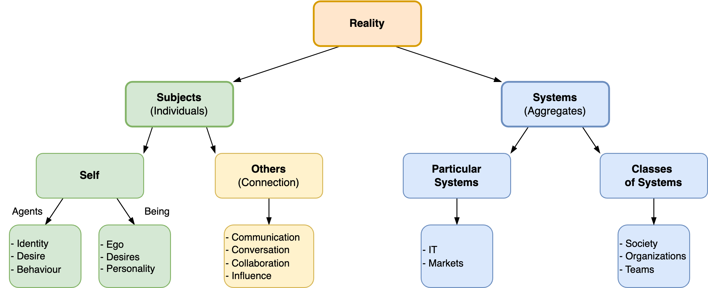
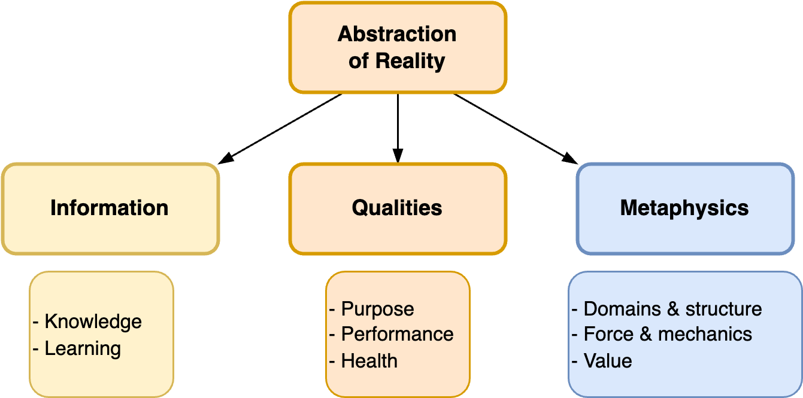

# Index

Terms that relate to multiple documents or categories. See also [models](models.md).

- Reality. Subjects and systems.
- Abstraction of realiy. Qualities, information, metaphysics.

Language tends to differ per domain. Certain language is more appropriate for particular domains.

|              | Self        | Agent     | System             |
| ------------ | ----------- | --------- | ------------------ |
| **Example**  | A person    | A robot   | A team or business |
| **Identity** | Ego         | Identity  | Identity           |
| **Purpose**  | Desire      | Objective | Vision             |
| **Origin**   | Birth       | Creation  | Shared visiongff   |
| **Action**   | Personality | Behaviour | Performance        |

[toc]

## Activity

[subjects/activity.md](subjects/activity.md)

[subjects/change.md](subjects/change.md)

[subjects/behaviour.md](subjects/change.md)

## Change

[subjects/change.md](subjects/change.md)

[subjects/progression.md](subjects/progression.md)

[labour/goals.md](labour/goals.md)

## Communication

[systems/communication-patterns.md](systems/communication-patterns.md)

[collaboration/messaging.md](collaboration/messaging.md)

[collaboration/conversations.md](collaboration/conversations.md)

## Desire

[systems/desire](systems/desire.md)

[subjects/desire.md](subjects/desire.md)

[psychology/desires.md](psychology/desires.md)

[psychology/mind-body.md](psychology/mind-body.md)

## Goals

[labour/goals.md](labour/goals.md)

[management/goals-planning-strategy.md](management/goals-planning-strategy.md)

## Function & Relations

[domain-modelling/relations.md](domain-modelling/relations.md)

[systems/relations](systems/relations.md)

## Health & Life

[psychology/health.md](psychology/health.md)

[psychology/desires.md](psychology/desires.md)

[labour/lifecycle](labour/lifecycle.md)

[systems/lifecycle](systems/lifecycle.md)

[metaphysics/quality.md](metaphysics/quality.md)

[collaboration/teams.md](collaboration/teams.md)

## Identity

[subjects/identity.md](subjects/identity.md)

[domain-modelling/domain-driven-design.md](domain-modelling/domain-driven-design.md)

## Knowledge

[intelligence/knowledge.md](intelligence/knowledge.md)

## Labour

[subjects/labour.md](subjects/labour.md)

## Management

[management](management)

[systems/systems-management.md](systems/systems-management.md)

## Messaging

[collaboration/messaging.md](collaboration/messaging.md)

[systems/communication-patterns.md](systems/communication-patterns.md)

## Model

[math/models.md](math/models.md)

[intelligence/modelling.md](intelligence/modelling.md)

[intelligence/mental-models.md](intelligence/mental-models.md)

## Organization

[systems/systems](systems/systems.md)

[metaphysics/structures.md](metaphysics/structures.md)

[collaboration/teams.md](collaboration/teams.md)

## Product

[labour/products-projects-initiatives.md](labour/products-projects-initiatives.md)

[management/product-management.md](management/product-management.md)

## Psychology

[psychology](psychology)

## Quality

[metaphysics/quality.md](metaphysics/quality.md)

## Relation

[systems/relations.md](systems/relations.md)

[domain-modelling/functions-relations.md](domain-modelling/relations.md)

## Result

[labour/results.md](labour/realization.md)

## Subject

[subjects/subjects.md](subjects/subjects.md)

## System

[systems/systems.md](systems/systems.md)

## Value

[labour/value.md](labour/value.md)

[metaphysics/value.md](metaphysics/value.md)

[software-industry/values.md](software-industry/values.md)

[software-industry/devops.md](software-industry/devops.md)

