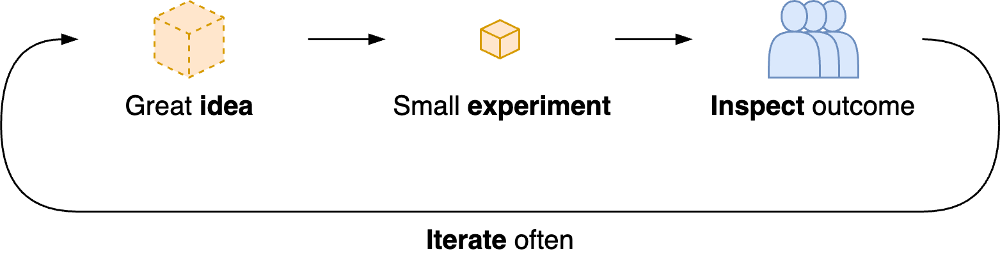

# Empiricism

> Succeed through a rapid progression of failures.

Empricism in collaboration focusses on learning from experience. It is useful in environments with uncertainty. See also [continuous systems improvement](../systems/continuous-improvement.md).

Obtain knowedge through experience, rather than *a priori* theory. Use experiments to learn.

**Prerequisites**

- 📄 Transparancy. Towards each other and to stakeholders. Aim for shared understanding. Understand the context.
- 🔦 Inspection. Reflecting on what we have done, continuously.
- 🛠️ Adaption. Update plans when you obtain new information.

|              | Transparency             | Inspection                 | Adaption                         |
| ------------ | ------------------------ | -------------------------- | -------------------------------- |
| **Question** | What do we do? For whom? | How is it going?           | What can we improve?             |
| **Method**   | ➡️➡️➡️ Value chain          | 🔁 Feedback loops           | 🔀 Be able to adapt               |
| **Enabled**  | Shared understanding     | Reflection & conversations | Owernship, self-organizing teams |

