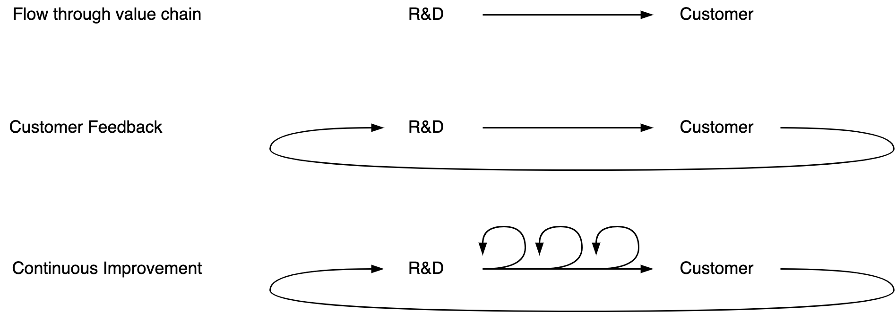

# Learning

See also [knowledge](knowledge.md) and [modeling](modeling.md).

[toc]

## Overview

Learning is facilitated by [models](modelling.md). Learning is the process of updating these models.

- As humans, we use [mental models](#Mental Models) to make sense of the world.

**Learning Types**

> Learning revolves around revising your opinions.

Experiments not require complex setups. Start simple and expand if necessary. Three types:

1. Learn by observation. Then reflect on the observations.
2. Iterate. Change a specific variable and measure the effect. Then repeat.
3. Experiment. E.g. A/B testing.
    1. Replicate multiple environments.
    2. Change one of them and use the other one as a baseline.
    3. Compare the results.

This can be done in a formal way. See [scientific method](knowledge.md#Scientific Method).

## Mental Models

Rigidity. Worldviews.

- Dualisms. Binary, black-white, left-right, us-them, good-bad.
- Holism. Unity, cohesion. Idealistic.
- Zen. Both singular and plural. Multiple correct models. Free of rigid rules.

### Building Models

|                              | A Priori            | Evidence-based                                     |
| ---------------------------- | ------------------- | -------------------------------------------------- |
| **Application** (Real world) | Inference           | Comparison, intuition, random sampling (anecdotes) |
| **Theory** (Ideal world)     | Fundamental / logic | Rational analysis                                  |

**Thinking**

Conceptual and visual thinking. Associative and linear thinking.

|                       | Conceptual (Word, Facts)                                | Visual / Spatial                                             | Subconscious              |
| --------------------- | ------------------------------------------------------- | ------------------------------------------------------------ | ------------------------- |
| **Type**              | Analytical                                              | Associations                                                 | Intuition                 |
| **Categorization**    | Definitions, negation                                   | Similarity                                                   | Outside of language       |
| **Collect knowledge** | Sequentially, linear                                    | Emergent                                                     | Letting go of assumptions |
| **Inference**         | [Binary](https://en.wikipedia.org/wiki/Boolean_algebra) | [Bayesian](https://en.wikipedia.org/wiki/Bayesian_inference) | -                         |

### Applying Models

**Decision making**

|            | Abstraction-based                      | Example-based               |
| ---------- | -------------------------------------- | --------------------------- |
| Observing  | Fundamentals, deconstruct observations | Remember interpretations    |
| Evaluation | Self-reflection. Evaluate models       | Free of judgement           |
| Prediction | Inference                              | Compare, translate examples |

**Reasoning**

|                        | Internal                     | External                      | Instinct              |
| ---------------------- | ---------------------------- | ----------------------------- | --------------------- |
| **Method**             | Fundamentals                 | Comparisons & interpretations | Intuition             |
| **Awareness**          | Self-aware. Self-reflection. | Automatic. Auto-pilot.        | Instinct, unconscious |
| **Locus of attention** | Internal memories.           | The present, the world.       | Broad                 |
| **Speed**              | Slow.                        | Fast.                         | Medium                |
| **Mental models**      | Question models              | Apply models                  | No preconceptions     |

### Updating models

Phases (similar to the scientific method).

- Observe. Collect data.
- Experiment. Gather data. Test hypotheses.
- Analyze / translate / generalize. Synthesize.

**Bottom-up & top-down learning**

Extremes of the spectrum

- Build guidelines from the ground up, based on experience.
- Imagine an ideal model, then test it in the real world.

Comparison

|                         | Bottom-up                  | Top-down                                    | Intuitive                      |
| ----------------------- | -------------------------- | ------------------------------------------- | ------------------------------ |
| **Start with**          | Repetition (practice)      | Deep understanding (theory)                 | Clean slate                    |
| **Then, continue with** | Reflection                 | Apply knowledge, verify a theoretical model | Avoid language, preconceptions |
| **Focus on**            | Likelihood                 | Certainty, perfection (idealism)            | Exploration, questioning       |
| **Aim for**             | Get to 80% ASAP            | Get to 100%, eventually                     | Flow                           |
| **Reasoning**           | Generalization (induction) | Logical inference (deduction)               | Intuition                      |

Risks of bottom-up learning

- Inability to generalize, due to lack of fundamental understanding.
- Over-confidence.

Risks of top-down learning

- Overfitting, over-engineering.
- Procrastination.
- Overly critical.

See [learning styles](https://en.wikipedia.org/wiki/Learning_styles)

The exception to this is learning like a child would. Being open-minded, without preconceptions or judgement. Moving with a feeling of wonder, using intuition.

### Other

**Tension-release**
Push & pull. Similar to a dialogue, there should be a two-way interaction. Cross boundaries shortly, then step back and reflect. This allows you to maintain flow.

**Thesis-antithesis-synthesis**
A three-steps pattern. In general, small (fast) cycles are less disruptive.

1. **Thesis**. An idea (eureka) or a revolution. Associated with hype and momentum.
2. **Antithesis**. A conflict. The new way will naturally differ from the old paradigm and will have to be tested to real-word scenario's. There can be resistance from the status quo. Moreover, the existing structures are optimized for the old paradigm. Output is likely to decrease for a while. Change is an investment that might pay off over time.
3. **Synthesis**. A resolution where the new way is incorporated and becomes part of the main paradigm. Side-effect of the original change are resolved.

**Revolution vs. Evolution**
Changes van vary from being large and disruptive, to gradual shifts.

**Consicous competence**

1. *Un*conscious *in*competence
2. Conscious *in*competence
3. Conscious competence
4. *Un*conscious competence

After this, one could go back and zoom in on specific behaviours that can be improved.

- Unlearning: from 4. to 2.
- Relearning: from 2. to 4.

## Attitude & Mindset

**Attitude**

- Problem-oriented. Aware of risks, consequences. Understanding of root cause.

- Solution-oriented. Imagine change and improvement.

**Mindset**

- Practice & Repetition. Listening (observing) and reflection.

- Growth mindset. Now you don't know, but you can learn and change.

**T-shaping**

|          | Specialist         | Generalist                   |
| -------- | ------------------ | ---------------------------- |
| Focus    | Single domain      | Between domains              |
| Scope    | Bounded            | Unbounded                    |
| Goal     | Mastery everything | Increase learning rate       |
| Attitude | Expertise          | Beginner's mind, open minded |

**Beginner's mind**

Attitude

- Motivated: eager to learn.
- Optimism: ready to learn.
- Open minded: no assumptions. Feeling of wonder.
- Aware of ignorance, limited skill.
- Present. Focussed on learning the next step, rather than a far-away end goal.
- Free, no rigid, predefined plan.

The more you know, the more questions arise.

Increase rate of learning, rather than finishing learning.

Build models that generalize to other domains, add to increase your pace of learning.

**Zen mind**

Eager, present, paying attention. Here and now. Being, rather than recalling, imagining, thinking or controlling.

- Seeing, rather than looking

- Listening, rather than hearing

- Noticing, rather than accepting

**Peace of mind**

Learn optimally by doing it in an environment where you have peace of mind.

Avoid boredom.

## Organizational Learning

An optimal learning environment has:

- A teacher/coach/facilitator
- Other learners
- Customer or real-world feedback

Learning requires both theory and practice (experimentation). Making mistakes is a vital part of learning.

- Prefer collaboration over competition. The latter discourages mistakes, and thus hampers learning.

Learning on a local level is easy, but learning at the "middle management level" is not (e.g. due to competition, fear of failure).

Local improvements and adaptation are a vital complement to top-down strategies.

- This requires alignment on all levels. Hence higher management should share their vision and strategy within the organization.
- Local improvements are usually easier than global ones.

### Improvement Frameworks

A few dimensions:

- Top-down or bottom-up.
- Invite or inflict change.
- Revolutionary or evolutionary change.

#### Scrum

See [srcum](../collaboration/scrum-guide.md). Inspect-Adapt-Reflect.

#### Kanban

Visualize-Stabilize-Optimize. First you have to find the right challenge (e.g. the bottleneck). Second you have to find stability, otherwise you cannot reliably control it. Only then you can start to optimize.

- The long-term version of this is [PDCA](https://en.wikipedia.org/wiki/PDCA).

#### Agile

Context: uncertain, ever-changing environments. IT can never be fast enough.

1. Formalize work. Make it explicit. Vizualize it.
2. Focus. Manage flow by managing WIP.
3. Feedback loops. Relate performance to some goal or outcome.
4. Reflect & Improve. Iterate.

#### DevOps

3-step improvement process

#### Lean

Principles

1. Focus on customer value
2. Identify value stream, from concept to cash
3. Flow, minimize lead time, flow efficiency
4. Pull, don’t over produce
5. Strive for perfection, high quality.  This is mostly for *complicated* rather than *complex* domains

## Practice (Context)

### Organizations & Processes

The ideal learning strategy depends on the  [environment](https://en.wikipedia.org/wiki/Cynefin_framework). See [domains](../systems/organization-structure.md#Autonomy%20and%20Alignment%20per%20Domain).

- Chaotic: act-sense-respond
- Complex: probe-sense-respond
- Complicated: sense-analyse-respond
- Obvious: sense-categorise-respond

### Learning

Other patterns

- plan-do-check-act
- imitate-assimilate-innovate
- inspect-adapt-reflect
- visualize-stabilize-optimize

## Learning Models

[Dreyfus](https://en.wikipedia.org/wiki/Dreyfus_model_of_skill_acquisition) model combined with the [conscious competence](https://en.wikipedia.org/wiki/Four_stages_of_competence) model.

| Novice                       | Advanced Beginner                                    | Competence                                  | Proficient                                | Expert                                    |
| ---------------------------- | ---------------------------------------------------- | ------------------------------------------- | ----------------------------------------- | ----------------------------------------- |
| *Un*conscious *in*competence | Conscious *in*competence                             | Conscious competence                        | *Un*conscious competence                  | Transcended                               |
| ...                          | Recollection: Situational instead of non-Situational | Recognition: Holistic instead of decomposed | Decision: Intuitive instead of analytical | Awareness: Absorbed instead of monitoring |
| Needs rules                  | Tests rules                                          | Applies rules                               | Falls back on rules                       | Transcends rules                          |

> follow rules - break rules - make rules

**[Dreyfus](https://en.wikipedia.org/wiki/Dreyfus_model_of_skill_acquisition) model**

| Skill Level/ Mental Function | Novice          | Advanced Beginner | Competence | Proficient | Expert   |
| ---------------------------- | --------------- | ----------------- | ---------- | ---------- | -------- |
| **Recollection**             | Non-Situational | Situational       |            |            |          |
| **Recognition**              | Decomposed      |                   | Holistic   |            |          |
| **Decision**                 | Analytical      |                   |            | Intuitive  |          |
| **Awareness**                | Monitoring      |                   |            |            | Absorbed |

**[Shuhari](https://en.wikipedia.org/wiki/Shuhari) model**

1. Obey. Follow traditions, learn fundamentals, heuristics, proverbs.
2. Digress. Break with tradition.
3. Separate, transcendence. Exceed tradition. Find new ways

**Teaching models - roles**

[Source](https://twitter.com/andybudd/status/1557757908166877186)

- Consultant: Here, let me fix that problem for you
- Mentor: This is what I did when I had that problem
- Advisor: Here are a few things people do to solve that problem
- Coach: How do you think you might solve that problem?

**Zones**

- Comfort zone. Easy, stable, safe.
- Growth zone. Alive, anticipation, challenge, excitement.
- Panic zone. Anxiety, stress, fear, tension.

## Asking Good Questions

**Tools / Deconstruction**

Remove "self"

- "How do *I* do X" → "*Who* knows how to do X?"

Deconstruct implications

- "How can I do X better?" → "What does *better* mean?"

Question the origin

- "How did you come to that question?"

Mirror questions

- "What do you think/feel about it?"

**In Coaching**

- Oppurtunity > blame. What tools do you need to succeed? ~~Why did you fail?~~

**In Teaching**

See [socratic questioning](https://en.wikipedia.org/wiki/Socratic_questioning).

- Origin. *Could you explain that further? What do you base that on?*
- Assumptions. *Is that always true? What would need to happen for that to change?*
- Evidence. *Could this evidence be incomplete?*
- Perspectives. *What alternatives are there? Who beliefs otherwise?*
- Implications / consequences. *If X, then what about Y? What's the effect on Z?*
- Reflect. *What makes this question important? Why is it useful?*

**Mu**

Mu is a rejection to a given binary question. It is defined as "not true and not false".

- In science, *mu* answers suggest that there is more to the question. They form a basis to continue investigating.
- Moreover, they suggest that the initial question / hypothesis is somehow lacking - that it originates from a limited perspective.

## References

- R. M. Pirsing. *Zen and the Art of Motorcycle Maintenance.*
