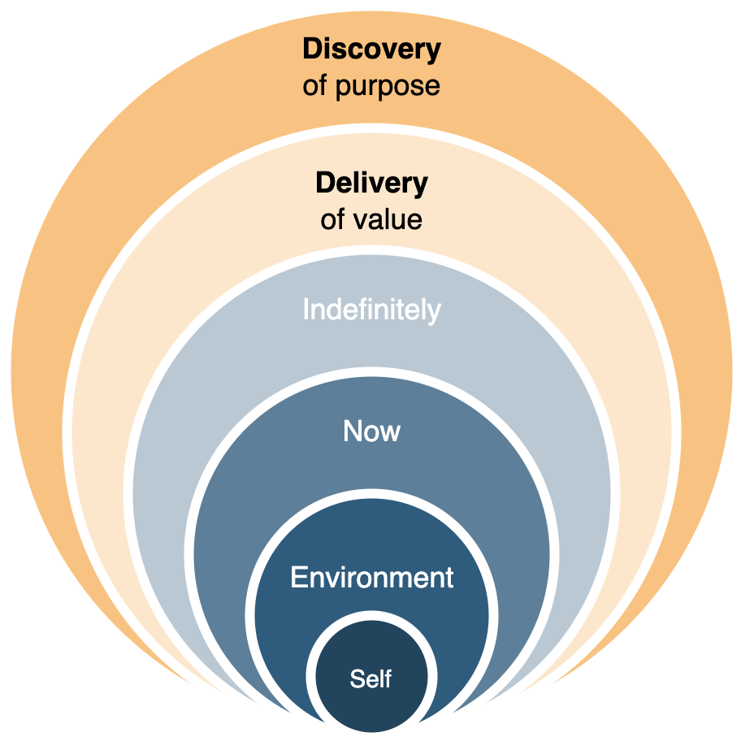

# Labour

This document presents a liberal taxonomy of labour, work and management. It is inspired by from various fields, for example [systems science](https://en.wikipedia.org/wiki/Systems_science) and [business administration](https://en.wikipedia.org/wiki/Business_administration). Labour can be defined as ([src](https://en.wikipedia.org/wiki/Work_(human_activity))):

> Labour is human activity directed at meeting necessities for self-preservation and the reproduction of the species. Because these needs cannot be satisfied once and for all, labour never really reaches an end [...] a futile but necessary activity.

This contrasts with *work*, which has a clearly defined beginning and end. This [instrumental](https://en.wikipedia.org/wiki/Instrumentalism) property creates a bias towards purposefulness. [Product management](product-management.md) often focusses on delivering value to a customer. The interests of employees, citizens and climate should also be taken into account. 


**Purpose and Sustainability**

The purpose of any type of labour can be deconstructed in *discovery* and *delivery*. The former is both an [existential](https://en.wikipedia.org/wiki/Existentialism) question and a [validation](https://en.wikipedia.org/wiki/Verification_and_validation) of beliefs and posibilities. Delivery is more concrete, and consists of the following:

- Add value now. To either the being (or organization) itself or to its environment. This includes monitoring and verification.
- Add value in the future. Ensure self-preservation and be able to adapt. E.g. by assuring access to capital.

A secondary set of goals is to do this *sooner, safer* and *happier*.




**Objectives and Initiatives**

At minimum, labour requires the selection of an *objective* and an *initiative* to achieve it. This requires alignment with stakeholders and gathering of resources.

The initiative is meant to move from a *current stateI* to a *target state*. This requires a transcendence of [inertia](https://en.wikipedia.org/wiki/Newton's_laws_of_motion) - otherwise there would be no need for the initiative at all. The transcendence is made possible by [consuming](https://en.wikipedia.org/wiki/First_law_of_thermodynamics) *resources*. The promise of change may or may not be enough to obtain these.


Choosing the right objective and initiatives is a challenge in itself. See [goals](goals-planning-strategy.md).


**Organized Labour**

Labour can be divided into *processes* and *projects*. It is done by a person or an *organization* and it involves *resources*. Often it involves of various sorts. Al of these concepts may involve [management](management-principles.md).

- A process is a pre-defined method to do labour. It may involve repetition and it may be optimized by improving reliability and speed.
- A [project](project-management.md) involves a change of some sort. It's too unique or uncertain be be a process. It may require adaption.


Labour can be performed by an [organization](organization-structure.md) or [system](systems-management.md). An organization may define itself on different levels.

1. Meaning. Awareness of identity. What should our identity be?
2. Identity. Who are we?
3. Values. Give this identity, what do we value?
4. Beliefs. How do these values relate to the real world.
5. Capability. What are we capable of doing?
6. Behavior. What are we doing?
7. Environment. What is outside of us?

These influence decisions. For example, belief is a prerequisite for making changes - and can limit capability. E.g.

```markdown
**We      cannot do         this     here**
_identity belief capability behavior environment_
```


**Labour Itself**

Labour can be categorized as follows. Based on [environments](https://cynefin.io/wiki/Cynefin), ranging from `chaotic-complex-complicated-obvious`. 

It may have the following forms:

1. Research (theoretical, experimental), deconstruct the application domain.
2. Development: novelty, effectiveness, build/improve an application. I.e. invest and introduce change.
3. Operations: efficiency & quality, run a black-box application. I.e. cut cost and block change. Execute a process.
4. Administration: consistency, manage a black-box application. Audit an executed process.

*Management* of labour usually falls under operations or administration. It differentiates itself from "actual" work by distancing itself from it. E.g. through delegation or orchestration.


## Assignments

Initiatives can be defined as assignments or projects that are difficult in some sense. For a given a project there are two phases to consider: planning and execution. Both are [vital](https://en.wikipedia.org/wiki/Verification_and_validation) to:

- Deliver the right thing
- Deliver it right

**Planning**

Requirements are set to to ensure that an initiative results in the desired outcome - or decrease the change of surprises.

Risk management is done to identify and address risks.

**Execution**

After a planning phase, the initiative is executed. Next to following the plan, this may require:

- Updating plans & managing resources.
- Informing stakeholders & managing expectations.

**Feedback**

Updating [prior](https://en.wikipedia.org/wiki/Bayesian_inference) beliefs using new information. This requires observation, analysis and reflection. See [modeling](modeling.md).

**Improvement**

Change [organizational structure](organization-structure.md) and the environment. See [learning](learning.md).