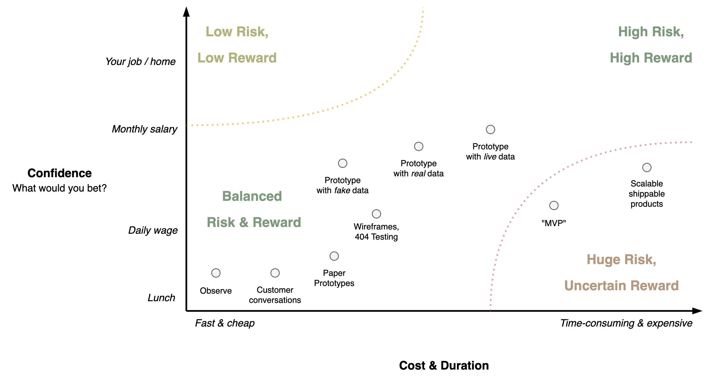

# Bets

Bets are tools to *test beliefs*. They are light-weight versions of [scientific experiments](../intelligence/scientific-method.md) that validate and verify hypotheses. They are especially useful in complex environments where higher order effects are common. Also see [results](../management/results.md) and [delivery](../management/delivery.md).

Considerations. Considering stakeholders and customers:

- Are they willing to bet everything on a single release?
- Are they willing to use prototypes and user-testing to optimize in iterations?
- Do they want to hear bad news?
- Do they believe in risks? E.g. new features that could have adverse effects.
- Do they want to validate beliefs?

## Beliefs

Bets imply a level of uncertainty. Start by making uncertainty explicit and transparent.

Beliefs and predictions.

- Product beliefs. E.g. *"We belief that feature X will help users with Y."*

- Market beliefs. E.g. *"We believe that shipping X will increase revenue by Z."*

## Sizing

Bets can have several forms. They should be sized according to the amount of uncertainty. Otherwise they result in wasted time or reckless risk taking.

