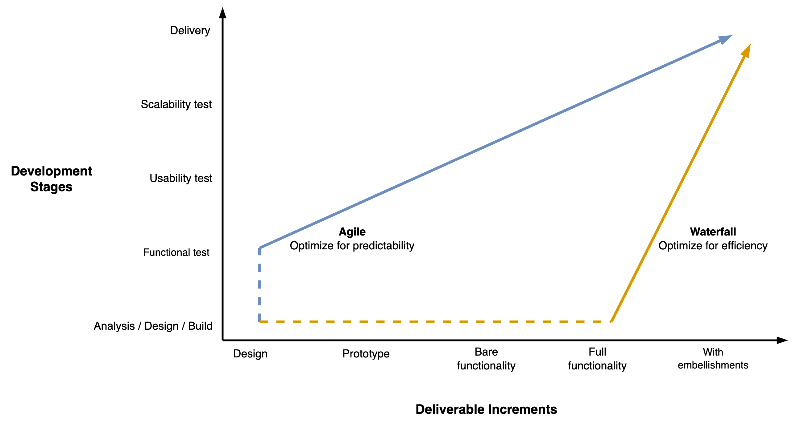

# Delivery

Projects can be delivered in increments. Strategies typically optimize for efficiency or predictability.

[toc]

## Overview

Product **increments** tend to follow a release pipeline. In software engineering the phases are typically: 

- `requirements, analysis, design, implementation, testing, deployment`. 

Projects can be **optimized** for efficiency or predictability. The former takes **risk** by building large increments. The latter minimizes risk by testing early. See [requirements](project-requirements.md).

## Delivery Strategies

Product increments can be designed in several ways. There is a tradeoff between efficiency (throughput) and risk.

|                  | Optimize for             | Risk               |
| ---------------- | ------------------------ | ------------------ |
| **By slice**     | Efficiency               | Missing layers     |
| **By component** | Efficiency (in parallel) | Integration issues |
| **MVPs**         | Speed                    | Mediocre products  |
| **By prototype** | User experience          | Limited details    |

Each release as can be treated as an experiment.

- There is a belief (hypothesis) about its outcome
- Test beliefs by releasing.

Learn as much from it as you can.

The following example visualizes the different increments in the context of building a church.

### Components

Develop each component in parallel by specialists.

### MVP

Iteratively deliver minimum viable products (MVP) and test them with real customers.

### Prototyping

>  Prototype for `1x`, design for `100x`, and only then build for `10x`.

Emphasize the discovery phase. Continuously develop better prototypes to ensure the design is valuable.

## Agile and Waterfall Projects

Projects can be optimized for efficiency or predictability. The former takes risk by building large increments. The latter minimizes risk by testing early.

Watefall-type projects start with full requirements. Development and testing happens afterwards, in sequence. Agile approaches start earlier with (functional) testing and then improve the design in increments.

|                     | Waterfall                 | Agile                   |
| ------------------- | ------------------------- | ----------------------- |
| **Optimize for**    | Throughput (output)       | Market fit (outcome)    |
| **Scope**           | Requirements drive design | Discovery drives design |
| **Decision making** | Theoretical (top-down)    | Empirical               |
| **Testing**         | Eventually                | Continuously            |
| **Worst case**      | Project fails             | Project is insufficient |

This graph shows the granularity of increment verses the development stages. The steepness of the line is associated with risk apetite.

For software projects the increments follow a typical form.

