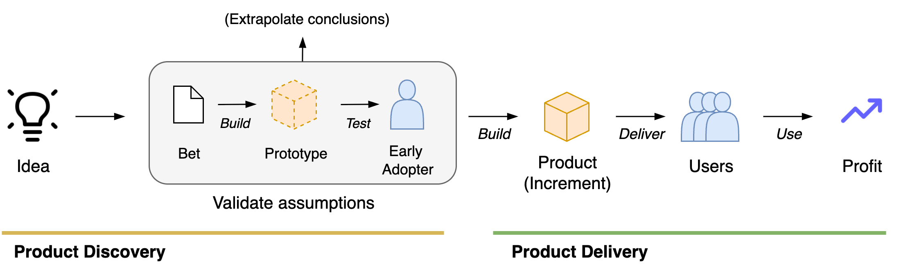

# Product Discovery

Discovery is about optimizing products, increments and features. Also see [requirements](project-requirements.md), [bets](bets.md) and [results](results.md).

[toc]

## Overview

Discovery consists of:

- Discovering new product ideas.
- Discovering the needs of customers, stakeholders and users.
- Translating ideas into plans. Using traditional [project management](https://en.wikipedia.org/wiki/Project_management) or storytelling.
- Testing (optimizing) market fit.

The next sections present a method based on storytelling, that facilitates **translation** between ideas, goals and plans. It emphasizes:

- Storytelling over requirement handovers.
- Experiments over upfront planning.

## Translation

>  Specialists know what they want, but groups do not.

One of the hardest parts of software engineering is communication and alignment. The biggest waste is not inefficiency, but rather misdirection. This is caused both by *a priori* unknowns and miscommunication.

One solution to this issue is to develop software incrementally, and continuously incorporate feedback. This requires strong alignment on abstract goals, and flexibility in planning.

This section sections present a way of translating product ideas into concrete plans.

### Storytelling

>  "Stories get their name from how they’re supposed to be used, not from what you’re trying to write down" ~ Jeff Patton

User stories a way of working that is based on *telling stories*. It prioritizes shared understanding over formal documents and requirements. 

- Stories tend to emphasize people and their purpose. Developing a plan is secondary to this.
- Telling a story requires *at least* two people. Conversations may involve the organization, customers, users and developers.

#### User Stories

A user story has three components. See [extreme programming](https://en.wikipedia.org/wiki/Extreme_programming).

| Component    | Action                                                       |
| ------------ | ------------------------------------------------------------ |
| Card         | Write down a sentence that describes what you'd like to see. |
| Conversation | Explore the idea together, using words and pictures.         |
| Confirmation | Record your agreements.                                      |

The conversations should lead to agreements on:

- Acceptance criteria. *How do we know that we’re done?*
- Demo. *How can we demonstrate this to stakeholders?*

A plan to *implement* the user story can be created *ad hoc*, e.g. in a refinement session.

#### Traditional Project Management

This approach differes from traditional project management. Project requirements are formulated after a negotiation. They are then handed over to developers. This works well for predictable environments.

|                | Project document    | (User) Story                |
| -------------- | ------------------- | --------------------------- |
| **Purpose**    | Delivery            | Alignment                   |
| **Creation**   | Through negotiation | Through conversation        |
| **Delivery**   | Handovers           | Continuously                |
| **Commitment** | Time, scope or cost | Satisfy acceptance criteria |
| **Optimize**   | Output              | Outcome                     |

#### Discovering Requirements

> The worst thing you can do is start building immediately.

A typical problem of projects is that there can be a huge amount of uncertainty at the time of their formulation. This effect is stronger for larger projects.

An alternative to this is to use [experiments](bets.md) before building new features. This may involve questionnaires, paper prototypes, wireframes, mockups, etc.

### Story Mapping

Story mapping is a technique to discover what to build.

>  Shared documents ≠ shared understanding 

Goals - ordered by importance.

1. Develop a shared understanding.
2. Promote shared ownership. Make team members feel heard. Be inlusive.
3. Create shared documents to remember the conversations.

#### Session Format

Attitude: beginner's mind. 

- Be eager to discover and learn. 
- Be open minded, without a hidden agenda or pre-defined plan.

Discovery process.

1. Tell a story, from beginning to [end](results.md). Go wide, rather than deep. Meanwhile, write down *keywords*.
   1. Split up large chunks from small chunks. Focous on the large chunks.

2. Define the context.
   1. Define the product goal and vision.
   2. Define the target market. E.g. persona's of typical users. You can use symbols to remember these.
   3. List any relevant constraints.
3. Build a chain of smaller stories. E.g.
   "As a `user`, I want to ...,
   *(and then)* I want to get ...,
   *(or, I might)* want to see ...."
4. Reflect on this, and determine what increments you can build next.

Delivery process

- Discuss what is technically feasible to build.
- Relate it to what would provide value, based on the original story.

#### Example Mapping

This is an example mapping of a webstore. There are a few layers.

1. The **main user flow** is denoted by large cards. It depicts the value chain.
2. **Detailed steps** per link. These are separated by a dashed line.
   1. Bare minimum steps.
   2. Bonus steps. These can be valuable but are not vital.

#### Example Increments

Ideally this happens after the market fit is tested.

1. Prioritize a functional, end-2-end flow. This allows validation of the design and its scalability.
2. Make it business meaningful. Replace mocks with real data.
3. Improve user experience. Add toping.

## Experiments

See [bets](bets.md).

## References

- Patton. *User Story Mapping*

