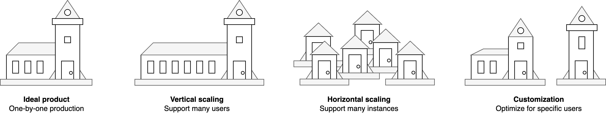

# Product Increments

[toc]

## Overview

Projects can be optimized for efficiency or predictability. The former takes risk by building large increments. The latter minimizes risk by testing early. See also [requirements](project-requirements.md), [bets](bets.md) and [Agile](../software-industry/agile.md).

Types of increments.

- Intermediate deliverables within a project or initiative.
- Phases within the lifecycle of a product.

Planning phases.

- What to build (discovery)
- How to build it (delivery)

## Scaling & Flexiblity

Scaling of products can have several forms.

- One-by-one production. Optimize the delivery of a single product.
- Size of production batches. E.g. build milions of homogeneous products.
- Scaling of a software product. E.g. support milions of users.
- Flexibility. Tailor to specific user-needs.

## Predictability & Adaptability

Product increments can be designed in several ways. There is a tradeoff between efficiency (throughput) and risk.

|                  | Optimize for             | Risk               |
| ---------------- | ------------------------ | ------------------ |
| **By slice**     | Efficiency               | Missing layers     |
| **By component** | Efficiency (in parallel) | Integration issues |
| **MVPs**         | Speed                    | Mediocre products  |
| **By prototype** | User experience          | Limited details    |

Each release as can be treated as an experiment. Learn as much from it as you can.

- There is a belief (hypothesis) about its outcome
- Test beliefs by releasing.

Mock components if you want to test the product as a whole. Replace mocks and stubs later on, after the product fit has been shown.

The following example visualizes the different increments in the context of building a church. See also [Picasso's bull](https://www.artyfactory.com/art_appreciation/animals_in_art/pablo_picasso.htm).

### Components

Develop each component in parallel by specialists.

### MVP

Iteratively deliver minimum viable products (MVP) and test them with real customers.

### Prototyping

>  Prototype for `1x`, design for `100x`, and only then build for `10x`.

Emphasize the discovery phase. Continuously develop better prototypes to ensure the design is valuable.

