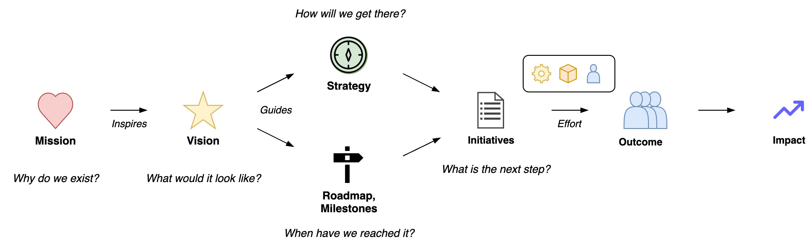
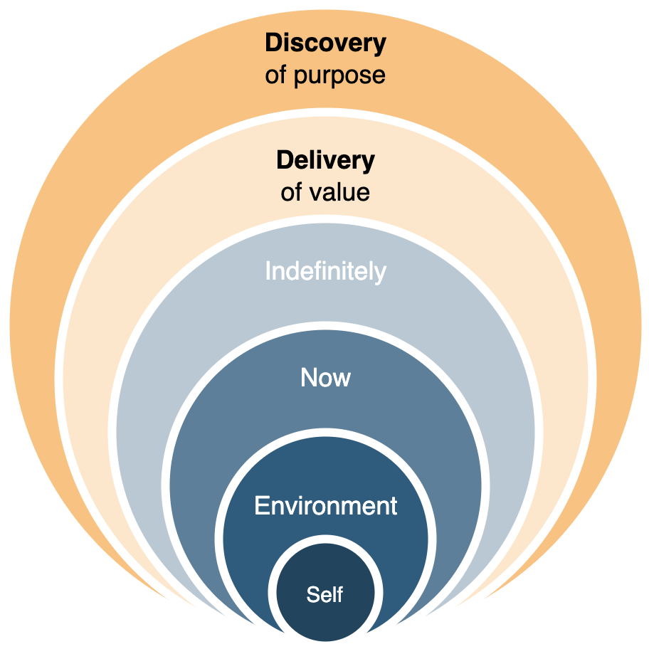

# Labour

This document presents a liberal taxonomy of labour, work and management. It is inspired by from various fields, for example [systems science](https://en.wikipedia.org/wiki/Systems_science) and [business administration](https://en.wikipedia.org/wiki/Business_administration).

[Product management](../management/product-management.md) often focusses on delivering value to a customer. The interests of employees, citizens and climate should also be taken into account.

[toc]

## Overview

### Labour

Labour revolves around production. From input to output. From an initiative to an outcome.

1. [initiatives](initiatives.md)
2. [increments](increments.md)
3. [results](results.md)


Often, impact is difficult to estimate. Instead, we focus on optimizing an output or outcome.


### Organized labour

Organized labour requires alignment and strategy. It moves from a mission to discovery to delivery.



## Purpose and Sustainability

>  Patience ≠ doing nothing

The purpose of any type of labour can be deconstructed in *discovery* and *delivery*. The former is both an [existential](https://en.wikipedia.org/wiki/Existentialism) question and a [validation](https://en.wikipedia.org/wiki/Verification_and_validation) of beliefs and posibilities. Delivery is more concrete, and consists of the following:

- Add value now. To either the being (or organization) itself or to its environment. This includes monitoring and verification.
- Add value in the future. Ensure self-preservation and be able to adapt. E.g. by assuring access to capital.

A secondary set of goals is to do this *sooner, safer* and *happier*.




## Objectives and Initiatives

See [goals](../management/goals-planning-strategy.md) and [initiatives](initiatives.md).


## Organized Labour

Labour can be divided into *processes* and *projects*. It is done by a person or an *organization* and it involves *resources*. Often it involves of various sorts. Al of these concepts may involve [management](../management/management-principles.md).

How to run an organization.

1. Align on a stable, perpetual objective. Relate this to the different stakeholders.
2. Set clear, time-bound objectives (see above).
3. Ensure that the organization is working towards them.
4. Setup periodic reflection moments at appropriate time scales. E.g. daily, bi-weekly, quarterly, yearly meetings. Learn what needs to change to achieve success.

Cycle

1. Take a step back / reflect. Step outside the daily operations.
2. Decide on a next objective. Choose a direction to move towards.
3. Develop and execute plans. Move forwards.
4. Repeat.

**Autonomous teams**

A top-down approach where teams execute pre-specified plans is straightforward and works well in certain environments. Whenever teams need to adapt quickly this approach starts to fail.

- Alignment with other teams. Being aware of the greater purpose.
- Reflection of the team itself, it's work and it's environment.
- Adapting objectives and plans based on progress.

**Roles in Teams**

There exist multiple models for [role and responsibility assignment](https://en.wikipedia.org/wiki/Responsibility_assignment_matrix). A few fundamental roles:

- Accountable for the end-result.
- Responsible for execution.
- Consulted. E.g. providing consultancy or support.
- Informed. Following along.

Roles can be official and persistent, or informal and dynamic.

**Modes of collaboration**

- Firefighting. Try to survive.
- Maintenance. Optimize for efficiency.
- Balanced. Focus on effectiveness. Plan and reflect.

### Projects and processes

- A process is a pre-defined method to do labour. It may involve repetition and it may be optimized by improving reliability and speed.
- A [project](../management/project-management.md) involves a change of some sort. It's too unique or uncertain be be a process. It may require adaption.


#### Identity

Labour can be performed by an [organization](../systems/system.md) or [system](../systems/systems-management.md). An organization may define itself on different levels. These influence decisions. For example, belief is a prerequisite for making changes - and can limit capability.

```markdown
**We      can    do         this     here**
_identity belief capability behavior environment_
```

See [organization](../collaboration/organization.md).

## Labour Itself

Labour can be categorized as follows. Based on [environments](https://cynefin.io/wiki/Cynefin), ranging from `chaotic-complex-complicated-obvious`.

It may have the following forms:

1. Research (theoretical, experimental), deconstruct the application domain.
2. Development: novelty, effectiveness, build/improve an application. I.e. invest and introduce change.
3. Operations: efficiency & quality, run a black-box application. I.e. cut cost and block change. Execute a process.
4. Administration: consistency, manage a black-box application. Audit an executed process.

*Management* of labour usually falls under operations or administration. It differentiates itself from "actual" work by distancing itself from it. E.g. through delegation or orchestration.

## Assignments

Initiatives can be defined as assignments or projects that are difficult in some sense. For a given a project there are two phases to consider: planning and execution. Both are [vital](https://en.wikipedia.org/wiki/Verification_and_validation) to:

- Deliver the right thing
- Deliver it right

**Planning**

Requirements are set to to ensure that an initiative results in the desired outcome - or decrease the change of surprises.

Risk management is done to identify and address risks.

**Execution**

After a planning phase, the initiative is executed. Next to following the plan, this may require:

- Updating plans & managing resources.
- Informing stakeholders & managing expectations.

**Feedback**

Updating [prior](https://en.wikipedia.org/wiki/Bayesian_inference) beliefs using new information. This requires observation, analysis and reflection. See [modeling](../intelligence/modelling.md).

**Improvement**

Change [organizational structure](../systems/structure.md) and the environment. See [learning](../intelligence/learning.md).
