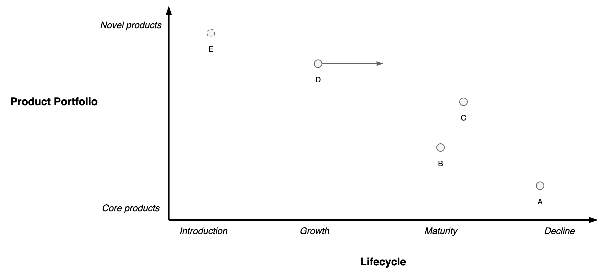

# Product Lifecycle

The lifecycle of a product or feature consists of several phases.

Development phases. Analogy of a chess game.

1. Opening game. Focus on essentials. Deploy pieces into the game. Explore areas with risk.
2. Middlegame. Improve reliability, scalability, stability, usability.
3. Endgame. Finishing touch. Improve efficiency, maintainability.

Market phases.

1. 🌱 Introduction. Discover where to go.
2. 🪴 Growth. Expand.
3. 🌳 Maturity.
4. 🍂 Decline.

## Maps

**Lifecycle**

Lifecycle of different products or features

**Commoditization of Components**

Level of [commoditization](https://en.wikipedia.org/wiki/Commoditization). From custom to standard to commodity. From uncharted to industrialized.

