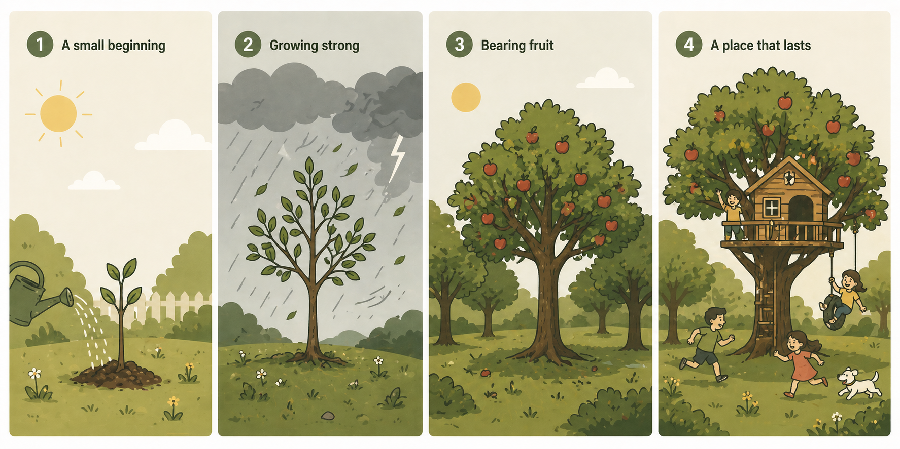
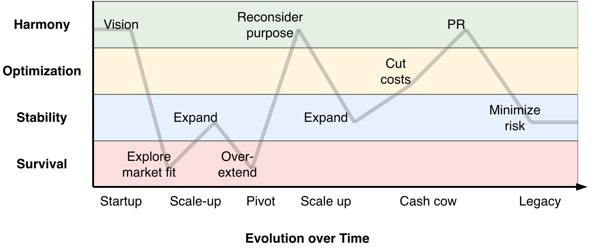
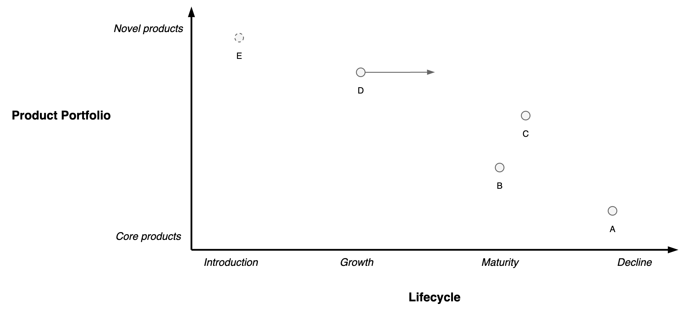
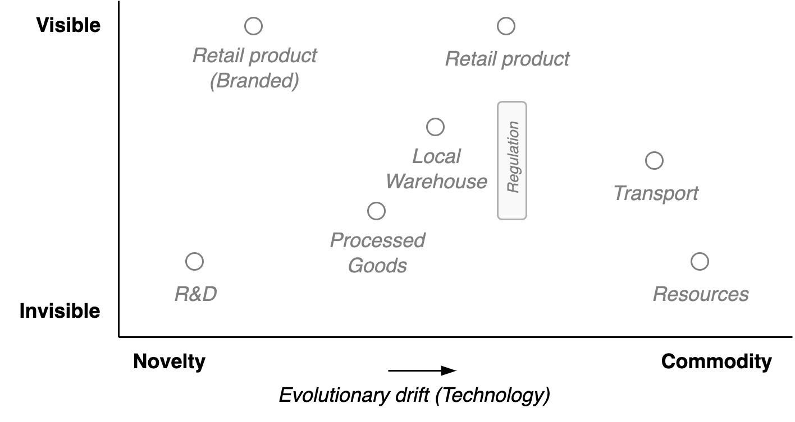

# Product Lifecycle

The lifecycle of a product or feature consists of several phases.

Development phases. Analogy of a chess game.

1. Opening game. Focus on essentials. Deploy pieces into the game. Explore areas with risk.
2. Middlegame. Improve reliability, scalability, stability, usability.
3. Endgame. Finishing touch. Improve efficiency, maintainability.

## Tree Analogy

Each stage in the lifecycle of an product has challenges.

1. 🌱 Uncertainty of existence. Working to survive. Discover where to go.
2. 🪴 Uncertainty of stability. Expand. Reduce risk and variability.
3. 🌳 Uncertainty of competition. Market dynamics. Optimize. Overcome old structures and become better than competitors. Collaborate with other organizations. Avoid under-performance.
4. 🍂 Legacy. Ideals. Look past direct (short-term) performance and reconsider what maters most.

|      | Uncertainty                      | Aim      | Avoid             | Time horizon   |
| ---- | -------------------------------- | -------- | ----------------- | -------------- |
| 🌱    | Existence (explore)              | Survive  | Death             | Now            |
| 🪴    | Stability (expand)               | Grow     | Risk, variability | Potential      |
| 🌳    | Competitive advantage (preserve) | Optimize | Under-performance | Long-term      |
| 🍂    | Sustainability, significance     | Ideals   | Tunnel vision     | Sustainability |

The scale and direction tends to vary. Organizations may have a fractal structure, with sub-organizations that have a different maturity.

## Restaurant Analogy

In reaillty the lifecycle may evolve unpredictably. See [organizatins evolution](../systems/evolution.md).

## Maps

**Lifecycle**

Lifecycle of different products or features

**Commoditization of Components**

Level of [commoditization](https://en.wikipedia.org/wiki/Commoditization). From custom to standard to commodity. From uncharted to industrialized.

