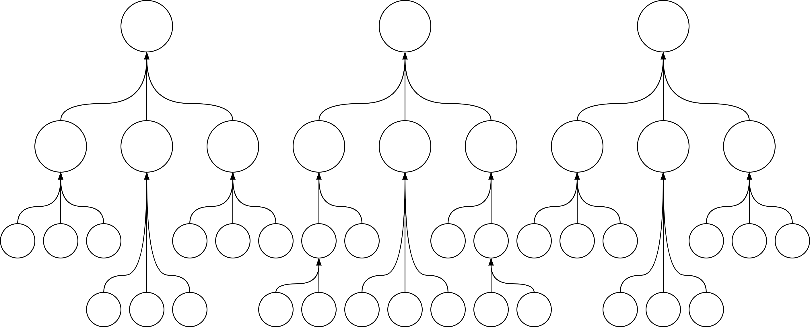

# Mandate Levels

Labour is defined in different levels of abstraction. Organizations use long term, abstract definitions that cascade down to short term practical tasks. From vision to initiative to user story to task. This documents explores the [mandate levels](https://cutlefish.substack.com/p/tbm-2752-mandate-levels) of these entities.

Outsourcing can be done at different mandate levels. It can be done in the form of contractors, SaaS, or AI-based tooling.

Mandate levels from long term to short term. See also [terminology](../labour/terminology.md).

| Mandate                              | Description               |
| ------------------------------------ | ------------------------- |
| **❤️ Mission**                        | Why we exist              |
| **⭐ Vision** (North star)            | What world we envision    |
| **🎯 Objective** (OKR)                | What we intent to achieve |
| **🗺️ Initiative** (saga/episode/epic) | An abstract plan          |
| **📄 User story**                     | A specific plan           |
| **☑️ Task**                           | A procedure               |

Mandates may require constraints. These can be defined as.

- 🧭 Strategy. *Policies for decision making in specific situations*
- 🚦 Metrics. KPIs, health indicators.

Mandates can be visualized as trees.

