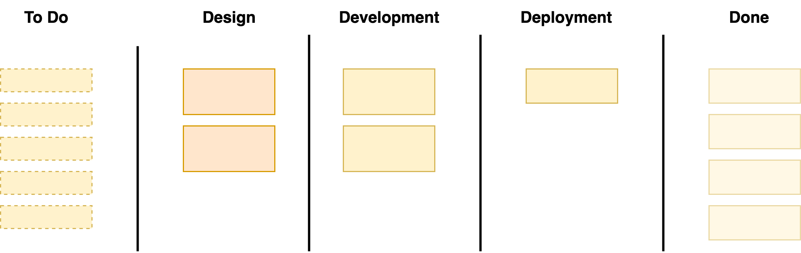
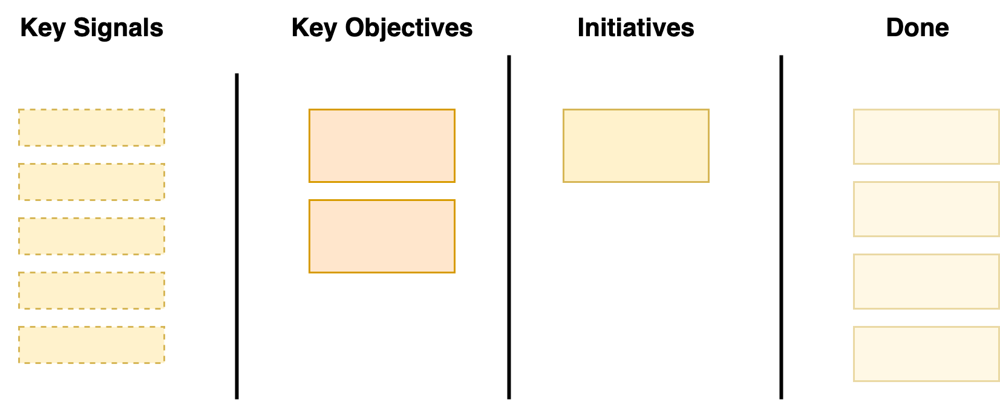
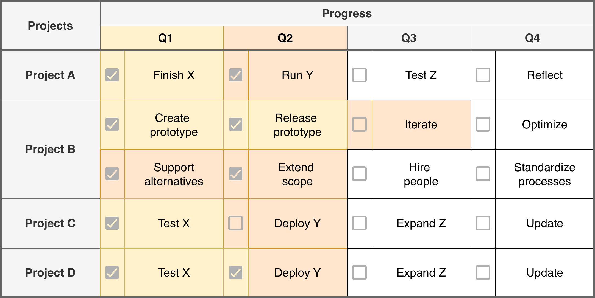

# Planning Templates

To visualize where you are and where to go.

## WIP Board

Card on the left hand side represent (drafts of) initiatives. Based on capacity and priority, they are moved to a *design* phase. After a design is agreed upon, *development* and *deployment* starts. Once all accetance criteria are met, the card is moved to *done*.

## Kanban Board

> Stop starting, start finishing

A WIP board that uses a pull-system rather than large batches of work items. It prioritizes finishing existing work over starting new work. See [kanban](../collaboration/kanban.md).

## Signals & Initiatives

**Signals** are noteworthy problems and opportunities. These are used to design **objectives**. **Initiatives** are used to obtain objectives. Once they are completed they are moved to done.

## Priority Matrix

**Cost vs. Urgency**

|                          | Not urgent | -         | Urgent    |
| ------------------------ | ---------- | --------- | --------- |
| **High risk / low cost** | Project X  |           |           |
| **-**                    |            |           | Project Y |
| **Low risk / High cost** |            | Project Z |           |

## Project Overview

A table that shows all projects and all phases. Checkboxes indicate which phases are finished. Colors can be used to indicate which phases fall in which quarter.

